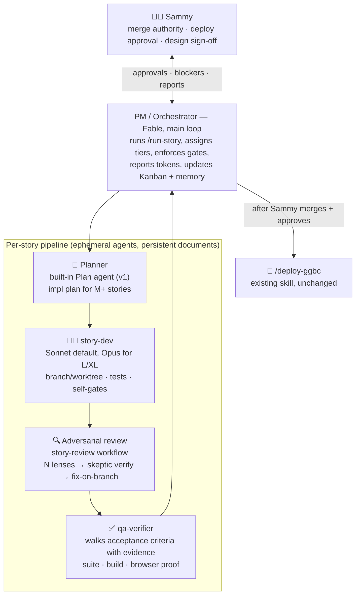

# GGBC Agent Team Charter

**Prepared:** 2026-08-24 · **Status:** ✅ **Approved by Sammy 2026-08-24 (v1.1)** — the §6 files are scaffolded and this is the team's operating charter *(v1.1 = self-critique + wheel-check pass; see design-review notes after §9)*
**Purpose:** Design the standing agent team that executes [the approved roadmap](https://claude.ai/code/artifact/0d6283f9-36e3-4dfb-a267-757515ca48cb) (`docs/product-roadmap-10.2-12.md`) — an IRL-style engineering hierarchy mapped honestly onto Claude Code primitives.
**Dual use:** This document is also the handoff doc. If team-building moves to a fresh session, §8 lists exactly what that session loads; nothing else is needed.

---

## 0 · TL;DR

- **Your hierarchy maps cleanly, with one honest correction:** the PM is not an agent — it's the main-loop session (Fable) running a `/run-story` pipeline skill, because only the main loop can talk to you, hold memory, and enforce gates. Devs, adversarial reviewers, and QA become **named agent definitions** (`.claude/agents/*.md`) invoked by that pipeline.
- **The team is mostly formalization, not invention.** The house already runs every role informally: `build-next-issue` is a dev loop, the 45-agent adversarial reviews are the review org, `/deploy-ggbc` is release engineering. This charter names the roles, pins their contracts, and chains them into one pipeline per roadmap story.
- **Where the IRL metaphor breaks — and how we compensate:** real teammates persist; agents are ephemeral. All "team memory" therefore lives in documents — the roadmap, this charter, evidence bundles on PRs, and the memory dir. Reports aren't bureaucracy here; **they're the only institutional memory the team has.**
- **Humans keep the two irreversible gates:** Sammy merges, Sammy approves deploys. The team never auto-merges or auto-deploys — same covenant as `build-next-issue`.
- **v1.1 changes after self-critique:** the **story brief** becomes a first-class pipeline stage (ticket quality is the biggest lever on agent output — same as human teams); S/M non-trigger reviews reuse the **built-in `/code-review` skill** instead of a bespoke workflow (the bespoke org is reserved for trigger-list/L/XL stories where it earned its 11x record); **DoR/DoD** checklists gate entry and exit; and the **thin-agents / fat-skill** principle keeps the process defined in exactly one place.
- **Build cost is small:** 3 agent files + 1 skill + 1 trigger-tier review workflow + this charter committed to docs. Pilot on E1-S1 (review/QA/deploy legs, code already written), then E9-S1 (full pipeline including the dev leg).

---

## 1 · Org chart



**Role → your IRL ask:** PM/orchestrator → the main-loop pipeline skill · "devs for writing code" → `story-dev` · "devs for adversarial review" → the `story-review` workflow staffed by `adversarial-reviewer` agents · "QA agents" → `qa-verifier`. Release engineering stays `/deploy-ggbc`.

---

## 2 · Roles

### PM / Orchestrator — the main-loop session
- **Substrate:** this session (or any future session) invoking **`/run-story <STORY-ID>`**. Not a subagent — the PM must talk to Sammy mid-flight, read/write memory, and enforce gates, which subagents cannot.
- **Duties per story:** pull the story + acceptance criteria from `docs/product-roadmap-10.2-12.md`; **ground-truth the story's state with `gh` before acting** (branch/PR/deploy state — never trust the board's snapshot; this week's lesson ×3); verify its gate column; **compile the story brief** (§3) that every downstream agent receives; **print the delegation map before launching** — every agent's tier + one-line reasoning (your calibration preference); drive the pipeline; surface blockers to you instead of guessing; close with the evidence bundle, Kanban update, memory write, and **per-story token actuals vs the roadmap's size band**.
- **Never:** merges, deploys without approval, or lets a finding ship unresolved-and-undocumented. Defaults to delegating implementation; may do trivial glue inline.

### Planner — built-in `Plan` agent (v1)
- **When:** M-size and larger build stories. S stories skip straight to dev.
- **Produces:** file-level implementation plan, test plan, and a risk list that explicitly checks the adversarial-trigger list (spread refactors, async store orchestration, backend contracts, safety gates, user-writable storage) so review scope is pre-declared.
- **v1 decision:** use the built-in Plan agent, prompt-loaded with house context by the skill. Graduate to a custom `story-planner` only if plans repeatedly miss house patterns.

### story-dev — `.claude/agents/story-dev.md`
- **Mission:** implement the plan on a `claude/<story-id>-<slug>` branch; worktree isolation whenever stories run in parallel (the contested-checkout gotcha: bind-mounted tests execute what's on disk).
- **Contract before handing back — deterministic self-gates, all green:** full test suite, **`npm run build`** (PR CI doesn't typecheck tests — the house's known trap), lint from a clean checkout. Returns a structured report: files touched, tests added, deviations from plan with reasons.
- **Model:** Sonnet default; PM overrides to Opus for L/XL stories or named-risky seams, per the roadmap's tier column. **Never:** merges, pushes to main, touches secrets, deploys, or weakens a safety gate to make a test pass.

### Adversarial review — two tiers, matched to stakes
- **Standard tier (S/M stories, no trigger-list hit):** the **built-in `/code-review` skill**, effort mapped from story size (S → medium, M → high), run on the branch pre-PR. Don't rebuild what ships in the box — it already does multi-finding review with verification.
- **Trigger tier (L/XL or any trigger-list hit):** the bespoke `story-review` workflow — the proven house org: N independent lenses → skeptic verification of each finding → fix-on-branch → re-verify, plus **mutation-verified kill tests** for anything touching a safety gate. Lens agents use the `adversarial-reviewer` agent type (strong model, high effort — **verifiers are never economized**; a weak verifier is negative value). This tier earned its 11x-confirmed record on exactly these story shapes; it is reserved for them, not spent on everything.
- **Timing is the point:** review runs on the branch, **before** the PR is marked ready — never alongside, never after (Phase 5 shipped 9 known defects the other way). Every finding ends CONFIRMED-fixed, REFUTED-with-reason, or ACCEPTED-with-reason in the evidence bundle.
- **Reviewers never mutate the shared checkout:** mutation-testing a coverage claim happens in a throwaway detached worktree, removed afterward — the target stays byte-identical to its committed state (pilot E1-S1 retro: a reviewer's uncommitted mutation was left in the shared worktree and had to be reset).

### qa-verifier — `.claude/agents/qa-verifier.md`
- **Distinct from review:** review hunts defects in the *diff*; QA verifies the *story*. Runs **after** review fixes, on the final branch state.
- **Duties:** walk the story's acceptance criteria one by one with evidence per item (test output, screenshots, curl transcripts); re-run suite + build on the final state; browser-verify previewable changes — guarding the served-source gotcha (preview serves the worktree, so grep the served bundle before trusting a repro); confirm deploy-order notes and migration notes exist when applicable.
- **Output:** the AC checklist, each item pass/fail + evidence link. An ambiguous criterion escalates to the PM rather than getting a charitable pass. **Model:** Sonnet — procedural, loud-failure work; judgment calls escalate.

### Release engineering — `/deploy-ggbc` (existing, unchanged) + a rollback line
Invoked by the PM only after Sammy merges and says deploy. Deploy-order constraints from the story (e.g., backend-before-frontend) are restated in the PR body and honored. User-visible features get a release note to `#feature-releases` via the Discord MCP as part of story close. **Rollback playbook (previously implicit, now stated):** a bad deploy is answered with revert-PR + redeploy of the previous image tag, health-poll verified — never a hotfix-under-pressure on main; migration-bearing deploys get their rollback caveats written in the PR body *before* merge (the migration-0027 docstring pattern).

---

## 3 · The story pipeline

```
/run-story <ID>
  1  INTAKE     PM reads story + AC from the roadmap; ground-truths state with gh
                (branches, PRs, deploys); verifies gate column; if a design-first
                gate applies and the design doc isn't Sammy-approved, STOP and say so.
                Exit = Definition of Ready met (below).
  2  BRIEF      PM compiles the STORY BRIEF — the packet every downstream agent
                receives: AC verbatim, relevant house gotchas pulled from memory,
                file/seam pointers, conventions, deploy-order constraints, tier map.
                Ticket quality is the biggest lever on agent output; a story ID
                alone is not a brief.
  3  PLAN       (M+ only) Plan agent → impl plan from the brief; PM sanity-checks vs AC.
  4  BUILD      story-dev on branch/worktree → self-gates green → structured report.
  5  REVIEW     Standard tier: built-in /code-review (S→medium, M→high).
                Trigger tier (L/XL or trigger-list hit): story-review workflow.
                Findings fixed on branch → re-verified.
  6  QA         qa-verifier walks AC with evidence on the final branch state.
  7  PR         Draft PR with the evidence bundle: AC checklist, review findings +
                resolutions, QA report, deploy-order + rollback notes, token actuals.
  8  HUMAN GATE Sammy reviews + merges. PM pings with a 5-line summary, then waits.
  9  DEPLOY     On Sammy's go → /deploy-ggbc → prod verification per its checklist.
 10  CLOSE      Definition of Done checked (below); Kanban table updated in docs,
                durable facts to memory, token actuals vs band reported to Sammy.
```

**Definition of Ready** (gate into BUILD): AC testable as written · dependencies verified against ground truth, not the board · design doc approved where the roadmap requires one · brief compiled · tier map printed.
**Definition of Done** (gate out of CLOSE): every AC verified with evidence · all review findings resolved or accepted-with-reason · deployed and prod-verified (or explicitly parked pre-deploy by Sammy) · Kanban + memory updated · token actuals reported.

**Design-story variant** (E1-S2, E3-S1, E6-S1, E8-S1/S3): steps 3–5 become *draft doc → red-team workflow → revise*; the deliverable is a Sammy-approved doc in `docs/`, and step 8 is n/a. Security-relevant designs are red-teamed **pre-code** — the practice that caught the Phase 3 scope hole.

**Failure paths are first-class:** a story that can't meet its AC comes back as *blocked-with-reason*, not as a lowered bar. "Blocked" is always an acceptable end state; a quietly weakened acceptance criterion never is.

---

## 4 · Operating protocols

Inherited from roadmap §6 (single source of truth — not duplicated here): review-before-merge triggers, barbell tiering, deterministic-checks-first, frontend merge hygiene, content-safety red line. Team-specific additions:

1. **WIP limit: 2 stories in flight, 3 at absolute peak.** Your review bandwidth is the system's bottleneck by design; the schedule slips before the quality bar does. Parallel stories always get separate worktrees.
2. **Delegation map is printed before every launch** — per-agent model/effort + one-line reasoning — and **actuals are reported at close** so your calibration loop stays closed.
3. **Documents are the team's memory.** Every pipeline stage returns a structured report; the PR carries the full evidence bundle. If it isn't written down, the next session's team never knew it.
4. **Escalate, don't improvise, on:** any safety-gate interaction, any AC ambiguity that changes scope, any dependency discovered mid-story that the roadmap doesn't show, and any deviation that would touch merge/deploy authority.
5. **Kanban lives in roadmap §7** (v1). The PM updates it at story close via docs commit. Revisit (GitHub Projects) only if >2 concurrent stories makes the table confusing.
6. **Thin agents, fat skill.** The process is defined in exactly one place — `run-story` + this charter. Agent files stay thin role contracts (mission, self-gates, output format, never-list). Duplicating protocol across five files guarantees drift; an agent needing process detail gets it via the story brief, not via its own definition.

---

## 5 · Human gates — what only Sammy does

| Gate | When |
|---|---|
| **Merge** | Every PR. The team opens draft PRs with evidence; you merge. No exceptions in v1 (see open decision D2). |
| **Deploy approval** | Every prod deploy, invoked as `/deploy-ggbc` on your word. |
| **Design sign-off** | Every design-first gate story (E1-S2, E3-S1, E6-S1, E8-S1/S3) and the Arch v2 GO/ITERATE decision. |
| **Tier overrides** | You can override any delegation-map assignment before launch — that's the point of printing it. |

---

## 6 · What gets built (the "hire")

| File | Contents | Size |
|---|---|---|
| `.claude/agents/story-dev.md` | Dev contract from §2: conventions, self-gates, structured report, never-list | S |
| `.claude/agents/adversarial-reviewer.md` | Lens-agent persona: refute-first stance, verdict format, no-drive-by-fix rule | S |
| `.claude/agents/qa-verifier.md` | AC-walking procedure, evidence format, escalation rule, served-source guard | S |
| `.claude/skills/run-story/SKILL.md` | The PM pipeline (§3) incl. the design-story variant, DoR/DoD checklists, story-brief template, delegation-map + token-report mandates | M |
| `.claude/workflows/story-review.js` | **Trigger-tier only** review workflow (lenses → skeptics → mutation-verify); S/M stories use built-in `/code-review` and need no custom code | S–M |
| `docs/agent-team.md` | This charter, committed (same PR pattern as the roadmap) | S |

Estimated build spend: **S–M total** (≤500k). The pipeline reuses `/deploy-ggbc`, the built-in Plan agent, and the existing review-workflow patterns rather than reinventing them.

---

## 7 · Pilot plan — the team's probation period

1. **Pilot 1 — E1-S1** (ship the LP/scene-video provenance gate): exercises **review, QA, PR, merge-gate, deploy** on code that's already written — the fastest safe shakedown, and it's the roadmap's top item anyway.
2. **Pilot 2 — E9-S1** (swap-vs-join): small, isolated feature — the first **full pipeline** run including plan + dev legs.
3. **Hire/adjust checkpoint:** both stories deployed with complete evidence bundles, token actuals within band, and your verdict on report quality. Then 10.2 proceeds through the team as standard practice, and we consider the later upgrade path (a scheduled PM loop draining Ready-for-Dev under the WIP limit — the `/sprint-plan` pattern pointed at the roadmap). Not in v1.

---

## 8 · If this moves to a fresh session instead

This charter is the handoff. The new session loads, in order:
1. `docs/product-roadmap-10.2-12.md` (the approved roadmap — stories, AC, tiers, protocol §6)
2. This charter (artifact or `docs/agent-team.md` once committed)
3. Memory: `project_roadmap_v3_phases_10_2_to_12.md`, `user_model_effort_delegation.md`, `feedback_adversarial_review_catches_real_bugs.md`, `feedback_review_before_merge_not_after.md`
4. Ground-truth check per the house rule: verify branch/PR state with `gh` before acting — never trust a handoff's snapshot (this week's lesson, three times over).

Task for that session: review §9 decisions with Sammy → build the §6 manifest → run the §7 pilots.

---

## 9 · Open decisions for your review

| # | Decision | Recommendation | Alternative |
|---|---|---|---|
| D1 | Where the PM lives | Main-loop session + `/run-story` skill (only the main loop can talk to you and hold memory) | — (a "PM subagent" can't do the job; not a real option) |
| D2 | Merge authority | **Strictly you, every PR** (matches the build-next-issue covenant) | Pre-authorize team merge for S-size docs/test-only stories to cut your load — can add later once the team has a track record |
| D3 | Planner | Built-in Plan agent, prompt-loaded with house context | Custom `story-planner.md` now (only if v1 plans miss house patterns) |
| D4 | Kanban home | Roadmap §7 table, PM-maintained | GitHub Projects (more tooling, better at >2 concurrent stories) |
| D5 | Autonomous cadence | v1: you invoke `/run-story` per story | Later: scheduled PM loop drains Ready-for-Dev under the WIP limit — revisit after the pilots |

---

---

## 10 · Design-review notes (v1.1) — the wheel question, answered

**Wheels copied deliberately:**
- **The house's own 4 months of practice** — the best wheel available, because it's already survived contact with this codebase 11 confirmed times. The charter formalizes it rather than inventing alternatives.
- **Claude Code built-ins** — Plan agent, `/code-review`, worktrees, workflow patterns. v1.1 explicitly swapped a bespoke review workflow for the built-in skill on standard-tier stories.
- **Standard process furniture** — DoR/DoD, WIP limits, ticket-quality discipline (the story brief). Boring, proven, adopted as-is.

**Wheel checked and not found:** the plugin catalog has no agent-team/orchestration pack to install (searched 2026-08-24). Generic packs wouldn't help anyway — the team's entire value is house-specific protocol (the gotcha list, the provenance red line, review-before-merge), which no off-the-shelf pack encodes.

**The wheel deliberately NOT copied: the human org chart itself.** Human hierarchies solve human problems — limited attention, incentives, communication overhead. Agents have different failure modes: no persistence, context starvation, sycophancy toward their prompt, silent failure. The structures that fix those are **staged pipelines, evidence bundles, and verification gates** — so that's what this actually is; the IRL role names are kept for legibility, not because the metaphor is load-bearing.

**Considered and rejected (recorded so future sessions don't re-litigate):**
- *A "tech lead" role* — architecture continuity is already the PM + the design-first gates; a role with no distinct mechanical substrate is org-chart theater.
- *Merging QA into review* — they catch different failures: review misses "built the wrong thing correctly"; QA's AC-walk catches it. Kept separate, same as IRL.
- *Competing implementations by default* — judge-panel (N attempts → score → synthesize) stays an on-demand pattern for wide-solution-space design stories, not the default; single dev + strong review is cheaper for roadmap-shaped work.

---

*Approved 2026-08-24; §6 files scaffolded the same day (`.claude/agents/`, `.claude/skills/run-story/`, `.claude/workflows/story-review.js`). Pilot 1 = E1-S1.*
