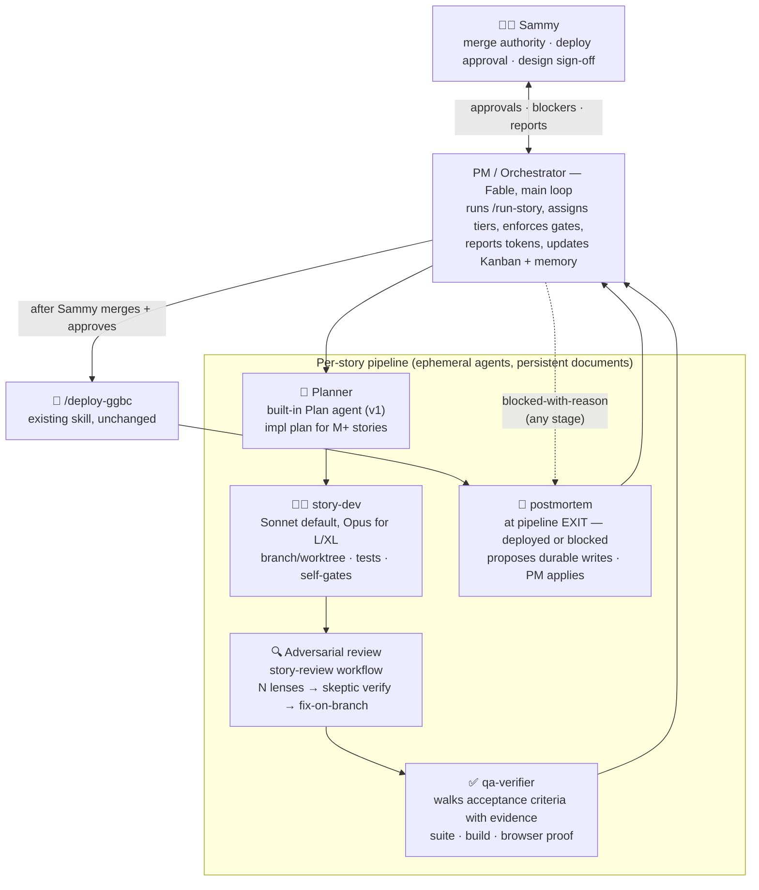

# GGBC Agent Team Charter

**Prepared:** 2026-08-24 · **Updated:** 2026-08-26 (v1.2) · **Status:** ✅ **Approved by Sammy 2026-08-24 (v1.1)** — the §6 files are scaffolded and this is the team's operating charter *(v1.1 = self-critique + wheel-check pass; see design-review notes after §9. v1.2 = the `postmortem` role, added after both pilots' retros were hand-copied into four unsynced places apiece; red-teamed pre-merge under §4.4 and revised on its 7 confirmed findings — see §10.)*
**Purpose:** Design the standing agent team that executes [the approved roadmap](https://claude.ai/code/artifact/0d6283f9-36e3-4dfb-a267-757515ca48cb) (`docs/product-roadmap-10.2-12.md`) — an IRL-style engineering hierarchy mapped honestly onto Claude Code primitives.
**Dual use:** This document is also the handoff doc. If team-building moves to a fresh session, §8 lists exactly what that session loads; nothing else is needed.

---

## 0 · TL;DR

- **Your hierarchy maps cleanly, with one honest correction:** the PM is not an agent — it's the main-loop session (Fable) running a `/run-story` pipeline skill, because only the main loop can talk to you, hold memory, and enforce gates. Devs, adversarial reviewers, and QA become **named agent definitions** (`.claude/agents/*.md`) invoked by that pipeline.
- **The team is mostly formalization, not invention.** The house already runs every role informally: `build-next-issue` is a dev loop, the 45-agent adversarial reviews are the review org, `/deploy-ggbc` is release engineering. This charter names the roles, pins their contracts, and chains them into one pipeline per roadmap story.
- **Where the IRL metaphor breaks — and how we compensate:** real teammates persist; agents are ephemeral. All "team memory" therefore lives in documents — the roadmap, this charter, evidence bundles on PRs, and the memory dir. Reports aren't bureaucracy here; **they're the only institutional memory the team has.**
- **Humans keep the two irreversible gates:** Sammy merges, Sammy approves deploys. The team never auto-merges or auto-deploys — same covenant as `build-next-issue`.
- **v1.1 changes after self-critique:** the **story brief** becomes a first-class pipeline stage (ticket quality is the biggest lever on agent output — same as human teams); S/M non-trigger reviews reuse the **built-in `/code-review` skill** instead of a bespoke workflow (the bespoke org is reserved for trigger-list/L/XL stories where it earned its 11x record); **DoR/DoD** checklists gate entry and exit; and the **thin-agents / fat-skill** principle keeps the process defined in exactly one place.
- **v1.2 change:** a **`postmortem`** role (§2) closes the loop the pipeline was leaking — capture was one unenforced DoD line, so both pilots' lessons ended up hand-copied into **four** unsynced places apiece (charter prose, executable code in `story-review.js`, a `MEMORY.md` index line, and a memory-file body). It runs at **pipeline exit — deployed *or* blocked** — proposes durable writes anchored to run evidence, and on designated runs audits memory for staleness. It **proposes; the PM applies**, gated on **blast radius** rather than on proposal kind, and its own bar is set against over-production, not under-. *Red-teamed pre-merge under §4.4 (36 findings → 7 confirmed / 3 plausible / 26 refuted); the confirmed defects are fixed in this version — see §10.*
- **Build cost is small:** 4 agent files + 1 skill + 1 trigger-tier review workflow + this charter committed to docs. Pilot on E1-S1 (review/QA/deploy legs, code already written), then a small isolated feature for the full pipeline including the dev leg. (E9-S1 originally held that second slot; see §7 — it had already shipped.)

---

## 1 · Org chart



**Role → your IRL ask:** PM/orchestrator → the main-loop pipeline skill · "devs for writing code" → `story-dev` · "devs for adversarial review" → the `story-review` workflow staffed by `adversarial-reviewer` agents · "QA agents" → `qa-verifier`. Release engineering stays `/deploy-ggbc`. The **postmortem** is the one role with no IRL counterpart in your list — it exists because agents forget and humans don't (§10).

---

## 2 · Roles

### PM / Orchestrator — the main-loop session
- **Substrate:** this session (or any future session) invoking **`/run-story <STORY-ID>`**. Not a subagent — the PM must talk to Sammy mid-flight, read/write memory, and enforce gates, which subagents cannot.
- **Duties per story:** pull the story + acceptance criteria from `docs/product-roadmap-10.2-12.md`; **ground-truth the story's state with `gh` before acting** (branch/PR/deploy state — never trust the board's snapshot; this week's lesson ×3); verify its gate column; **compile the story brief** (§3) that every downstream agent receives; **print the delegation map before launching** — every agent's tier + one-line reasoning (your calibration preference); drive the pipeline; surface blockers to you instead of guessing; close with the evidence bundle, Kanban update, memory write, and **per-story token actuals vs the roadmap's size band**.
- **Never:** merges, deploys without approval, or lets a finding ship unresolved-and-undocumented. Defaults to delegating implementation; may do trivial glue inline.

### Planner — built-in `Plan` agent (v1)
- **When:** M-size and larger build stories. S stories skip straight to dev.
- **Produces:** file-level implementation plan, test plan, and a risk list that explicitly checks the adversarial-trigger list (spread refactors, async store orchestration, backend contracts, safety gates, user-writable storage) so review scope is pre-declared.
- **v1 decision:** use the built-in Plan agent, prompt-loaded with house context by the skill. Graduate to a custom `story-planner` only if plans repeatedly miss house patterns.

### story-dev — `.claude/agents/story-dev.md`
- **Mission:** implement the plan on a `claude/<story-id>-<slug>` branch; worktree isolation whenever stories run in parallel (the contested-checkout gotcha: bind-mounted tests execute what's on disk).
- **Contract before handing back — deterministic self-gates, all green:** full test suite, **`npm run build`** (PR CI doesn't typecheck tests — the house's known trap), lint from a clean checkout. Returns a structured report: files touched, tests added, deviations from plan with reasons.
- **Model:** Sonnet default; PM overrides to Opus for L/XL stories or named-risky seams, per the roadmap's tier column. **Never:** merges, pushes to main, touches secrets, deploys, or weakens a safety gate to make a test pass.

### Adversarial review — two tiers, matched to stakes
- **Standard tier (S/M stories, no trigger-list hit):** the **built-in `/code-review` skill**, effort mapped from story size (S → medium, M → high), run on the branch pre-PR. Don't rebuild what ships in the box — it already does multi-finding review with verification.
- **Trigger tier (L/XL or any trigger-list hit):** the bespoke `story-review` workflow — the proven house org: N independent lenses → skeptic verification of each finding → fix-on-branch → re-verify, plus **mutation-verified kill tests** for anything touching a safety gate. Lens agents use the `adversarial-reviewer` agent type (strong model, high effort — **verifiers are never economized**; a weak verifier is negative value). This tier earned its 11x-confirmed record on exactly these story shapes; it is reserved for them, not spent on everything.
- **Timing is the point:** review runs on the branch, **before** the PR is marked ready — never alongside, never after (Phase 5 shipped 9 known defects the other way). Every finding ends CONFIRMED-fixed, REFUTED-with-reason, or ACCEPTED-with-reason in the evidence bundle.
- **Reviewers never mutate the shared checkout:** mutation-testing a coverage claim happens in a throwaway detached worktree, removed afterward — the target stays byte-identical to its committed state (pilot E1-S1 retro: a reviewer's uncommitted mutation was left in the shared worktree and had to be reset).
- **A verifier that did not run is not a pass.** Any finding whose skeptics all died (model limit, terminal API error) is reported `unverified`, never `confirmed`, and the PM re-runs verification before acting on it. Check the workflow's failures block and agent counts before trusting any result — "completed" is not "passed" (E2-S1 retro: a Fable-limit outage killed 42 skeptics and the status logic scored 21 unverified findings as confirmed).

### qa-verifier — `.claude/agents/qa-verifier.md`
- **Distinct from review:** review hunts defects in the *diff*; QA verifies the *story*. Runs **after** review fixes, on the final branch state.
- **Duties:** walk the story's acceptance criteria one by one with evidence per item (test output, screenshots, curl transcripts); re-run suite + build on the final state; browser-verify previewable changes — guarding the served-source gotcha (preview serves the worktree, so grep the served bundle before trusting a repro); confirm deploy-order notes and migration notes exist when applicable.
- **Output:** the AC checklist, each item pass/fail + evidence link. An ambiguous criterion escalates to the PM rather than getting a charitable pass. **Model:** Sonnet — procedural, loud-failure work; judgment calls escalate.

### Release engineering — `/deploy-ggbc` (existing, unchanged) + a rollback line
Invoked by the PM only after Sammy merges and says deploy. Deploy-order constraints from the story (e.g., backend-before-frontend) are restated in the PR body and honored. User-visible features get a release note to `#feature-releases` via the Discord MCP as part of story close. **Rollback playbook (previously implicit, now stated):** a bad deploy is answered with revert-PR + redeploy of the previous image tag, health-poll verified — never a hotfix-under-pressure on main; migration-bearing deploys get their rollback caveats written in the PR body *before* merge (the migration-0027 docstring pattern).

### postmortem — `.claude/agents/postmortem.md`
- **Why it exists:** the team is ephemeral and its documents are its only memory (§4.3) — but capture was one unenforced line in the DoD, run by the most exhausted context in the pipeline. It shows. The E1-S1 worktree-mutation lesson lives in **four** unsynced copies (`story-review.js`'s executable stance string, charter §2 above, a `MEMORY.md` index line, and a memory-file body); the E2-S1 dead-skeptics lesson has the same four. `feedback_workflow_empty_result_check_failures.md` was written only *after* that bug scored 21 unverified findings as confirmed. And memory has reached ~55 files behind a ~15KB always-loaded index, with at least one file grown past 15KB by appending rather than distilling.
- **Runs at pipeline EXIT, every run — deployed, parked, *or blocked*.** Not at CLOSE: a blocked-with-reason story never reaches CLOSE, and it is the run whose premise just got falsified — the densest lesson the pipeline produces. Also ad hoc after any incident that wasn't story-shaped.
- **CAPTURE (every exit):** diff what happened against what the charter predicted — band vs actuals per category, whether the brief's gotchas fired, what bit that no document covered, whether a *rule* proved wrong (which outranks a wrong fact: a bad rule misfires on every future story). Routing a lesson includes routing it **completely** — the `adversarial-reviewer.md` / `story-review.js` stance pair is a deliberate duplicate that cannot be single-sourced (the workflow must run where custom agent types aren't loaded), so a stance lesson must name both targets or it is incomplete.
- **CURATE (when the ledger shows ≥5 exits since the last CURATE, or on request — the only two triggers):** refute-first staleness audit — mechanical sweep of every named file/symbol/PR, index-vs-body drift, accretion (**repetition, not length**), duplication. Off the per-story clock deliberately: staleness accrues with repo change and calendar time, not with story closes, and the sweep is most of this stage's cost. The count is **read from `docs/agent-team-log.md`, never remembered** — a fresh PM session has no cross-run state, so a cadence that isn't computable from a committed file is one that silently never fires. Its extent is **reported, not assumed** (`entries_swept / entries_total` + the commands run) — a partial sweep is fine, a partial sweep reported as complete is not.
- **The bar is the point.** Default hypothesis: the run taught nothing new. `no durable lesson` is a common, legitimate verdict. **Its failure mode is producing too much:** every proposal competes for an index that loads into every future session. Preference order is change nothing → amend → sharpen in place → create new. Declined proposals go to `DECLINED.md`, which it must read first — otherwise a gate degrades into attrition, where declining costs more than consenting.
- **Proposes; never writes — and the gate keys on `removes_content`, not on kind** (§5). A full-body "update" of an unversioned file destroys exactly as much as a delete, so blast radius is the only honest partition; any such proposal carries a `preserved[]` list and the PM snapshots the pre-image before applying. Doc edits ride the normal PR gate, and any proposal changing *how the team works* is red-teamed by `story-review` in design mode first.
- **It leaves proof it ran:** a row in **`docs/agent-team-log.md`** at *every* exit — verdict verbatim, the four token numbers (§4.2), any pre-image path — plus the same verdict pasted into the close report where one exists. The ledger is the load-bearing half: a blocked exit produces no close report, so on the runs this role values most it is the only evidence. A row with a blank verdict is a skip, not a clean run. Both exist because otherwise a skipped stage and a clean one are byte-identical in every artifact Sammy sees — the failure the role was created to end.
- **Model:** Opus — synthesis over a whole run record, against a live sycophancy trap (it is reading its own team's transcript). **Never:** grades agents; the findings are about documents and process.

---

## 3 · The story pipeline

```
/run-story <ID>
  1  INTAKE     PM reads story + AC from the roadmap; ground-truths state with gh
                (branches, PRs, deploys); verifies gate column; if a design-first
                gate applies and the design doc isn't Sammy-approved, STOP and say so.
                Exit = Definition of Ready met (below).
  2  BRIEF      PM compiles the STORY BRIEF — the packet every downstream agent
                receives: AC verbatim, relevant house gotchas pulled from memory,
                file/seam pointers, conventions, deploy-order constraints, tier map.
                Ticket quality is the biggest lever on agent output; a story ID
                alone is not a brief.
  3  PLAN       (M+ only) Plan agent → impl plan from the brief; PM sanity-checks vs AC.
  4  BUILD      story-dev on branch/worktree → self-gates green → structured report.
  5  REVIEW     Standard tier: built-in /code-review (S→medium, M→high).
                Trigger tier (L/XL or trigger-list hit): story-review workflow.
                Findings fixed on branch → re-verified.
  6  QA         qa-verifier walks AC with evidence on the final branch state.
  7  PR         Draft PR with the evidence bundle: AC checklist, review findings +
                resolutions, QA report, deploy-order + rollback notes, token actuals.
  8  HUMAN GATE Sammy reviews + merges. PM pings with a 5-line summary, then waits.
  9  DEPLOY     On Sammy's go → /deploy-ggbc → prod verification per its checklist.
 10  CLOSE      Definition of Done checked (below); Kanban table updated in docs,
                postmortem at pipeline exit (§2) + ledger row, actuals to Sammy.
```

**Definition of Ready** (gate into BUILD): AC testable as written · dependencies verified against ground truth, not the board · design doc approved where the roadmap requires one · brief compiled · tier map printed.
**Definition of Done** (gate out of CLOSE): every AC verified with evidence · all review findings resolved or accepted-with-reason · deployed and prod-verified (or explicitly parked pre-deploy by Sammy) · Kanban updated · **postmortem run at exit, its ledger row appended to `docs/agent-team-log.md`, verdict pasted into the close report, proposals applied-or-declined** · **plan absorption done if the story produced ground truth** (a knowledge deliverable — audit, research, design validation — means the roadmap's premises must be re-checked against it before the story closes, not left for the next reader to trip over) · token actuals reported as build / verification / plan absorption.

**Design-story variant** (E1-S2, E3-S1, E6-S1, E8-S1/S3): steps 3–5 become *draft doc → red-team workflow → revise*; the deliverable is a Sammy-approved doc in `docs/`, and step 8 is n/a. Security-relevant designs are red-teamed **pre-code** — the practice that caught the Phase 3 scope hole.

**Failure paths are first-class:** a blocked run still exits through the postmortem — a falsified premise is the densest lesson the pipeline produces, and it is precisely the run that never reaches CLOSE. A story that can't meet its AC comes back as *blocked-with-reason*, not as a lowered bar. "Blocked" is always an acceptable end state; a quietly weakened acceptance criterion never is.

---

## 4 · Operating protocols

Inherited from roadmap §6 (single source of truth — not duplicated here): review-before-merge triggers, barbell tiering, deterministic-checks-first, frontend merge hygiene, content-safety red line. Team-specific additions:

1. **WIP limit: 2 stories in flight, 3 at absolute peak.** Your review bandwidth is the system's bottleneck by design; the schedule slips before the quality bar does. Parallel stories always get separate worktrees.
2. **Delegation map is printed before every launch** — per-agent model/effort + one-line reasoning — and **actuals are reported at close** so your calibration loop stays closed. Actuals are **four numbers, never one**: **build**, **verification** (scales with the count of checkable claims **× the review rounds needed to converge** — not with diff size; report the round count with the actuals. Band values live in the roadmap §5/§6.5, which own them — never copy a band number into this document), **plan absorption** (folding a knowledge-producing story's ground truth back into the roadmap; scales with how many *other* stories rested on the corrected premises), and **postmortem** (pipeline overhead; reported so that a stage costing zero tokens is legible as a *skip* rather than a clean run). Roadmap §5 defines the first three; postmortem has no roadmap band yet — its actuals accumulate in `docs/agent-team-log.md` until there are enough to set one. A blended number hides which lever to pull at recalibration.
3. **Documents are the team's memory.** Every pipeline stage returns a structured report; the PR carries the full evidence bundle. If it isn't written down, the next session's team never knew it.
4. **Escalate, don't improvise, on:** any safety-gate interaction, any AC ambiguity that changes scope, any dependency discovered mid-story that the roadmap doesn't show, and any deviation that would touch merge/deploy authority.
5. **Kanban lives in roadmap §7** (v1). The PM updates it at story close via docs commit. Revisit (GitHub Projects) only if >2 concurrent stories makes the table confusing.
6. **Thin agents, fat skill.** The process is defined in exactly one place — `run-story` + this charter. Agent files stay thin role contracts (mission, self-gates, output format, never-list). Duplicating protocol across five files guarantees drift; an agent needing process detail gets it via the story brief, not via its own definition.

---

## 5 · Human gates — what only Sammy does

| Gate | When |
|---|---|
| **Merge** | Every PR. The team opens draft PRs with evidence; you merge. No exceptions in v1 (see open decision D2). |
| **Deploy approval** | Every prod deploy, invoked as `/deploy-ggbc` on your word. |
| **Design sign-off** | Every design-first gate story (E1-S2, E3-S1, E6-S1, E8-S1/S3) and the Arch v2 GO/ITERATE decision. |
| **Tier overrides** | You can override any delegation-map assignment before launch — that's the point of printing it. |
| **Memory writes that destroy or grow** | Keyed on **blast radius, not on proposal kind**: any postmortem proposal with `removes_content: true` — a body rewrite, a delete, an index line removed — plus every `memory-new`. Rationale differs by class: destruction is irreversible on an unversioned dir (and a full-body "update" reaches that same worst case, which is why the gate cannot key on the word *delete*); a new file permanently grows the index loaded into every future session. Amendments and index corrections the PM applies directly, printing the full list either way. Declines are appended to `DECLINED.md` so the same proposal cannot return every run. |

---

## 6 · What gets built (the "hire")

| File | Contents | Size |
|---|---|---|
| `.claude/agents/story-dev.md` | Dev contract from §2: conventions, self-gates, structured report, never-list | S |
| `.claude/agents/adversarial-reviewer.md` | Lens-agent persona: refute-first stance, verdict format, no-drive-by-fix rule | S |
| `.claude/agents/qa-verifier.md` | AC-walking procedure, evidence format, escalation rule, served-source guard | S |
| `.claude/skills/run-story/SKILL.md` | The PM pipeline (§3) incl. the design-story variant, DoR/DoD checklists, story-brief template, delegation-map + token-report mandates | M |
| `.claude/workflows/story-review.js` | **Trigger-tier only** review workflow (lenses → skeptics → mutation-verify); S/M stories use built-in `/code-review` and need no custom code | S–M |
| `.claude/agents/postmortem.md` | Retro contract: capture/curate procedure, the produce-too-much bar, proposal format, propose-never-write rule (**v1.2**) | S |
| `docs/agent-team-log.md` | Committed run ledger — one row per pipeline exit; makes the CURATE cadence computable, proves the postmortem ran on blocked exits, and accumulates postmortem cost actuals (**v1.2**) | S |
| `docs/agent-team.md` | This charter, committed (same PR pattern as the roadmap) | S |

Estimated build spend: **S–M total** (≤500k). The pipeline reuses `/deploy-ggbc`, the built-in Plan agent, and the existing review-workflow patterns rather than reinventing them.

---

## 7 · Pilot plan — the team's probation period

1. **Pilot 1 — E1-S1** (ship the LP/scene-video provenance gate): exercises **review, QA, PR, merge-gate, deploy** on code that's already written — the fastest safe shakedown, and it's the roadmap's top item anyway.
2. ~~**Pilot 2 — E9-S1** (swap-vs-join)~~ — **retired 2026-08-26. E9-S1 could never have served as a pilot: its deliverable shipped 2026-04-11 in PR #59, four and a half months before this plan named it.** The run that discovered that exited blocked at INTAKE for ~55k and is logged in `docs/agent-team-log.md`. Leaving the designation in place was a live trap — §8 tells a fresh session to "run the §7 pilots".
   **Sammy's call, given 2026-08-26: E2-S2 (token breakdown) runs as the PLAN-leg pilot.** It is the first story banded large enough that `run-story` step 3 cannot skip PLAN. Whether probation is *satisfied* is still decided at the §7.3 checkpoint after it closes, not in advance. Since v1.0 was written, E4-S0 and E9-S6 both completed full pipeline runs (E9-S6's PR carries a build leg of 1.04M across 5 fix rounds, four adversarial passes, QA and deploy), so the evidence Sammy needs may already exist — but the team does not get to declare its own probation over, and §7.3 reserves that verdict for you. Two legs have no artifact proving they ever ran: **PLAN (step 3)** and **step 10c's CURATE mode**.
   **§7.3 verdict — Sammy, 2026-08-28: probation satisfied; the team is hired.** Rendered after E2-S2 closed (deployed, 6 review rounds, full close report with variance explained). Every leg except CURATE has now run with a durable artifact — PLAN ran twice on E2-S2 — and CURATE is not outstanding evidence: its ≥5-exit cadence stood at 2 at verdict time and fires naturally from the ledger.
3. **Hire/adjust checkpoint — PASSED 2026-08-28 (Sammy's verdict above). 10.2 now proceeds through the team as standard practice; the scheduled-PM-loop upgrade below remains a separate future decision, not enabled by this verdict.** Original bar: evidence bundles complete, token actuals reported as the numbers §6.5 mandates **with variance explained** (not "within band" — three of the four runs so far blew their bands for reasons §6.6 now accepts), and your verdict on report quality. Then 10.2 proceeds through the team as standard practice, and we consider the later upgrade path (a scheduled PM loop draining Ready-for-Dev under the WIP limit — the `/sprint-plan` pattern pointed at the roadmap). Not in v1.

---

## 8 · If this moves to a fresh session instead

This charter is the handoff. The new session loads, in order:
1. `docs/product-roadmap-10.2-12.md` (the approved roadmap — stories, AC, tiers, protocol §6)
2. This charter (artifact or `docs/agent-team.md` once committed)
3. Memory: `project_roadmap_v3_phases_10_2_to_12.md`, `user_model_effort_delegation.md`, `feedback_adversarial_review_catches_real_bugs.md`, `feedback_review_before_merge_not_after.md`
4. Ground-truth check per the house rule: verify branch/PR state with `gh` before acting — never trust a handoff's snapshot (this week's lesson, three times over).

Task for that session (historical — the §6 manifest is built and the §7 pilots completed 2026-08-28): pick up the next Ready-for-Dev story via `/run-story` under the WIP limit.

---

## 9 · Open decisions for your review

| # | Decision | Recommendation | Alternative |
|---|---|---|---|
| D1 | Where the PM lives | Main-loop session + `/run-story` skill (only the main loop can talk to you and hold memory) | — (a "PM subagent" can't do the job; not a real option) |
| D2 | Merge authority | **Delegated to the team 2026-08-28**, after the §7.3 probation verdict: the PM merges a story PR when the §8 merge checklist is green and no escalation trigger fires; it stops and presents otherwise. **Deploy authority did NOT move** — every deploy still needs Sammy's explicit go. Sammy can pause the delegation at any time. Previously: strictly Sammy, every PR | Widen later to the `build-next-issue` / `sprint-plan` queues, which keep their own human gate for now; or narrow back to docs/test-only if a merge goes wrong |
| D3 | Planner | Built-in Plan agent, prompt-loaded with house context | Custom `story-planner.md` now (only if v1 plans miss house patterns) |
| D4 | Kanban home | Roadmap §7 table, PM-maintained | GitHub Projects (more tooling, better at >2 concurrent stories) |
| D4a | Visual mirror of D4 (added 2026-08-27) | A published Artifact board, source at `.claude/skills/run-story/board/ggbc-board.html`, refreshed by the PM at PLAN/HUMAN GATE/CLOSE (`run-story` §3) — §7 stays the source of truth; the board is read-only convenience for Sammy | None yet in use |
| D5 | Autonomous cadence | v1: you invoke `/run-story` per story | Later: scheduled PM loop drains Ready-for-Dev under the WIP limit — revisit after the pilots |

---

---

## 10 · Design-review notes (v1.1) — the wheel question, answered

**Wheels copied deliberately:**
- **The house's own 4 months of practice** — the best wheel available, because it's already survived contact with this codebase 11 confirmed times. The charter formalizes it rather than inventing alternatives.
- **Claude Code built-ins** — Plan agent, `/code-review`, worktrees, workflow patterns. v1.1 explicitly swapped a bespoke review workflow for the built-in skill on standard-tier stories.
- **Standard process furniture** — DoR/DoD, WIP limits, ticket-quality discipline (the story brief). Boring, proven, adopted as-is.

**Wheel checked and not found:** the plugin catalog has no agent-team/orchestration pack to install (searched 2026-08-24). Generic packs wouldn't help anyway — the team's entire value is house-specific protocol (the gotcha list, the provenance red line, review-before-merge), which no off-the-shelf pack encodes.

**The wheel deliberately NOT copied: the human org chart itself.** Human hierarchies solve human problems — limited attention, incentives, communication overhead. Agents have different failure modes: no persistence, context starvation, sycophancy toward their prompt, silent failure. The structures that fix those are **staged pipelines, evidence bundles, and verification gates** — so that's what this actually is; the IRL role names are kept for legibility, not because the metaphor is load-bearing.

**Considered and rejected (recorded so future sessions don't re-litigate):**
- *A "tech lead" role* — architecture continuity is already the PM + the design-first gates; a role with no distinct mechanical substrate is org-chart theater.
- *Merging QA into review* — they catch different failures: review misses "built the wrong thing correctly"; QA's AC-walk catches it. Kept separate, same as IRL.
- *Competing implementations by default* — judge-panel (N attempts → score → synthesize) stays an on-demand pattern for wide-solution-space design stories, not the default; single dev + strong review is cheaper for roadmap-shaped work.
- *A postmortem **committee*** (v1.2, considered because the sycophancy risk is real — the agent reads its own team's transcript). Rejected: a committee is the right shape when findings need independent refutation before they're trusted, but a postmortem's output is *proposals a human gates anyway*, so the marginal skeptic buys little. The sycophancy answer is cheaper and lands where it bites: a hostile default hypothesis ("this run taught nothing"), evidence-anchoring on every proposal, and refute-first proof before any deletion. Proposals that *would* change how the team works escalate into the red-team mechanism that already exists — `story-review` in design mode — rather than justifying a bespoke committee.
- *A `/postmortem` skill alongside the agent* — the role's process would then live in two files and drift, which §4.6 exists to prevent. The agent's own definition is the contract; `run-story` step 10c is the invocation.
- *Letting the installed `consolidate-memory` skill cover CURATE entirely* (v1.2 — recorded because it is the obvious objection and was previously unrecorded). It genuinely does the merge/prune half, and that is precisely why CURATE moved **off** the per-story clock to every-5th-exit: what the skill lacks is a schedule and a tie to run evidence. The postmortem supplies the trigger and the grounding; where their work overlaps, prefer invoking the skill over re-deriving it.
- *Keeping the memory gate keyed on proposal **kind*** (v1.2, killed by the pre-merge red-team). The first draft gated `memory-new`/`memory-delete` and let `memory-update` through — but `content` for a memory file is a full body, so the most destructive operation available had no gate while the word "delete" did. Same failure shape as a provenance gate binding to a mutable reference instead of to content. Gates key on blast radius.

**v1.2 red-team (§4.4 applied to this charter itself).** 4 lenses → 36 findings → 2 skeptics each → **7 confirmed · 3 plausible · 26 refuted · 0 unverified**, ~4.9M tokens. All 7 confirmed and 2 of 3 plausible are fixed in this version: the unfalsifiable DoD item (now a pasted verdict + a fourth token number), the CLOSE-only trigger (now pipeline exit, blocked included), the unreported sweep extent, the kind-keyed gate, the missing declines ledger, and the footer's pilot-numbering contradiction. Calibration datum for §5 of the roadmap: a 3-file *process* change drew XL-band verification, on par with E2-S1's audit — verification scales with checkable claims, not diff size (§4.2), and process designs are claim-dense.

**v1.2 round 2 — the fixes were themselves red-teamed** (3 lenses → 28 findings → **6 confirmed · 2 plausible · 20 refuted · 0 unverified**, ~4.2M). It was worth running: round 1's fixes had introduced two real regressions. (a) Moving the trigger to *pipeline exit* while leaving both proof-of-execution probes bound to the **close report** meant blocked exits — the runs this role values most — had no proof at all; (b) setting CURATE at "every 5th exit" created a trigger **no stateless PM session could evaluate**, whose silent default is never. Both are closed by `docs/agent-team-log.md`, which was the missing durable artifact underneath both. Also fixed: a §4.2 edit that orphaned plan absorption's definition onto postmortem (found independently by all three lenses), a pre-image "backup" written to the session-scoped scratchpad, and the reviewer-stance pair being documented as drifted without anything repairing it. **Standing lesson: a fix pass earns its own review** — this house's record now shows regressions introduced by fixes in E4-S0 and here, twice in a row.

**v1.2 post-merge refinement, from dogfooding the contract before it shipped.** Running the CURATE rewrite lane by hand on `feedback_adversarial_review_catches_real_bugs.md` falsified the premise it was written on: that file was the charter's own headline example of accretion, and a full distillation preserving all ~66 of its claims returned **15%**. It was long because it was dense, not because it repeated itself. B3 now says so explicitly — *length is not accretion; justify a shrink against the claim count, not the byte count* — because an agent instructed to distill will always produce a distillation, and the claims it drops are exactly the hard-won ones nobody notices missing.

---

*Approved 2026-08-24; §6 files scaffolded the same day (`.claude/agents/`, `.claude/skills/run-story/`, `.claude/workflows/story-review.js`). Pilot 1 = E1-S1 (review/QA/deploy legs) and E2-S1 both shipped. **§7's "Pilot 2 = E9-S1" was retired 2026-08-26 — that story had already shipped in April; see §7 for what is and is not yet proven.** v1.2 (2026-08-26) added the `postmortem` role at `run-story` step 10c, red-teamed pre-merge under §4.4.*
