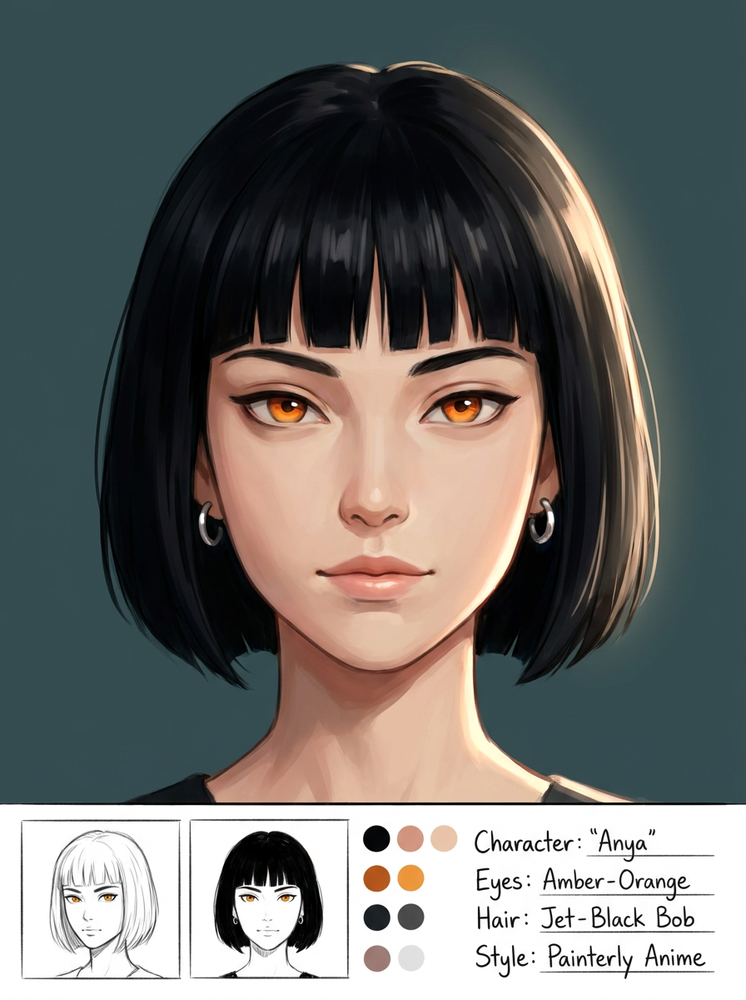
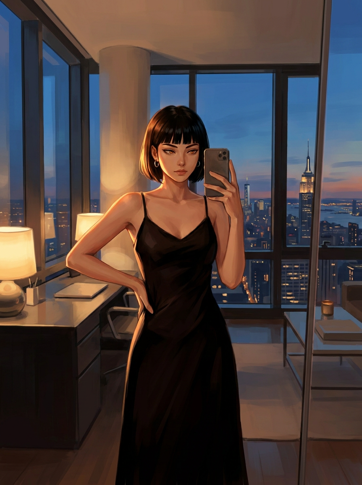

# Character Selfies — "Scene" mode (breaking out of the avatar's frame)

**Status:** Proposal (decisions locked 2026-08-18) · **Drafted:** 2026-08-18 · **Repos:** goodgirlsbotclub (frontend) + ggbc-backend · **Builds on:** [`character-selfies-design.md`](character-selfies-design.md) (Phases 0–2.5, all shipped)

The selfie feature works: a character sends an identity-consistent photo of themselves inline in chat (SFW via Replicate FLUX Kontext; NSFW via the self-hosted Kontext + undress-LoRA keyframe). But every selfie is **the avatar, lightly edited** — same pose, same framing, same setting. Ask for "a full-body mirror selfie in her penthouse overlooking Manhattan" and you get a close crop of the avatar in the avatar's own setting, because our generator is an image **editor**, not a **photographer**. This doc specifies a second selfie mode — **"Scene"** — that puts the character in genuinely new places and poses while keeping their identity and art style.

---

## 1. Why the current selfie can't roam

FLUX Kontext is an **instruction-following image editor**: it takes the avatar as input and makes the *smallest* change that satisfies the instruction. That is exactly why it preserves identity so perfectly — and exactly why it can't relocate/re-pose. The two asks are opposites:

> **"preserve the input"**  ⟂  **"put them somewhere new, in a new pose"**

This is already documented as the Phase 1 finding: *Kontext prioritizes preserving the source avatar (identity / outfit / scene / lighting) over the text descriptors — great for consistency, weak for "somewhere different."* The NSFW-undress prompt fix (2026-08-18) leaned **harder** into surgical, no-reframe editing to make the undress reliable — which is directly at odds with scene variety. You can't prompt your way out of this; you need a different **kind** of model for the "new scene" case.

So Kontext stays as one mode, and we add a second.

---

## 2. The two modes

| Mode | Engine | Strength | Use it for |
|---|---|---|---|
| **Close-up** (today) | FLUX Kontext (edit-in-place) | **Pixel-perfect** avatar fidelity, zero scene drift | "she smiles at the camera", quick reaction selfies — the avatar, framed as a selfie |
| **Scene** (new) | Reference-conditioned **generator** | **Full** scene/pose/framing freedom, identity + art-style held (not pixel-perfect) | "full-body mirror selfie in her penthouse", "on the beach at sunset", "sitting at a café" |

The tradeoff is fundamental and worth stating plainly: **fidelity ↔ freedom.** Close-up maxes fidelity by never leaving the avatar's frame; Scene trades a little fidelity for the freedom to leave it. There is no single model that gives both — so we expose both and let the moment decide.

---

## 3. Architecture — the two-stage pipeline

Scene mode is **two stages**, which cleanly separates the two hard problems:

```
avatar (character/{avatar} blob)
   │
   ▼  STAGE 1 — reference-conditioned generator (SFW, hosted, BYO key)
   │    "put THIS character in <scene/pose>, keep their look + art style"
   │    → the character, clothed, in a brand-new scene
   │
   ├── SFW Scene selfie → done (return Stage-1 image)
   │
   ▼  STAGE 2 — existing Kontext + undress-LoRA (self-hosted RunPod)
        surgical "remove the clothing, change nothing else" on the Stage-1 image
        → the character, nude, in the new scene
```

Why this shape is the right one:

- **Stage 1 does the roaming** — a reference-conditioned generator composes a *new* image from the avatar reference, so it can go anywhere.
- **Stage 2 does the undress, surgically** — because Stage 1 already set the scene, Stage 2 is a pure in-place "remove clothing" edit, which is the **reliable** Kontext-undress case (the one the 2026-08-18 fix nailed). Scene relocation and undress never fight each other, because they happen in different stages.
- **Stage 2 is unchanged** — it's the existing `nsfw` path. SFW Scene selfies never touch it.

### The one honest caveat: fidelity is capped by Stage 1

Kontext conditions on a **single** input image — it can't reach back to the original avatar to "restore" identity. So Stage 2 faithfully preserves **Stage 1's** character, not the card's. If Stage 1 drifts a little, Stage 2 locks that drift in. Net: **Scene-mode fidelity = Stage-1 fidelity**, and Kontext adds no identity benefit here — it's only doing the undress. That's inherent to any "new scene" approach; the lever is *choosing the best Stage-1 model.*

---

## 4. Prototype — it works

Tested on 2026-08-18 with **nano-banana-pro** (Google Gemini image, a reference-conditioned editor of the recommended class), reproducing the exact case that fails on Kontext.

**Reference "avatar" (generated stand-in):** a distinctive painterly-anime character — black bob, blunt bangs, amber eyes, hoop earrings.



**Stage-1 result — "@char full-body mirror selfie in her penthouse office overlooking Manhattan, holding a phone, black slip dress":**



Identity held (same face, bob, bangs, eyes, earrings), **art style held** (painterly/illustrated, not photo-realified), and the scene is **entirely new** — full-body, standing, phone raised in a mirror, Manhattan skyline through floor-to-ceiling windows, warm dusk interior. This is precisely the "break out of the avatar's bounds" case, working in **one** Stage-1 call. (A production reference would be the character's actual `character/{avatar}` art; a stand-in was used here only because the hosted service can't fetch an auth-gated blob URL.)

---

## 5. Stage-1 model landscape (researched + verified against live model pages, 2026-08-18)

| Family | Verdict | Why |
|---|---|---|
| **Reference-conditioned editors** — Nano Banana / Gemini image, **Qwen-Image-Edit-2509** | ✅ **Winner** | Condition on the reference's actual **pixels**, so identity **and drawn art style** survive a full scene change. Hosted BYO-key, ~cents/image, seconds. Prototype-proven. |
| IP-Adapter (classic / FLUX / SDXL-face) | ❌ | Its own maintainers state FLUX.1-dev-IP-Adapter is *"not for … character consistency."* A loose style/subject embedding, not an identity lock; face variants photoreal-ify drawn characters. |
| InstantID / PuLID / PhotoMaker | ❌ | Keyed on a **real-face** embedding — PuLID literally errors *"No faces detected"* on anime; photoreal base. Wrong tool for illustrated characters. |
| **Kontext multi-image** (`fal-ai/flux-pro/kontext/max/multi`, $0.08/img; or our own worker) | ⚠️ Situational | Best style fidelity (edits the drawn image, never photo-ifies) + **lowest integration effort** (reuses our worker). But weak at *text-driven* scene change **unless** you feed it a 2nd scene/pose reference image. Good as a "reframe using a reference photo" mode, not the primary text-to-scene generator. |
| **Per-character LoRA** (`replicate.com/ostris/flux-dev-lora-trainer`, ~$1.85 one-time train + a synthetic-view bootstrap) | ✅ **Premium tier** | Best fidelity **and** full freedom — the only path that both locks the exact drawn look and composes truly novel scenes. Costs an async train step + storage per character, and needs ~6–15 bootstrap views generated from the single avatar (via the existing Kontext editor) to avoid single-image overfit. |

**The key constraint that decides all of this:** GGBC characters are **illustrated / stylized**, not photoreal. Any model built around a *face encoder* (InstantID/PuLID) forces realism and loses the art. The winners are whole-image reference editors — and they hold anime specifically when the reference is anime and you don't ask them to cross styles (illustrated in → illustrated out), which is exactly our case.

### Recommended pick

- **Default Scene engine:** a reference-conditioned editor via a **hosted BYO-key** endpoint — **fal.ai `nano-banana-pro/edit`** (Gemini image, prototype-proven) or **Qwen-Image-Edit-2509** (open-weight, also multi-image, anime-friendly, cheaper/self-hostable). Keep it swappable behind our backend like the existing image-gen backends.
- **Premium Scene engine (in scope now):** opt-in **per-character LoRA** for favorite characters / power users — committed scope, built in parallel with the hosted Scene mode (see §8, decision 3).
- **Kontext-multi:** revisit if we add a "use a reference photo for the pose/setting" affordance — it's a one-pass win *when the user supplies a scene reference*, but not for pure text-driven scenes.

---

## 6. Integration into GGBC

### Contract

Extend the existing selfie request with a **mode** (defaulting to today's behavior, so nothing changes for Close-up):

```jsonc
POST /api/selfie/generate
{
  "characterName": "Ivy",
  "prompt": "full-body mirror selfie in her penthouse overlooking Manhattan",
  "tier": "sfw",              // sfw | nsfw  (unchanged — the undress tier)
  "mode": "scene"            // NEW: "closeup" (default) | "scene"
}
```

- `mode: "closeup"` → today's path exactly (Kontext edit). Backward-compatible default.
- `mode: "scene"`, `tier: "sfw"` → **Stage 1 only** (reference editor), return the image.
- `mode: "scene"`, `tier: "nsfw"` → **Stage 1 → Stage 2** (reference editor, then the existing RunPod Kontext undress on the Stage-1 output). Same `generation:video` gate as today's nsfw.

The async job/poll contract (`{jobId}` → `GET /selfie/status/{jobId}`) already accommodates a multi-stage NSFW render — no client-shape change beyond the new `mode` field.

### Backend

- New `_generate_scene_sfw(avatar_bytes, prompt)` calling the hosted reference-editor with the avatar as the reference image + the scene prompt. Add it as a swappable "scene backend" alongside the Replicate/RunPod paths (mirrors the image-gen backend abstraction).
- Credentials: **BYO key** — `api_key_fal` (or `api_key_google` for Gemini direct), resolved like the existing `api_key_replicate` / `api_key_runpod`. Fits the platform's BYO-key direction.
- NSFW Scene: feed Stage-1's PNG bytes into the existing `_render_keyframe_only` undress path — it already takes an arbitrary input image, so no scene-worker change.

### Frontend

- `TakeSelfieModal` gains a **mode toggle** ("Close-up" / "Scene"); Scene shows the descriptor box as a real scene/pose prompt (Close-up keeps today's light hints). The `[selfie:…]` auto-trigger stays **Close-up + SFW** for v1 (cheap, fast, no BYO-fal-key assumption) — Scene is a deliberate manual choice, like the tier picker.
- Gate the Scene option on a configured scene backend key (same pattern as `hasReplicateKey()` in `selfieStore`).

### Safety

The avatar-provenance gate and permission checks are **unchanged and still apply** — Scene mode generates *from the same cleared avatar*, so it inherits the same NCII protection. NSFW Scene keeps the `generation:video` containment.

---

## 7. Costs & latency (verified where noted)

- **Stage 1 (reference editor):** ~cents/image, seconds. (fal FLUX-class ~$0.025–0.035/MP; Nano Banana / Qwen comparable; confirm exact on the chosen endpoint.) BYO key — the user pays.
- **Stage 2 (NSFW undress):** unchanged — the existing RunPod Kontext keyframe (~seconds warm; the ~8-min cold-start model download is a separate, already-understood tradeoff — see the scene-worker Dockerfile notes).
- **Premium LoRA:** ~$1.85 one-time train/character (verified: Replicate `ostris/flux-dev-lora-trainer`) + a few cents/image, + a bootstrap generation step.

SFW Scene = one fast hosted call. NSFW Scene = one fast hosted call + the existing RunPod undress.

---

## 8. Decisions (locked 2026-08-18)

1. **Scene backend — hosted fal `nano-banana-pro/edit`, BYO key.** Prototype-proven and fastest to ship; the user supplies their own key (`api_key_fal`), consistent with the platform's BYO-key direction. SFW-only-by-policy is fine — Stage 2 does the nudity. Kept **swappable** behind the backend, so **Qwen-Image-Edit** (open-weight, self-hostable) stays a drop-in alternative if we later choose to bundle Scene into the flat sub instead of BYO.
2. **Auto-trigger stays Close-up + SFW only.** The model's automatic `[selfie:…]` tag never spends on Scene — Scene is a deliberate **manual** choice (like the tier picker). No surprise fal spend, no auto-trigger key requirement.
3. **Premium per-character LoRA is in scope *now* — built alongside Scene, not deferred.** The LoRA path (async train step + LoRA storage + synthetic-view bootstrap) is committed and developed **in parallel** with the Scene phases, rather than gated behind a "once Scene proves out" prove-out. It still ships as its own premium tier; only the *timing* changes — the infra work starts now.
4. **Gate Phase A on a real-avatar validation pass.** Before committing the hosted backend, validate nano-banana on a handful of *actual* GGBC character cards (some more illustrated, some more semi-real) — the prototype used a stand-in. This is a Phase-A prerequisite, not a fork.

---

## 9. Phasing

User-facing rollout stays sequential (SFW Scene → NSFW Scene → LoRA tier), but per decision 3 the LoRA infra is **committed and built in parallel** starting now — it is *not* gated behind Scene proving out.

- **Phase A — SFW Scene mode.** `mode` field + hosted reference-editor backend (BYO fal key) + the `TakeSelfieModal` toggle. Cheapest, no new infra, immediately useful ("Ivy anywhere"). **Gated on the real-avatar validation pass (decision 4).**
- **Phase B — NSFW Scene mode.** Chain Stage-1 → the existing Kontext undress for `mode:scene, tier:nsfw`. No scene-worker change. **Safety precondition (2026-08-19 Phase A review):** unlike Kontext, a *generator's* output is not bounded by its input pixels — the provenance gate clears the reference **avatar**, but a scene prompt could summon people the gate never cleared. Phase A contains this with a single-subject prompt anchor (only the reference character, no other people, never a real person) and by being SFW-only. Phase B **must not** pipe Stage-1 output into the undress worker on that prompt-level guard alone: it needs an output-side gate first (identity/similarity check of the Stage-1 image against the avatar, or real-person/likeness moderation of scene prompts). Otherwise this seam becomes a text-driven NCII path around the avatar-upload red line.
- **Phase C — Premium per-character LoRA (in scope now, built in parallel).** Opt-in "train your character" + LoRA storage + the synthetic-view bootstrap; unlocks max fidelity + freedom for favorites. Development runs alongside Phases A/B; it lights up as its own premium tier when ready.
- **Phase D (maybe) — Kontext-multi "reference photo" affordance.** Let the user supply a scene/pose reference image for a one-pass reframe.

---

## 10. TL;DR

Kontext is a photo *editor* — it can't leave the avatar's frame, and that's structural, not a prompt problem. Add a **Scene** mode: a reference-conditioned **generator** (nano-banana / Qwen-Image-Edit) puts the character in any scene/pose while holding identity + art style (proven), and for NSFW we chain the *existing* Kontext undress behind it (surgical, reliable). Fidelity is capped by the Stage-1 model, so the model choice is everything — and for illustrated characters, whole-image reference editors beat every face-encoder approach. Ship SFW Scene first (BYO fal key, no new infra), then NSFW Scene, with premium per-character LoRA now committed scope and built in parallel.
