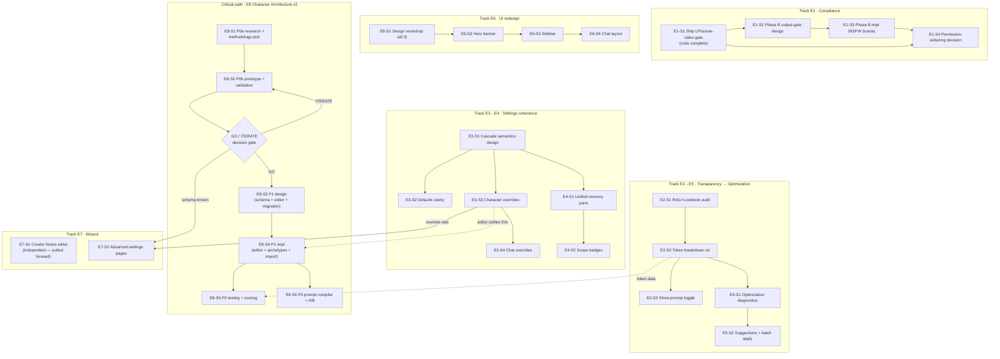

# GGBC Roadmap — Phases 10.2–12+

**Prepared:** 2026-08-24 · **Role:** Product Manager synthesis of `HANDOFF_FABLE_GGBC_PRODUCT_PLAN.md` + 7 initiative docs
**Status:** ✅ **Approved by Sammy 2026-08-24** · in-repo at `docs/product-roadmap-10.2-12.md` (merged via PR #443) · Epics/Stories are live for agent-team execution
**Scope:** 6 feature initiatives + Character Architecture v2, sequenced around real in-flight work (verified against GitHub + the droplet-adjacent memory trail today, not against the handoff's snapshot)

---

## 0 · TL;DR

- **The critical path is Character Architecture v2** (research → validation gate → build). It's the strategic moat, it's design-first, and it partially gates the Character Wizard. Everything else runs as parallel tracks that ship user-visible value while Arch v2 derisks.
- **The first shippable item is already built:** the Live-Portrait/scene-video provenance gate (compliance) exists on two **local, unpushed branches**. Phase 10.2 starts by reviewing and shipping it.
- **Three handoff claims were stale** (verified today): Phase 10.1 merged in April, theme customization shipped in May, and Selfies Phase 3 (attested upload) deployed on 08-23. The roadmap below reflects ground truth — see §1.
- **Two dependency corrections** change the sequencing: the Creator Notes editor does *not* need to wait for Arch v2, and Wizard Phase 2 must be built **on the Settings Cascade's override rails**, not as its own mechanism.
- Six macro-phases (10.2 → 12+), nine epics, ~34 stories, each with tasks, acceptance criteria, an agent-tier assignment with one-line reasoning, and a token-size band. Kanban starting state in §7.

---

## 1 · Corrections to the handoff (verified 2026-08-24)

The handoff (dated 08-24, drafted from memory) carries several stale claims. I verified each against GitHub and current memory before sequencing. **These corrections remove two work items and re-scope a third.**

| Handoff claim | Ground truth (verified today) | Roadmap consequence |
|---|---|---|
| "Phase 10.1 in flight; PR #58 awaiting merge" | **PR #58 merged 2026-04-12.** No open PRs in either repo. | Phase 10.1 is DONE. Nothing gates on it. Removed from the plan; bookkeeping only (E9-S2). |
| "Phase 6.1 theme customization: color picker, CRUD, import/export, gallery remaining" | **All four shipped ~2026-05-01** (`ThemeEditorPage.tsx`, `themeStore.ts` save/delete, gallery — verified in code 2026-07-31). | Removed from the plan entirely. Not filler, not backlog — done. |
| "Selfies Phase B (output gate) + Phase C (LoRA + attested upload) pending" | **C1, C2, and Phase 3 (content-bound provenance = the attested-upload NCII fix) merged + deployed 2026-08-23** (backend #75, frontend #436, migration 0027, 40/40 rows pinned). What actually remains: (a) the **LP/scene-video provenance gate — code complete on two local branches, unpushed** (backend `claude/vigilant-wilson-a8d2d5` @ `8e94a97`, frontend `claude/upbeat-shamir-8919c9` @ `ad774ba5`); (b) **Phase B (NSFW Scene)**, hard-blocked on an output-side gate; (c) C3 (management + Replicate alt backend). | Compliance epic (E1) re-scoped: ship the built gate first (days, not weeks), then design the Phase B output gate. C3 → backlog. |
| "Character wizard gates on Arch v2 Phase 0" | Only **partially** true. Wizard P1 (Creator Notes editor) is display-layer — orthogonal to how behavior is defined. Only Wizard P2 (advanced-settings pages) is invalidated if Arch v2 changes the definition schema. | Wizard P1 pulled forward to Phase 11.1 as an independent win; Wizard P2 stays gated. |
| (Not in handoff) | Wizard P2's "advanced generation settings per character" **is** the Cascade's character-override feature, surfaced in a wizard. | New hard dependency: E7-S2 builds on E3-S3's override rails. One override mechanism, not two. |
| (Not in handoff) | Cascade P2 (character-overrides page) and Arch v2 P1 (structured-definition editor) **both refactor the character editor.** | Deliberately sequenced (11.1 vs 12) to avoid two concurrent rewrites of the same surface. |

Also renamed to avoid numbering collision: the old ST-roadmap items "10.2 more cloud providers" and "10.3 text-completion API" become backlog stories **E9-S3 / E9-S4**. The macro-phase numbers 10.2+ below refer to this roadmap.

---

## 2 · Sequencing rationale (the "why")

**1. Compliance ships first because it's already paid for.** The LP/scene-video gate closes a real hole (scene-video's undress prompt currently runs on *any* avatar, contained only by `generation:video` being owner-only). The code is written and tested; the remaining cost is push → PR → adversarial review → merge → deploy. Shipping it also unblocks the later decision to widen media permissions beyond owner (E1-S4). Cheapest risk-reduction on the board.

**2. Arch v2 starts immediately but ships last.** It's the longest chain (research → prototype → validation → GO gate → schema → editor → testing → prompt compiler) and the only initiative with a genuine kill-decision in the middle. Starting Phase 0 in week 1 means the GO/ITERATE gate lands around week 5 — early enough that a "iterate" verdict costs a research cycle, not a build. Nothing implementation-heavy is scheduled on top of it until the gate passes.

**3. Transparency before optimization.** The Optimization Agent (E5) needs per-section token data to make claims like "archive this WI entry, save 450 tokens." That data comes from Token Breakdown (E2-S2), whose section taxonomy comes from the RAG+Lorebook audit (E2-S1). So the order is fixed: audit → breakdown → agent. The audit is cheap and read-only; it starts in 10.2.

**4. Cascade design before Memory Pane and before Wizard P2.** The Memory Pane's Phase 2 ("which entries apply where") is a *rendering* of the cascade's scoping rules — designing badges before the precedence semantics exist means designing them twice. And Wizard P2's per-character generation settings must reuse the cascade's character-override mechanism. The cascade **design doc** (E3-S1, cheap) therefore lands in 10.3, ahead of both consumers, even though cascade *implementation* stretches across 11.1–11.2.

**5. UI redesign is one workshop, three staggered ships.** Hero, sidebar, and chat layout share a design language, so they're designed together in one Fable workshop (10.2), then implemented in ascending order of blast radius: hero (one page) → sidebar (app shell, touches every route) → chat layout (responsive complexity). The track is independent of everything else and gives each phase a user-visible win.

**6. Timeline is review-bandwidth-gated, not calendar-gated.** Agent teams have shipped whole phases in days when reviews were available (C1→C2→Phase 3 took ~a week). The week ranges below assume Sammy reviews 2–3 substantial PRs per week; compress or stretch them accordingly. Every macro-phase ends with a deploy + checkpoint, so the plan degrades gracefully if a phase takes longer.

**7. Honest metrics for a 9-user platform.** Success criteria below use measurable-in-app numbers (token deltas, gate coverage, test counts) and qualitative creator confidence — not DAU vanity metrics that are noise at this scale. The platform is the testing ground for the production-platform vision; the metrics that matter are "does this make the owner-tier experience trustworthy and efficient."

---

## 3 · Dependency graph

Solid arrows are hard blocks; dotted are informs-but-doesn't-block. The **critical path** is the E8 chain — it has the only decision gate and the largest build. E1-S1 is the **urgent path** (built compliance code sitting unmerged).

---

## 4 · Phase plan

Phases are sequenced milestones, not calendar promises; each ends with deploy + review checkpoint. Week ranges assume 2–3 substantial reviews/week from Sammy.

### Phase 10.2 — Compliance closeout + foundations (~weeks 1–2)

| Item | Track | What ships / what exists after |
|---|---|---|
| **E1-S1** Ship LP/scene-video provenance gate | Compliance | Both branches pushed, PR'd, adversarially reviewed **before** merge, deployed; uncleared avatars 403 on all animation paths |
| **E2-S1** RAG + Lorebook injection audit | Transparency | Reference doc: actual precedence, overlap measurement, section taxonomy for E2-S2 |
| **E8-S1** Arch v2 P0a — research + methodology pick | Critical path | Competitive analysis + chosen methodology (per doc: Core Values + Decision Framework + Testing) |
| **E6-S1** UI design workshop (hero + sidebar + chat) | UI | Approved mockups for all three surfaces, responsive + dark-mode + a11y annotated |
| **E9-S1** Phase 5.3 swap-vs-join | Quick win | Small isolated feature; finishes old Phase 5 |
| **E9-S2** Roadmap bookkeeping | Hygiene | 10.1/6.1 marked done in docs + memory; this roadmap committed to `docs/` |

**Phase token band:** ~1.5–3M output tokens (dominated by E1-S1's review workflow + E8-S1 research fan-out).

### Phase 10.3 — Transparency + first visible wins (~weeks 3–5)

| Item | Track | What ships |
|---|---|---|
| **E2-S2** Token breakdown visualization | Transparency | Per-turn section breakdown in the usage panel |
| **E2-S3** Show-prompt toggle | Transparency | Exact-prompt viewer (user-only) |
| **E3-S1** Cascade semantics design doc | Settings | Reviewed precedence spec + store-refactor plan — unblocks E3 impl, E4, E7-S2 |
| **E6-S2** Hero banner | UI | Landing-page carousel live |
| **E8-S2** Arch v2 P0b — prototype + validation | Critical path | 5–10 reimagined characters, measured token + consistency comparison, validation report |
| **E1-S2** Phase B output-gate design | Compliance | Red-teamed design doc for the output-side identity gate |

**Ends with the Arch v2 GO/ITERATE gate** — the roadmap's single most important checkpoint. **Phase token band:** ~2–4M (E8-S2's behavior probes are a workflow fan-out; E2-S2 touches `buildConversationContext()` and needs a full adversarial review).

### Phase 11.1 — Settings coherence + compliance impl (~weeks 6–8)

| Item | Track | What ships |
|---|---|---|
| **E3-S2** Cascade P1 — defaults clarity | Settings | Defaults section + "what's active now" indicators |
| **E3-S3** Cascade P2 — character overrides | Settings | Override rails in the character editor (the risky store refactor) |
| **E6-S3** Sidebar | UI | Collapsible nav shell, mobile drawer |
| **E5-S1** Optimization Agent P1 — diagnostics | Transparency | Severity-ranked findings report on real settings |
| **E1-S3** Phase B impl — output gate + NSFW Scene | Compliance | Only if E1-S2's design was approved; otherwise stays blocked (acceptable outcome) |
| **E7-S1** Creator Notes editor | Wizard | Rich-text editor + live preview + templates (pulled forward — no Arch v2 dependency) |

**Phase token band:** ~2.5–4.5M (E3-S3 and E1-S3 are the heavyweights, both mandatory-adversarial-review).

### Phase 11.2 — Memory + chat + overrides completion (~weeks 9–11)

| Item | Track | What ships |
|---|---|---|
| **E3-S4** Cascade P3 — chat overrides | Settings | Per-chat override panel, persisted to chat metadata |
| **E4-S1** Unified memory pane | Settings | `/settings/memory` with WI / Lorebooks / Data Bank tabs + cross-type search |
| **E4-S2** Scope badges | Settings | Every entry shows where it applies, per cascade semantics |
| **E6-S4** Desktop chat layout | UI | 1/3 full-bleed avatar; mobile unchanged |
| **E5-S2** Optimization Agent P2 — suggestions | Transparency | Approve-batch flow with measured before/after |
| **E8-S3** Arch v2 P1 design | Critical path | Schema + editor design + migration design, red-teamed (design only — editor code waits for E3-S3 to settle) |

**Phase token band:** ~2–4M.

### Phase 12 — Character Architecture v2 build (~weeks 12–16)

| Item | Track | What ships |
|---|---|---|
| **E8-S4** Arch v2 P1 impl | Critical path | Structured character editor + archetype library + lossless ST-card migration for all 42 existing characters |
| **E7-S2** Wizard P2 — advanced settings | Wizard | Wizard pages on cascade rails + Arch v2 fields |
| **E8-S5** Arch v2 P2 — behavioral testing + scoring | Critical path | Scenario-probe validator, token-impact report, confidence score |
| **E8-S6** Arch v2 P3 — prompt compiler + A/B harness | Critical path | Structured-data → system-prompt generation with adversarial anti-drift patterns; old-vs-new A/B |

**Phase token band:** ~4–7M (the build phase; E8-S4 is the roadmap's only XL).

### Phase 12+ — Optional tail (post-gate, prioritize on results)

E5-S3 interactive optimization loop · E7-S3 wizard AI suggestions · E4-S3 memory folders/cross-links · E3-S5 settings visual restructure · E8 P4 (modular stack, world bindings, interaction archetypes) · E9-S3 cloud providers · E9-S4 text-completion API · E9-S5 Selfies C3.

---

## 5 · Epics — stories, tasks, acceptance criteria, tiers

Tier notation per Sammy's delegation practice: every assignment carries one-line reasoning; the barbell rule applies (cheap tiers for mechanical loud-failure work, strong tiers for design/synthesis/verification — **never economize on verifiers**). Size bands (output tokens, incl. review workflows): **S** ≤150k · **M** 150–500k · **L** 0.5–1.5M · **XL** >1.5M. Bands are planning estimates — calibrate against 10.2 actuals and report per-phase spend after each run.

---

### E1 · Media Provenance Completion — *Compliance* 🔴 priority

Close the remaining avatar-provenance holes so every media-generation path (selfie closeup/scene/studio, live portrait, scene video) is gated fail-closed on content-bound clearance, and unblock the future decision to widen media permissions beyond owner tier. This is the platform's defining red line: fictional-characters-only, never real-person depiction.

**Epic success criteria**
- All 5 media-generation paths verify content-bound provenance fail-closed (NULL pin ⇒ blocked); confirmed by kill tests that are **mutation-verified** (delete the gate → suite goes red).
- NSFW Scene (Phase B) ships only with the output-side gate live — or ships not at all. "Blocked" is an acceptable end state; a bypass is not.
- Permission-widening decision (E1-S4) is made with a written brief, not by default.

#### E1-S1 · Ship the LP/scene-video provenance gate — **✅ DEPLOYED 2026-08-24 (Pilot 1)** · Size S–M (actual: over band, ~1.3M — trigger-tier review dominates)
Outcome: intake ground-truthing found the backend half already merged+deployed by another session (#76/#77 — the local `claude/vigilant-wilson-a8d2d5` was superseded and would have regressed main; deleted). Frontend leg rebased past the #437 overlap, trigger-tier reviewed (4 confirmed coverage findings fixed + mutation-verified; correctness/bypass lenses clean), QA'd, shipped as #446.

| # | Task | Tier — reasoning |
|---|---|---|
| 1 | Push both branches, open PRs with deploy-order note (frontend at-or-before backend is harmless — pre-blocks what the server would 403) | Haiku — mechanical git/gh work |
| 2 | Adversarial review **before merge** (backend gate = security surface; frontend = advisory pre-gate) | Fable-orchestrated multi-lens workflow — security verification is never economized |
| 3 | Merge + deploy both; prod verify: uncleared avatar → 403 with rendered detail text on LP and scene-video; cleared avatar → normal generation | Sonnet — scripted verification against the droplet |

**Acceptance:** `POST /api/live-portrait/generate` and `/api/scene-video/generate` 403 uncleared avatars in prod · frontend shows the not-cleared notice + disabled Generate, and scene modal short-circuits **before** the paid summarizer call · no regression for cleared avatars · review findings resolved pre-merge, not in a follow-up PR.

#### E1-S2 · Phase B output-side gate design — **Kanban: Design** · Size M
The load-bearing precondition (recorded in `selfie.py`'s docstring): no chaining Scene stage-1 output into the undress worker without an output-side identity gate — otherwise it's a text-driven NCII path around the avatar-upload red line. Validation data says the single-subject anchor doesn't sterilize background figures (2/4 runs).

| # | Task | Tier — reasoning |
|---|---|---|
| 1 | Design doc: evaluate identity/similarity-vs-avatar verification vs likeness moderation vs hybrid; failure modes; cost per generation; what "gate fails" does to UX | Fable — safety-critical design synthesis |
| 2 | **Red-team the design pre-code** (this practice already caught a scope hole + schema miss on Phase 3) | Fable-orchestrated adversarial workflow |
| 3 | Decision brief for Sammy: ship-shape / needs-prototype / not-shippable-yet | Fable — recommendation with visible reasoning |

**Acceptance:** doc merged to `docs/` · red-team findings addressed in the design · explicit Sammy sign-off before any E1-S3 code.

#### E1-S3 · Phase B implementation — NSFW Scene — **Kanban: Backlog (gated on S2)** · Size L

| # | Task | Tier — reasoning |
|---|---|---|
| 1 | Output-side gate implementation per approved design | Opus — subtle safety logic against a hostile threat model |
| 2 | Scene stage-1 → undress stage-2 chaining behind the gate | Opus — cross-service pipeline with the containment premise shift |
| 3 | Kill tests for every gate predicate, **mutation-verified** | Sonnet writes, Fable-orchestrated mutation pass verifies — a kill test that doesn't kill is false confidence |
| 4 | Full adversarial review before merge; deploy; prod smoke on a real key | Fable orchestration + Sonnet verification |

**Acceptance:** NSFW Scene renders only when the output-gate passes · gate-fail path is user-legible (no silent downgrade) · mutation pass proves each kill test bites · zero regressions in the 850+ backend suite.

#### E1-S4 · Permission-widening decision — **Kanban: Backlog** · Size S
After S1 (+S3 if shipped): brief on widening `generation:video` / `generation:lora_train` beyond owner tier, per the tier-on-features monetization model. Fable writes the brief; Sammy decides. **Acceptance:** written go/no-go with the residual-risk list.

---

### E2 · Prompt Transparency — *RAG audit + Token Breakdown*

Make every token in a turn attributable: audit how RAG and Lorebook actually inject, then show users a per-section breakdown and the exact prompt. Foundation for E5.

**Epic success criteria**
- Injection precedence is documented from code, not intention, and covered by a regression test.
- Per-turn breakdown visible in-app; section sum matches the reported total within tokenizer-estimate tolerance.
- "Show prompt" renders the exact assembled prompt, user-only, excluded from exports/shares.
- The audit surfaces at least one concrete redundancy or ordering fix worth filing.

#### E2-S1 · RAG + Lorebook injection audit — **Kanban: Ready for Dev** · Size S–M

| # | Task | Tier — reasoning |
|---|---|---|
| 1 | Trace `buildConversationContext()` + `buildGroupConversationContext()`: map injection points, order, dedup (or absence) | Explore agents — read-only fan-out search |
| 2 | Live trace: one character with RAG + Lorebook enabled, inspect the real assembled prompt | Sonnet — hands-on repro in the dev stack |
| 3 | Measure overlap on ~10 sample chats; write up precedence + the section taxonomy E2-S2 will visualize | Fable — synthesis; the taxonomy choice shapes two downstream epics |

**Acceptance:** `reference_rag_lorebook_injection.md` updated with *actual* semantics · taxonomy list approved · findings filed as issues where fixes are warranted.

#### E2-S2 · Token breakdown visualization — **Kanban: Backlog (gated on S1)** · Size M–L

| # | Task | Tier — reasoning |
|---|---|---|
| 1 | Instrument prompt assembly to emit per-section counts (reuse existing token-counting infra — don't re-implement) | Opus — `buildConversationContext()` is load-bearing; a regression here corrupts every generation |
| 2 | Regression tests pinning section order + RAG/Lorebook coexistence | Sonnet — the safety net for task 1 |
| 3 | Breakdown UI (stacked bar/pie, per-turn + on-demand, drill-in) via the dataviz skill | Sonnet — standard component work against a spec |
| 4 | Adversarial review before merge (prompt-assembly refactor = trigger condition) | Fable-orchestrated |

**Acceptance:** breakdown shows system / WI-lore / history / character / author's-note / user / RAG sections summing to the turn total · zero diff in assembled prompts before vs after instrumentation (golden-prompt test) · works in solo + group chats.

#### E2-S3 · Show-prompt toggle — **Kanban: Backlog** · Size S–M
Toggle in generation panel → formatted exact-prompt viewer; user-only, never in exports. Sonnet impl (contained feature on S2's plumbing), Haiku tests. **Acceptance:** rendered prompt is byte-identical to what was sent · excluded from share/export paths · toggle state persists.

#### E2-S4 · Insights data API — **Kanban: Backlog** · Size S
Expose breakdown data through a store API for E5's agent. Haiku — mechanical once S2 exists. **Acceptance:** E5-S1 consumes it without touching prompt-assembly internals.

---

### E3 · Settings Cascade — *global → character → chat*

Make precedence explicit and identical in code and UI, and build the single override mechanism that the character editor, the chat panel, the wizard (E7-S2), and the memory pane's scope badges (E4-S2) all reuse.

**Epic success criteria**
- One documented precedence rule, enforced by one resolution function, covered by tests — no parallel override mechanisms anywhere.
- "What's in effect right now" answerable in ≤2 clicks from any chat.
- Overrides round-trip (set → persist → reload → apply) at character and chat level.
- Zero regressions in existing generation-settings behavior.

#### E3-S1 · Cascade semantics design — **Kanban: Design** · Size M

| # | Task | Tier — reasoning |
|---|---|---|
| 1 | Precedence spec: full setting inventory, which levels may override what, reset semantics, conflict display | Fable — this decision propagates into four other epics |
| 2 | Store-refactor plan for `generationStore` / `chatStore` / `worldStore` override flags + a single `resolveEffectiveSettings()` seam | Fable + Plan agent — architecture before code |
| 3 | Resolve the open question: are worlds first-class settings containers? (recommendation: not in v1 — power/complexity trade documented) | Fable — recommendation with visible reasoning |
| 4 | Design review with Sammy before any impl story starts | — |

**Acceptance:** reviewed doc in `docs/` · UI patterns (badges, indent, reset) specified · E4 + E7 leads sign off that the spec answers their scoping questions.

#### E3-S2 · Phase 1 — defaults clarity — **Kanban: Backlog** · Size M
Defaults section in Settings (world / generation / character / chat) + "X saved, Y active in current chat" indicators. Sonnet — well-specified UI against S1's spec; Haiku for copy + tooltip pass. **Acceptance:** every default shows its active/overridden state · indicators update live when overrides change.

#### E3-S3 · Phase 2 — character overrides — **Kanban: Backlog** · Size L
The risky story: store refactor + character-editor page.

| # | Task | Tier — reasoning |
|---|---|---|
| 1 | Store refactor implementing `resolveEffectiveSettings()` | Opus — async store orchestration is a named adversarial-review trigger; this is silent-failure territory |
| 2 | Character Overrides page (checkboxes expand to editable defaults, live "if active, generation uses X" preview) | Sonnet — UI on top of the resolved seam |
| 3 | Round-trip + precedence test suite | Sonnet — deterministic checks preferred over reviewer trust |
| 4 | Adversarial review before merge | Fable-orchestrated — mandatory for this trigger class |

**Acceptance:** overrides beat globals, lose to chat overrides, exactly per spec · disabling an override reverts cleanly · existing characters unaffected until an override is explicitly set · **E7-S2 and E4-S2 can consume the rails without new mechanism code.**

#### E3-S4 · Phase 3 — chat overrides — **Kanban: Backlog** · Size M–L
Expand the in-chat quick-settings panel to the full override UI; persist to chat metadata. Sonnet impl on the now-proven rails; Opus consult only if the persistence shape gets hairy. **Acceptance:** per-chat overrides survive reload · visibly badged in the chat UI · reset restores the character/global value.

#### E3-S5 · Phase 4 — visual restructure — **Kanban: Backlog (12+)** · Size M
Route-level `/settings` reorganization. Optional; only if S2–S4 leave navigation feeling scattered.

---

### E4 · Memory Pane Consolidation

One place to manage World Info, Lorebooks, and Data Bank, with scope made visible per the cascade spec.

**Epic success criteria**
- One route answers "where do I manage world knowledge"; the three old routes redirect.
- Cross-type search returns hits from all three types with type indicators.
- Zero CRUD regressions (import/export, batch ops, toggles all keep working).
- Every entry displays a scope badge consistent with cascade semantics.

#### E4-S1 · Unified memory pane — **Kanban: Backlog (gated on E3-S1)** · Size M–L

| # | Task | Tier — reasoning |
|---|---|---|
| 1 | `/settings/memory` with WI / Lorebooks / Data Bank tabs — port existing UIs, reuse existing CRUD logic | Sonnet — a port, not a rewrite; loud-failure work |
| 2 | Cross-type search + filter sidebar (by type, character, world) | Sonnet |
| 3 | Unified action bar (import/export, batch delete, enable/disable) + old-route redirects | Haiku — mechanical consolidation |
| 4 | Mobile pass (tabs vs slide-up sheet) + regression suite over all three CRUD paths | Sonnet |

**Acceptance:** all existing WI/lorebook/databank tests green · search hits across all three types · no orphaned routes.

#### E4-S2 · Scope clarity badges — **Kanban: Backlog (gated on E3-S3)** · Size M
Visual scope indicators per entry + a "why didn't this entry fire?" affordance. Sonnet — renders cascade data, doesn't invent semantics. **Acceptance:** badge text matches `resolveEffectiveSettings()` truth · the why-didn't-it-fire panel names the actual gate (not triggered / disabled / out of scope / budget).

#### E4-S3 · Folders + cross-linking — **Kanban: Backlog (12+)** · Size L
Collections, cross-references ("used by character X in chat Y"), draft preview. Post-gate optional.

---

### E5 · Settings Optimization Agent

A client-side agent that turns E2's data into savings: diagnostics first, then approve-to-apply suggestions with measured before/after.

**Epic success criteria**
- Diagnostics on the owner's real data produce ≥3 legitimate findings (validated by Sammy as "yes, that's real waste").
- Every suggestion carries a token impact estimate; applying shows measured before/after within ±10% of the estimate.
- Nothing auto-applies — review-and-approve only; batch apply is reversible.
- Runs fully client-side (settings never leave the browser for analysis).

#### E5-S1 · Diagnostics report — **Kanban: Backlog (gated on E2-S2)** · Size M–L

| # | Task | Tier — reasoning |
|---|---|---|
| 1 | Heuristics design: unused WI (not triggered in N recent chats), redundant lore, oversized prompts, budget misalignment — thresholds + severity levels | Opus — heuristic quality is the product; over-aggressive recommendations poison trust |
| 2 | Client-side analysis engine consuming E2-S4's data API | Sonnet |
| 3 | Report UI (severity-ranked findings: info / warning / critical) in a Diagnostics tab | Sonnet |
| 4 | Validate on the owner's real characters before calling it done | Sonnet + Sammy — ground truth check |

**Acceptance:** findings cite evidence ("entry X: 0 triggers in last 25 chats, 450 tokens/turn when active") · severity calibrated (no critical-spam) · runs without a backend round-trip.

#### E5-S2 · Suggestions + batch apply — **Kanban: Backlog** · Size M
Per-finding options with impact estimates → review list → approved batch apply → before/after token comparison. Sonnet impl; Haiku for the undo/revert plumbing. **Acceptance:** every applied change is individually revertible · measured delta displayed post-apply · declined suggestions stay declined (no nagging).

#### E5-S3 · Interactive optimization loop — **Kanban: Backlog (12+)** · Size L
Goal-driven iteration + A/B profile mode. Post-gate optional; benefits from Arch v2's structured definitions.

---

### E6 · UI Redesign — Hero + Sidebar + Chat

One design language, three staggered ships, ascending blast radius. Hero doubles as monetization real estate (feature-highlight slides) per the tier-on-features model.

**Epic success criteria**
- All three surfaces match the approved workshop mockups (Sammy signs off per surface).
- Keyboard + screen-reader accessible (carousel navigable, ARIA labels, focus states); axe clean on new surfaces.
- Dark mode correct via the existing CSS-variable theme system.
- Mobile: sidebar collapses to drawer; chat layout untouched on portrait; no horizontal scroll anywhere.

#### E6-S1 · Design workshop — **Kanban: Design** · Size M
All three surfaces in one Fable design-canvas session (hero slides incl. feature-highlight template, sidebar states expanded/collapsed/drawer, chat 1/3-avatar layout with breakpoint behavior), annotated for responsive + dark mode + a11y. Fable — this is the design-first gate for the whole epic. **Acceptance:** Sammy approves mockups; implementation stories inherit specs, not vibes.

#### E6-S2 · Hero banner — **Kanban: Backlog (gated on S1)** · Size M

| # | Task | Tier — reasoning |
|---|---|---|
| 1 | Carousel component (4–5 recent characters + feature slides, auto-advance 5–7s, manual controls, pause-on-hover, `prefers-reduced-motion` respected) | Sonnet — contained component against a mockup |
| 2 | Recent-characters data wiring + feature-slide config | Haiku — plumbing |
| 3 | Keyboard/ARIA pass + tests | Haiku — mechanical against the a11y annotations |

**Acceptance:** matches mockup · keyboard-navigable · catalog grid below unaffected · slide config editable without code changes.

#### E6-S3 · Sidebar — **Kanban: Backlog** · Size M–L
App-shell change: My Characters / Works / Personal sections, collapse-to-icons with localStorage persistence, mobile drawer, route coordination. Sonnet impl; **visual QA sweep across every route before merge** (app-shell = wide blast radius); Haiku for the persistence + tests. **Acceptance:** every existing route renders correctly with sidebar expanded/collapsed/drawer · state survives reload · no layout shift on load.

#### E6-S4 · Desktop chat layout — **Kanban: Backlog** · Size M
1/3 full-bleed avatar (viewport-height scaled) + 2/3 chat on desktop; existing single-column on mobile/portrait. Sonnet — CSS grid work with breakpoint tests. **Acceptance:** no regression in chat interactions (swipe, edit, branch UI) · avatar never distorts · clean behavior at tablet widths.

---

### E7 · Character Wizard — Advanced Settings

Creator Notes first (independent, pulled forward), advanced pages later on cascade rails + the Arch v2 schema.

**Epic success criteria**
- Creator Notes editor produces sanitized HTML that renders identically in preview and in the live info pane.
- ≥3 quality templates ship; a notes-from-template character looks visibly "premium" vs freeform text.
- Wizard P2 contains **zero** override mechanism of its own — it writes through E3's rails.
- Wizard remains skippable/linear; advanced pages are opt-in.

#### E7-S1 · Creator Notes editor — **Kanban: Backlog (schedule 11.1)** · Size M

| # | Task | Tier — reasoning |
|---|---|---|
| 1 | Rich-text/WYSIWYG editor step with live info-pane preview | Sonnet — mirrors the proven persona-wizard structure (copy-and-adapt) |
| 2 | HTML template library (≥3 presets: callouts, highlights, character-sheet layout) | Haiku — content + styling against the existing render path |
| 3 | Sanitization: confirm output flows through the existing DOMPurify path; add an XSS test vector suite | Sonnet — the one sharp edge in this story |

**Acceptance:** preview matches live render byte-for-byte post-sanitize · hostile HTML vectors neutralized (test-pinned) · templates insertable + editable.

#### E7-S2 · Advanced-settings pages — **Kanban: Backlog (gated on E3-S3 + E8 gate)** · Size M–L
Optional wizard pages: personality/tags, per-character generation settings **via cascade override rails**, lorebook defaults, connection profile, avatar/media settings. Sonnet impl; Opus consult on the wizard↔override-store seam. If the Arch v2 gate says GO, the personality page captures structured fields (values/conflicts/voice) instead of freeform — build it once, on the new schema. **Acceptance:** wizard-set generation settings are literally character overrides (visible in E3's UI) · skipping every advanced page still yields a valid character.

#### E7-S3 · Smart suggestions — **Kanban: Backlog (12+)** · Size M
AI-suggested notes/styling from greeting + personality inputs. Post-gate optional; premium-tier candidate.

---

### E8 · Character Architecture v2 — *the critical path* ⭐

Replace description-based character definition with behavioral definition (values, decision frameworks, conflict patterns, voice markers), validated by testing and compiled into drift-resistant prompts. The bet: higher behavior predictability at equal-or-lower token cost — the competitive moat SillyTavern's paradigm can't offer. Design-first with a hard GO/ITERATE gate; no build until the bet is measured.

**Epic success criteria**
- **P0 gate:** validation report on ≥5 reimagined characters shows measured behavior-consistency improvement at ≤ token parity vs their current definitions (targets set in E8-S1, agreed before prototyping — no moving goalposts). Explicit GO/ITERATE decision recorded.
- **P1:** all 42 existing characters migrate losslessly (old cards still render and chat identically until opted in).
- **P2:** every new-format character gets a confidence score + token-impact report before deploy.
- **P3:** A/B harness demonstrates the P0 result holds in real chat conditions, old vs new on the same character.

#### E8-S1 · P0a — research + methodology pick — **Kanban: Design** · Size M

| # | Task | Tier — reasoning |
|---|---|---|
| 1 | Competitive analysis (CharacterAI, Tavern lineage, structured-persona research) — what works, what fails, what nobody does | Fable + Explore/web research fan-out — strategy synthesis |
| 2 | Pick the prototype methodology (doc's candidate: Core Values + Decision Framework + Testing) and define P0 success metrics + targets **up front** | Fable — the gate criteria must precede the prototype |
| 3 | Scenario-probe battery design (betrayal, moral dilemma, genre-shift, adversarial user) for consistency measurement | Fable — measurement design determines whether the gate means anything |

**Acceptance:** methodology brief + measurable gate criteria approved by Sammy before E8-S2 spends tokens.

#### E8-S2 · P0b — prototype + validation — **Kanban: Backlog** · Size L

| # | Task | Tier — reasoning |
|---|---|---|
| 1 | Reimagine 5–10 existing characters in the new structure | Fable — the structure's expressiveness is being tested, so the strongest author writes |
| 2 | Run probe battery old-vs-new; score consistency blind | Workflow fan-out — probes parallelize; judging panel diverse-lens, strong tier (weak verifiers = false confidence) |
| 3 | Token accounting per behavioral element, old vs new | Haiku — mechanical counting |
| 4 | Validation report + GO/ITERATE recommendation | Fable — the roadmap's most consequential synthesis |

**Acceptance:** blind-judged consistency scores + token deltas against the pre-agreed targets · decision recorded with reasoning · if ITERATE: what to change and a bounded re-run budget (one iteration cycle before escalating to Sammy for a strategy call).

#### E8-S3 · P1 design — schema + editor + migration — **Kanban: Backlog (post-GO)** · Size M
Structured-definition schema, editor UX design, archetype-library shape, and the ST-card migration path (import → auto-extract → creator confirms). Fable, red-teamed before code — schema mistakes are forever. **Acceptance:** reviewed design doc · migration spec proves losslessness on paper for all current card fields.

#### E8-S4 · P1 impl — editor + archetypes + migration — **Kanban: Backlog** · Size XL
Sequenced after E3-S3 so the character editor isn't rewritten twice concurrently.

| # | Task | Tier — reasoning |
|---|---|---|
| 1 | Structured character editor (values, frameworks, conflicts, voice markers, growth arc) | Opus — the epic's core build |
| 2 | Archetype library (starter set, composable with personal layer) | Sonnet — content + composition on the schema |
| 3 | ST-card import/migration with lossless fallback (unmigrated cards behave exactly as today) | Opus — backward compat across 42 live characters is the sharp edge |
| 4 | Migration verification: automated old-vs-new render/chat equivalence for unopted characters | Sonnet — deterministic check, not reviewer trust |
| 5 | Adversarial review before merge | Fable-orchestrated — mandatory |

**Acceptance:** create/edit/migrate flows complete · unmigrated characters byte-identical in prompt assembly · archetype + personal layering produces coherent definitions · suite green.

#### E8-S5 · P2 — behavioral testing + confidence scoring — **Kanban: Backlog** · Size L–XL
Productize E8-S2's probe battery: in-app validator, token-impact report per element, confidence score with edge-case list. Opus impl; probe execution as workflows; consumes E2's token data. **Acceptance:** creator sees score + edge cases + token report pre-deploy · validator cost per run is displayed (BYO-key transparency) · score correlates with E8-S2's blind judgments on the reference set.

#### E8-S6 · P3 — prompt compiler + A/B harness — **Kanban: Backlog** · Size L
Structured data → system-prompt generation with adversarial anti-drift patterns; A/B harness comparing old vs new on the same character. Opus/Fable — prompt-methodology synthesis is the moat itself. **Acceptance:** compiled prompts beat freeform equivalents on the probe battery · A/B harness usable by Sammy on any character · token cost of compiled prompt ≤ freeform equivalent.

---

### E9 · Quick Wins & Closeout

**Success criteria:** filler never displaces gated work; docs/memory match reality at each phase end.

| Story | Item | Kanban | Tier | Size |
|---|---|---|---|---|
| E9-S1 | Phase 5.3 swap-vs-join card handling (finishes old Phase 5) | Ready for Dev | Sonnet impl + Haiku tests — small, isolated | S–M |
| E9-S2 | Bookkeeping: mark 10.1 + 6.1 done in docs/memory; commit this roadmap to `docs/` — **done 2026-08-24** (memory index fixed; roadmap merged via PR #443) | Deployed | Haiku — mechanical | S |
| E9-S3 | Additional cloud providers (old "10.2": DeepSeek, Cohere, …) | Backlog | Haiku/Sonnet per provider — pattern exists | S each |
| E9-S4 | Text-completion API support (old "10.3") | Backlog | Sonnet | M |
| E9-S5 | Selfies C3: LoRA management + Replicate alt backend | Backlog | Sonnet — both providers already researched | M |

---

## 6 · Delegation & review protocol (applies to every story)

1. **Review BEFORE merge — hard gate.** Every story's final task is an adversarial review of the branch, findings fixed on the branch, *then* merge. Never review-alongside or review-after (Phase 5 shipped 9 defects that way). Mandatory-trigger list for full multi-lens review: spread/layering refactors, async store orchestration, clients written against a backend contract, model-class swaps under safety gates, workers persisting to user-writable storage, and anything touching a safety gate.
2. **Design-first gates.** E1-S2, E3-S1, E6-S1, E8-S1/S3 produce reviewed design docs before implementation stories unlock. Security-relevant designs get red-teamed pre-code.
3. **Barbell tiering with visible reasoning.** Haiku/Sonnet-low for mechanical loud-failure stages; Opus/Fable-high for design, synthesis, and verification. Never economize on verifiers. Every workflow assignment states its one-line tier reasoning (as in §5) so Sammy can calibrate.
4. **Deterministic checks over model judgment** wherever possible: golden-prompt tests (E2-S2), migration equivalence (E8-S4), mutation-verified kill tests (E1), round-trip suites (E3).
5. **Token reporting.** After each phase: actual per-story spend vs the §5 band, one line each. Bands recalibrate after Phase 10.2 actuals.
6. **Frontend merge hygiene** (from hard-won memory): `npm run build` before merging (PR CI doesn't typecheck tests); watch the committed `node_modules` lint gotchas; never put the skip-CI marker in commit prose; PR bodies use "Closes #N".
7. **Content-safety red line.** Fictional-characters-only generation. Any story touching media paths re-verifies the provenance gate fail-closed. No feature ships around the gate, ever — "blocked" is always an acceptable ship state.

---

## 7 · Kanban — starting state

Columns: **Backlog → Design → Ready for Dev → In Progress → In Review → Deployed**

| Column | Cards |
|---|---|
| **In Review** | — |
| **Design** | E8-S1 (Arch v2 research) · E6-S1 (UI workshop) · E3-S1 (cascade semantics) · E1-S2 (Phase B output gate) |
| **Ready for Dev** | E2-S1 (RAG/Lorebook audit) · E9-S1 (swap-vs-join) |
| **Backlog — gated** | E2-S2←E2-S1 · E2-S3/S4←E2-S2 · E3-S2/S3←E3-S1 · E3-S4←E3-S3 · E4-S1←E3-S1 · E4-S2←E3-S3 · E5-S1←E2-S2 · E5-S2←E5-S1 · E6-S2/S3/S4←E6-S1 · E7-S1 (scheduled 11.1) · E7-S2←E3-S3+E8-gate · E8-S2←E8-S1 · E8-S3→S6←GO gate · E1-S3←E1-S2 · E1-S4←E1-S1 |
| **Backlog — unscheduled (12+)** | E3-S5 · E4-S3 · E5-S3 · E7-S3 · E8-P4 · E9-S3/S4/S5 |
| **Deployed** | **E1-S1** LP/scene-video provenance gate (2026-08-24: backend superseded-by-main #76/#77, frontend #446; run via the agent-team pipeline, Pilot 1) · **E9-S5** Selfies C3 management (shipped externally: backend #78 + frontend C3, 2026-08-24; residual: Replicate-alt-backend piece unverified) |
| **Deployed (pre-roadmap, for the record)** | Phase 10.1 local models (#58, Apr) · Phase 6.1 themes (May) · Selfies 0–2.5 + Scene A + Studio C1/C2 + Phase 3 provenance (Aug 23) |

---

## 8 · Risks & mitigations

| Risk | Likelihood | Mitigation |
|---|---|---|
| Arch v2 validation fails its targets | Real — it's a research bet | The gate exists precisely for this: one bounded ITERATE cycle, then a strategy call with Sammy. Downstream fallback: E7-S2 builds on current fields + cascade rails only; E8 P2/P3 concepts (testing, prompt patterns) still partially apply to freeform definitions. |
| Phase B output gate proves not-shippable | Moderate — identity verification vs a generator is genuinely hard | Acceptable outcome by design: NSFW Scene stays blocked; E1-S2 concludes with "not yet" + the research gap named. The red line holds either way. |
| E2-S2 instrumentation regresses prompt assembly | Moderate — `buildConversationContext()` feeds everything | Golden-prompt equivalence tests written *before* the refactor; adversarial review mandatory; E2-S1's audit documents current behavior first. |
| Character-editor collision (E3-S3 × E8-S4) | Designed out | Hard-sequenced: cascade overrides land and settle (11.1) before Arch v2 editor work (12). |
| Two override mechanisms drift into existence (wizard vs cascade) | Designed out | E7-S2 acceptance criterion requires writing through E3's rails; reviewers check for parallel mechanism code. |
| Sidebar app-shell change breaks arbitrary routes | Moderate | Full-route visual QA sweep is a named task; served-source check before trusting any browser repro (preview serves the worktree, not main). |
| Review bandwidth becomes the bottleneck | Likely at peak (11.1) | Phases are checkpointed; stories are independently shippable; nothing merges unreviewed — the schedule slips before the quality bar does. |
| Token spend drifts above bands | Possible | Per-phase actuals reported (§6.5); bands recalibrated after 10.2; XL work (E8-S4) sits behind the gate where the bet is already validated. |

---

## 9 · Immediate next actions (this week)

~~Roadmap review + bookkeeping~~ — **done 2026-08-24**: approved by Sammy, committed as `docs/product-roadmap-10.2-12.md` (PR #443), `MEMORY.md` phase statuses corrected.

1. **E1-S1 kicks off:** push both gate branches → PRs → adversarial review → merge → deploy. Single highest-value/lowest-cost item on the board.
2. **In parallel:** E2-S1 audit (read-only, no review bottleneck) and E8-S1 research begin; E6-S1 workshop gets scheduled as a Fable design session.
3. **Also merged in Deployed:** E9-S2 (bookkeeping) — future handoffs start from ground truth.
