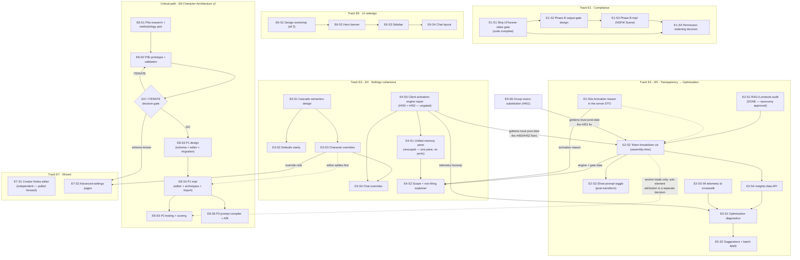

# GGBC Roadmap — Phases 10.2–12+

**Prepared:** 2026-08-24 · **Role:** Product Manager synthesis of `HANDOFF_FABLE_GGBC_PRODUCT_PLAN.md` + 7 initiative docs
**Status:** ✅ **Approved by Sammy 2026-08-24** · in-repo at `docs/product-roadmap-10.2-12.md` (merged via PR #443) · Epics/Stories are live for agent-team execution
**Scope:** 6 feature initiatives + Character Architecture v2, sequenced around real in-flight work (verified against GitHub + the droplet-adjacent memory trail today, not against the handoff's snapshot)

---

## 0 · TL;DR

- **The critical path is Character Architecture v2** (research → validation gate → build). It's the strategic moat, it's design-first, and it partially gates the Character Wizard. Everything else runs as parallel tracks that ship user-visible value while Arch v2 derisks.
- **The first shippable item shipped:** the Live-Portrait/scene-video provenance gate (compliance) went out 2026-08-24 as **E1-S1**, Pilot 1 of the agent-team pipeline. **E2-S1**, the read-only audit that anchors the transparency track, landed the same day as `docs/prompt-injection-audit.md` (#449) with 7 findings filed (#450–#456) — Pilot 2.
- **Four stale claims corrected** (verified today): Phase 10.1 merged in April, theme customization shipped in May, Selfies Phase 3 (attested upload) deployed on 08-23, and — found during E2-S1's close-out — the old ST-roadmap carry-over "text-completion API" (E9-S4) is already live in both repos. The roadmap below reflects ground truth — see §1.
- **Two dependency corrections** change the sequencing: the Creator Notes editor does *not* need to wait for Arch v2, and Wizard Phase 2 must be built **on the Settings Cascade's override rails**, not as its own mechanism.
- Six macro-phases (10.2 → 12+), nine epics, ~40 stories, each with tasks, acceptance criteria, an agent-tier assignment with one-line reasoning, and a token-size band. Kanban starting state in §7.

---

## 1 · Corrections to the handoff (verified 2026-08-24)

The handoff (dated 08-24, drafted from memory) carries several stale claims. I verified each against GitHub and current memory before sequencing. **These corrections remove two work items and re-scope a third.**

| Handoff claim | Ground truth (verified today) | Roadmap consequence |
|---|---|---|
| "Phase 10.1 in flight; PR #58 awaiting merge" | **PR #58 merged 2026-04-12.** No open PRs in either repo. | Phase 10.1 is DONE. Nothing gates on it. Removed from the plan; bookkeeping only (E9-S2). |
| "Phase 6.1 theme customization: color picker, CRUD, import/export, gallery remaining" | **All four shipped ~2026-05-01** (`ThemeEditorPage.tsx`, `themeStore.ts` save/delete, gallery — verified in code 2026-07-31). | Removed from the plan entirely. Not filler, not backlog — done. |
| "Selfies Phase B (output gate) + Phase C (LoRA + attested upload) pending" | **C1, C2, and Phase 3 (content-bound provenance = the attested-upload NCII fix) merged + deployed 2026-08-23** (backend #75, frontend #436, migration 0027, 40/40 rows pinned). What actually remains: (a) the **LP/scene-video provenance gate — code complete on two local branches, unpushed** (backend `claude/vigilant-wilson-a8d2d5` @ `8e94a97`, frontend `claude/upbeat-shamir-8919c9` @ `ad774ba5`); (b) **Phase B (NSFW Scene)**, hard-blocked on an output-side gate; (c) C3 (management + Replicate alt backend). | Compliance epic (E1) re-scoped: ship the built gate first (days, not weeks), then design the Phase B output gate. C3 → backlog. |
| "Character wizard gates on Arch v2 Phase 0" | Only **partially** true. Wizard P1 (Creator Notes editor) is display-layer — orthogonal to how behavior is defined. Only Wizard P2 (advanced-settings pages) is invalidated if Arch v2 changes the definition schema. | Wizard P1 pulled forward to Phase 11.1 as an independent win; Wizard P2 stays gated. |
| (Not in handoff) | Wizard P2's "advanced generation settings per character" **is** the Cascade's character-override feature, surfaced in a wizard. | New hard dependency: E7-S2 builds on E3-S3's override rails. One override mechanism, not two. |
| (Not in handoff) | Cascade P2 (character-overrides page) and Arch v2 P1 (structured-definition editor) **both refactor the character editor.** | Deliberately sequenced (11.1 vs 12) to avoid two concurrent rewrites of the same surface. |
| (Not in handoff — found 2026-08-24 during E2-S1 close-out) | "E9-S4 text-completion API support (old '10.3')" carried into this roadmap as backlog. **It is already shipped, verified in code today:** `CompletionMode = 'chat' \| 'text'` (`generationStore.ts:94`) with UI (`GenerationSettingsPage.tsx:601-618`), `isTextCompletionMode()` threaded through all six generate paths (`chatStore.ts:2315-2318`), the client posting `body.prompt` to `/api/backends/text-completions/generate` (`api/client.ts:1527-1534`), and the backend route live (`ggbc-backend/app/routers/generation.py:291`, documented at `:16`). | Same class as the 10.1/6.1 corrections above — a stale backlog carry-over, not work. **E9-S4 removed from the plan** (marked shipped in §5's E9 table, §7 Deployed-pre-roadmap). It also makes the audit's post-transform fork (resolved in E2-S1) load-bearing *today*: text-completion users already receive an instruct-collapsed single user message, so E2-S3's post-transform display has live users on day one. |
| (Not in handoff — found 2026-08-26 during E9-S1 intake) | "E9-S1 Phase 5.3 swap-vs-join card handling" carried into this roadmap as Ready for Dev. **It shipped 2026-04-11 in [PR #59](https://github.com/sammygallo/goodgirlsbotclub/pull/59)** (`b5938390`), an ancestor of `main` and of every image deployed since: `GroupCardMode = 'swap' \| 'join'` (`chatStore.ts:172`), the `cardMode` field on `GroupChatInfo` (`:200`) with legacy-chat migration defaulting to `'swap'` (`:346`), the two-branch card block in `buildGroupConversationContext` (`:2052-2087`), `setGroupCardMode` (`:3545`), and the "Card mode" segmented picker (`GroupChatControls.tsx:259-287`). E9-S6 added ~10 join-mode assertions to `chatStore.groupMacros.test.ts` last week (63/63 green). The claim had **four carriers**, not one — naming a single source was itself an error this correction originally made: memory `project_roadmap_status.md` row 5.3 (audited **the same day #59 merged**, so it caught the pre-merge tree), the tracked repo file `ROADMAP.md` §5.3 ("Gap: … No join mode"), this roadmap's E9-S1 row, and the untracked `HANDOFF_FABLE_GGBC_PRODUCT_PLAN.md`, which recommends Phase 5.3 as filler. A cold session greps the repo before it reads the memory dir, so `ROADMAP.md` was as live a trap as the memory row. All tracked carriers corrected 2026-08-26; the untracked HANDOFF doc corrected 2026-08-28 by an end-to-end sweep of every status row (superseded banner + 11 dead carriers fixed on disk, incl. Phase 10.1's void merge instructions and its false "gates 10.2" dependency). | Same class as the 10.1/6.1/E9-S4 corrections — a stale carry-over, not work. **E9-S1 removed from the plan** (§5's E9 table, §7 Deployed-pre-roadmap); memory corrected. One sub-clause of the *old* `ROADMAP.md` §5.3 wording — "join mode with **configurable** prefix/suffix" — was never built: the `## ` header, the `[SPEAKING NOW]` speaker marker and the `\n\n---\n\n` separator are hard-coded (`chatStore.ts:2062-2073`). The v3 row never asked for it, so it is **not** a residual story; recorded as an observation only. If it is ever wanted, note it edits the group builder and so inherits §7's ordering rule against E2-S2's un-seeded goldens. |

Also renamed to avoid numbering collision: the old ST-roadmap items "10.2 more cloud providers" and "10.3 text-completion API" became backlog stories **E9-S3 / E9-S4**. E9-S4 has since been verified shipped (row above) and is closed as bookkeeping; E9-S3 stands. The macro-phase numbers 10.2+ below refer to this roadmap.

---

## 2 · Sequencing rationale (the "why")

**1. Compliance ships first because it's already paid for.** *(Executed: E1-S1 shipped 2026-08-24 — see §5.)* The LP/scene-video gate closes a real hole (scene-video's undress prompt currently runs on *any* avatar, contained only by `generation:video` being owner-only). The code is written and tested; the remaining cost is push → PR → adversarial review → merge → deploy. Shipping it also unblocks the later decision to widen media permissions beyond owner (E1-S4). Cheapest risk-reduction on the board.

**2. Arch v2 starts immediately but ships last.** It's the longest chain (research → prototype → validation → GO gate → schema → editor → testing → prompt compiler) and the only initiative with a genuine kill-decision in the middle. Starting Phase 0 in week 1 means the GO/ITERATE gate lands around week 5 — early enough that a "iterate" verdict costs a research cycle, not a build. Nothing implementation-heavy is scheduled on top of it until the gate passes.

**3. Transparency before optimization.** The Optimization Agent (E5) needs two different things to make a claim like E5-S1's own worked example — "entry X: 0 triggers in last 25 chats, 450 tokens/turn when active." The **token half** comes from Token Breakdown (E2-S2), whose section taxonomy is the audit's §8 (approved). The **activation half** — which entry fired, on which turns, under which engine, and whether it was budget-evicted — exists only in part today, and this chain does not provision the rest: the server activation engine computes a per-entry reason internally (`_activation.py:228` — constant/keyword/semantic/sticky) but `RetrievalContextOut` never serializes it (`app/schemas/retrieval.py:159-183`); `captureWiFired` drops every server-path firing, because backend entry ids are disjoint from local `wi_`/`wibook_` ids with no crosswalk (`chatStore.ts:2461-2496`); and `wiScanReport`'s budget-eviction list stays zeroed on server-path turns (`chatStore.ts:1071-1079`). The audit's §6 names the client-side fired-WI telemetry and `wiScanReport` as the hooks to build on — the work is closing those three gaps, not starting from nothing. So the real order is: audit → breakdown **+ activation-reason plumbing (E2-S2a) and an entry-id crosswalk (E2-S5)** → insights data API (E2-S4) → agent. The audit itself was neither cheap nor read-only — it needed a worktree-local instrumentation seam (audit §8) and is re-banded **L** under the approved audit/design-verification minimum; it completed in 10.2, producing the §8 taxonomy and issues #450–#456.

**4. Cascade design before Wizard P2 — and, per the audit, *not* before the Memory Pane.** Wizard P2's per-character generation settings must reuse the cascade's character-override mechanism, so the cascade **design doc** (E3-S1) lands in 10.3 ahead of that consumer, even though cascade *implementation* stretches across 11.1–11.2. The Memory Pane was originally sequenced behind the same doc on the premise that "which entries apply where" is a rendering of cascade scoping. **That premise was wrong:** lore scope is *book composition* — `resolveEffectiveBooks()` plus a `world ∪ character ∪ persona` union assembled per call site — a separate, pre-existing mechanism the cascade does not own (audit §6.3). E4-S1 is therefore gated on **E4-S0**'s activation repair instead, and E4-S2 on **E2-S2**'s engine/gate data. All E4 still takes from the cascade is the budget and scan-depth *values* its explainer displays.

**5. UI redesign is one workshop, three staggered ships.** Hero, sidebar, and chat layout share a design language, so they're designed together in one Fable workshop (10.2), then implemented in ascending order of blast radius: hero (one page) → sidebar (app shell, touches every route) → chat layout (responsive complexity). The track is independent of everything else and gives each phase a user-visible win.

**6. Timeline is review-bandwidth-gated, not calendar-gated.** Agent teams have shipped whole phases in days when reviews were available (C1→C2→Phase 3 took ~a week). The week ranges below assume Sammy reviews 2–3 substantial PRs per week; compress or stretch them accordingly. Every macro-phase ends with a deploy + checkpoint, so the plan degrades gracefully if a phase takes longer.

**7. Honest metrics for a 9-user platform.** Success criteria below use measurable-in-app numbers (token deltas, gate coverage, test counts) and qualitative creator confidence — not DAU vanity metrics that are noise at this scale. The platform is the testing ground for the production-platform vision; the metrics that matter are "does this make the owner-tier experience trustworthy and efficient."

---

## 3 · Dependency graph

Solid arrows are hard blocks; dotted are informs-but-doesn't-block. The **critical path** is the E8 chain — it has the only decision gate and the largest build. E1-S1, the roadmap's original **urgent path**, shipped 2026-08-24; the urgency moved to **E4-S0**, which closes the audit's only High finding (#450) and must land before E2-S2 seeds golden-prompt fixtures (§7's prompt-content ordering rule).

---

## 4 · Phase plan

Phases are sequenced milestones, not calendar promises; each ends with deploy + review checkpoint. Week ranges assume 2–3 substantial reviews/week from Sammy.

### Phase 10.2 — Compliance closeout + foundations (~weeks 1–2)

| Item | Track | What ships / what exists after |
|---|---|---|
| **E1-S1** Ship LP/scene-video provenance gate | Compliance | Both branches pushed, PR'd, adversarially reviewed **before** merge, deployed; uncleared avatars 403 on all animation paths |
| **E2-S1** RAG + Lorebook injection audit | Transparency | ✅ Delivered as `docs/prompt-injection-audit.md` (PR #449): actual precedence, empirically-proven absence of dedup, §8 section taxonomy approved as E2-S2's spec, 7 findings filed (#450–#456) |
| **E8-S1** Arch v2 P0a — research + methodology pick | Critical path | Competitive analysis + chosen methodology (per doc: Core Values + Decision Framework + Testing) |
| **E6-S1** UI design workshop (hero + sidebar + chat) | UI | Approved mockups for all three surfaces, responsive + dark-mode + a11y annotated |
| ~~**E9-S1** Phase 5.3 swap-vs-join~~ | Quick win | **ALREADY SHIPPED** (PR #59, 2026-04-11) — verified at intake 2026-08-26; see §1. Removed from the phase. |
| **E9-S2** Roadmap bookkeeping | Hygiene | 10.1/6.1 marked done in docs + memory; this roadmap committed to `docs/` |

**Phase token band (restated 2026-08-24):** the pre-audit estimate was ~1.5–3M output tokens for the whole phase; two stories alone blew it. **E1-S1 ~1.3M** (S build + L verify — trigger-tier review dominant) and **E2-S1 ~5.1M** (L build + a verification pass that was the larger half: three adversarial lenses × two independent skeptics over 26 candidate findings). Neither was a build-estimation miss; both were unbudgeted verification. Restated as **~1.5–2M build + ~5M verification**, reported as two numbers per §5/§6.5.

### Phase 10.3 — Transparency + first visible wins (~weeks 3–5)

| Item | Track | What ships |
|---|---|---|
| **E4-S0** Data Bank + WI activation repair | Settings | Data Bank docs reach the prompt on local-scan and group turns, or the UI says honestly why not — covers both failure paths (keyless entries scoring zero in the local scan, and character-scoped docs landing in a second book `getCharacterBook` never resolves); budget-evicted entries stop starting cooldown/sticky timers, and sticky matches are checked against inclusion-group winners — closes #450 (High) + #452 |
| **E9-S6** Group macro substitution | Quick win | `{{user}}` / `{{char}}` / `{{setvar::…}}` resolve in group assembly; the blank-user-turn case guarded as solo already guards it — closes #451. Sequenced ahead of E2-S2's golden-prompt seeding so the goldens capture substituted group output rather than needing a re-baseline |
| **E2-S2a** Surface per-entry activation reason from the server engine (backend + client DTO) | Transparency | `activationReason` (`constant`/`keyword`/`semantic`/`sticky`) + `matchedKeyCount` threaded through `ActivationResult` → `RetrievalContextOut` → client map; unblocks E2-S2's drill-down on the default solo path. Lands before or with E2-S2. **Re-scoped 2026-08-26 (E9-S1 intake sweep): the engine half already exists.** `Candidate` in `ggbc-backend/app/routers/_activation.py:219-229` already carries both `matched_key_count` and `reason` (literally `"constant" | "keyword" | "semantic" | "sticky"`, set at `:483-510`); what is missing is purely outbound plumbing — `RetrievalContextOut` (`app/schemas/retrieval.py:193-200`) exposes only `entries` / `activatedEntryIds` / `evictedEntryIds`, with no per-entry reason, and `LorebookEntryOut` has no field for one. So this is DTO + client-map work, not activation-engine work, and should be re-banded down before it is picked up. |
| **E2-S2** Token breakdown visualization | Transparency | Per-turn section breakdown in the usage panel |
| **E2-S3** Show-prompt toggle | Transparency | Post-transform payload viewer (user-only) — what the provider actually received, with a notice when instruct-mode or an interceptor changed the structure |
| **E2-S5** WI telemetry id crosswalk | Transparency | Server-path firings recorded under local entry ids; existing telemetry maps migrated or flagged partial-coverage — hard-blocks E5-S1 |
| **E9-S7** Recall `no_key` hint | Quick win | Client reads the backend's `reason: "no_key"` and points at the embedding-key setting, so recall-without-a-key stops being indistinguishable from no-matches — closes #455 |
| **E3-S1** Cascade semantics design doc | Settings | Reviewed precedence spec + store-refactor plan — unblocks E3 impl and E7-S2 (E4 is no longer gated on it: lore scope is book composition, not the settings cascade — audit §6.3) |
| **E6-S2** Hero banner | UI | Landing-page carousel live |
| **E8-S2** Arch v2 P0b — prototype + validation | Critical path | 5–10 reimagined characters, measured token + consistency comparison, validation report |
| **E1-S2** Phase B output-gate design | Compliance | Red-teamed design doc for the output-side identity gate |

**Ends with the Arch v2 GO/ITERATE gate** — the roadmap's single most important checkpoint. **Phase token band:** ~4–7M build + ~2–3M verification, reported separately per §5. This phase absorbed five audit-derived stories (E2-S2a, E2-S5, E4-S0, E9-S6, E9-S7) after the roadmap was written; the pre-audit ~2–4M figure is superseded. (E8-S2's behavior probes are a workflow fan-out; E2-S2 touches `buildConversationContext()` and needs a full adversarial review.)

### Phase 11.1 — Settings coherence + compliance impl (~weeks 6–8)

| Item | Track | What ships |
|---|---|---|
| **E3-S2** Cascade P1 — defaults clarity | Settings | Defaults section + "what's active now" indicators |
| **E3-S3** Cascade P2 — character overrides | Settings | Override rails in the character editor (the risky store refactor) |
| **E6-S3** Sidebar | UI | Collapsible nav shell, mobile drawer |
| **E2-S4** Insights data API | Transparency | Store API exposing the per-turn breakdown, the per-entry World Info record (emitted tokens, activation reason, eviction), which engine served the turn, and the telemetry-coverage figure — E5-S1's hard input, so it lands in the same phase |
| **E5-S1** Optimization Agent P1 — diagnostics | Transparency | Severity-ranked findings report on real settings |
| **E1-S3** Phase B impl — output gate + NSFW Scene | Compliance | Only if E1-S2's design was approved; otherwise stays blocked (acceptable outcome) |
| **E7-S1** Creator Notes editor | Wizard | Rich-text editor + live preview + templates (pulled forward — no Arch v2 dependency) |

**Phase token band:** ~2.5–4.5M (E3-S3 and E1-S3 are the heavyweights, both mandatory-adversarial-review).

### Phase 11.2 — Memory + chat + overrides completion (~weeks 9–11)

| Item | Track | What ships |
|---|---|---|
| **E3-S4** Cascade P3 — chat overrides | Settings | Per-chat override panel, persisted to chat metadata |
| **E4-S1** Unified memory pane | Settings | One deepened World Info pane — **not** a three-way port (Data Bank was dissolved into native lorebooks and its page retired; settings is a page-stack with no routes to redirect) — plus a Documents view over document-derived books. Gated on E4-S0, not E3-S1. |
| **E4-S2** Scope + non-firing explainer | Settings | Every entry shows its composition scope (world / character / persona / per-chat); when an entry didn't fire, the panel names the engine that served the turn and the gate that stopped it |
| **E6-S4** Desktop chat layout | UI | 1/3 full-bleed avatar; mobile unchanged |
| **E5-S2** Optimization Agent P2 — suggestions | Transparency | Approve-batch flow with measured before/after |
| **E8-S3** Arch v2 P1 design | Critical path | Schema + editor design + migration design, red-teamed (design only — editor code waits for E3-S3 to settle) |

**Phase token band:** ~2–4M.

### Phase 12 — Character Architecture v2 build (~weeks 12–16)

| Item | Track | What ships |
|---|---|---|
| **E8-S4** Arch v2 P1 impl | Critical path | Structured character editor + archetype library + lossless ST-card migration for all 42 existing characters |
| **E7-S2** Wizard P2 — advanced settings | Wizard | Wizard pages on cascade rails + Arch v2 fields |
| **E8-S5** Arch v2 P2 — behavioral testing + scoring | Critical path | Scenario-probe validator, token-impact report, confidence score |
| **E8-S6** Arch v2 P3 — prompt compiler + A/B harness | Critical path | Structured-data → system-prompt generation with adversarial anti-drift patterns; old-vs-new A/B |

**Phase token band:** ~4–7M (the build phase; E8-S4 is the roadmap's only XL).

### Phase 12+ — Optional tail (post-gate, prioritize on results)

E5-S3 interactive optimization loop · E7-S3 wizard AI suggestions · E4-S3 memory folders/cross-links · E3-S5 settings visual restructure · E8 P4 (modular stack, world bindings, interaction archetypes) · E9-S3 cloud providers · E9-S5 Selfies C3. *(E9-S4 text-completion API was here until 2026-08-24, when it was verified already shipped — see §1.)*

---

## 5 · Epics — stories, tasks, acceptance criteria, tiers

Tier notation per Sammy's delegation practice: every assignment carries one-line reasoning; the barbell rule applies (cheap tiers for mechanical loud-failure work, strong tiers for design/synthesis/verification — **never economize on verifiers**).

**Size bands (output tokens): S** ≤150k · **M** 150–500k · **L** 0.5–1.5M · **XL** >1.5M. **Recalibrated 2026-08-28 (Sammy-directed, on six 10.2 runs of actuals; figures re-derived by a 59-agent design red-team from the ledger and PR trails — trust these over any earlier prose): the letters price the INITIAL build only.** Fix-round rework is verification-driven spend — it exists because a review round found something. It still lands inside the reported build number (§6.5), so **at estimation time it is priced off the verify class**: expect ~0.1–0.85M of build-side rework per finding-carrying round the class predicts. **Build letters are per task-PR leg** (the same per-loop granularity as verification below). Worked example, from E2-S2's ledger row (the authoritative carrier; PR #484's body carried a coarser earlier estimate): code-writing build ~5.7M story-total (6.9M reported minus 0.8M intake and 0.42M PLAN, which are pipeline overhead, not build) across four task-PR legs whose initial builds each sat inside S–M, with roughly two-thirds of the story total being fix-round rework across ~17 review rounds (initial-vs-rework split is a PM estimate — there is no per-stage meter, per the ledger's own caveat).

**Verification is priced in ROUNDS × a unit cost, not in letters** (charter §4.2: checkable claims × rounds-to-convergence). **Budgets are per STORY; a story delivered as N task-PRs runs a review loop per PR — multiply the class budget by the PR count at estimation time.** Unit costs are provisional (few runs yield a clean per-round figure; re-derive at the next recalibration): a **full trigger-tier round** ~1.5–3M · a **scoped confirmation round** (reduced lenses over the delta, only after a zero-confirmed-findings round, per #485) ~0.2–0.5M · a **standard-tier `/code-review` pass** ≤0.3M · a **claim-set adversarial pass** (every claim independently re-derived, two skeptics per finding — a heavier instrument than a code-review round) ~3.4–4.9M (ceiling = the charter v1.2 round-1 pass, the largest verification-only pass on record). Expected rounds and budgets **per review loop**. **The loop count N is declared at PLAN** (the plan decides the task-PR split; card-stage estimates use N=1 and flag the class budget as per-loop; the budget is restated at PLAN exit; S stories, which skip PLAN, fix N=1 at the BRIEF — carried in `run-story` step 3): E2-S2's card would have read N=1, its plan produced N=4 story task-PRs — #479/#481/#482/#484; the process PR #485 was pipeline overhead, not a story loop.

| Risk class | Membership test | Expected rounds | Budget/loop (rounds × unit) | Evidence |
|---|---|---|---|---|
| Standard | S/M build, no §6.1 trigger | 1 standard pass | ≤0.3M | — |
| Trigger-tier, contained seam | §6.1 trigger, single-repo, no gate/contract/assembly surface | 1 full + 1 confirmation | ~1.7–3.5M | — (no clean datum yet; priced from the units) |
| Safety gate / backend contract | touches a §6.8 gate or a cross-repo contract | 2–3 full + confirmation | ~3.2–9.5M | E4-S0: ~5.0M · E1-S1: ~1.3M (a floor case — one round converged; class floors are expectations, not minimums) |
| Prompt assembly / new mechanism over a frozen layer | touches either builder's emission, the dispatch seams, or ships new UI over a frozen data layer — **E2-S3 is in this class** | 4–6 full + confirmation | ~6.2–18.5M | E9-S6: 9.18M (4 rounds, 1 loop) · E2-S2: ~36.5M story-total by PR-trail sum over 4 loops (~17 rounds; the final loop's 5 full + 1 scoped ≈ 11M; the ledger's ~36.7M is the same spend — estimate variance) |
| Claim-set / design red-team | the deliverable IS a claim set: audits, pre-code red-teams, process-rule changes (§5's L-minimum rule) | 1–2 claim-set passes | ~3.4–9.8M (rounds × the claim-set unit) | charter v1.2 red-team: 4.9M + 4.2M across 2 passes (the §4.4 calibration datum) · E2-S2's D/E/F red-team: ~3.4M (1) · this recalibration's own: ~4.6M (1) · E2-S1 audit: verification-only ~3M est (its oft-cited 5.1M is the build-INCLUSIVE story total — do not re-derive units from it) |

The loop runs to convergence — the final round confirms zero — and a verification budget is never traded away to keep a story in band: the story slips, the review does not shrink (§6.1). **This table is the single authoritative carrier of calibration figures; where any other section's prose (incl. §6.6, §7, §9) restates a number and disagrees, the table wins and the restatement is the bug.**

**Un-started cards keep their letter notation; read the letter through the MEMBERSHIP TEST above, not through the letter itself:** the class decides the rounds. Where no trigger applies, `S/M verify` → standard pass and `L verify` → trigger-tier 2–3 rounds; a card whose surface matches the safety-gate, prompt-assembly, or claim-set test takes that class's rounds regardless of any letter it was carded with. Restating every card was considered and rejected — the letters still rank stories; the class table prices them.

**Pipeline overhead (named 2026-08-28; run-story step 10 reports the fourth number):** intake ground-truthing ~0.05–0.8M (scales with board staleness, not story size) · PLAN ~0.2–0.5M on M+ stories · QA ~0.1–0.3M · postmortem CAPTURE ~0.1–0.3M (E9-S1's 1.56M included a one-off charter adjudication; CURATE unpriced until its first firing). Infrastructure waste (usage-limit kills, resume overhead) is not budgeted but IS recorded in the ledger row when material — E2-S2 lost ~2.0M to one mid-run limit kill. Stories with no verification pass carry a build band only.

**L minimum when a story's deliverable is a claim set that gets red-teamed.** The test is mechanical: does the story's task table contain an adversarial verification or red-team pass? If yes, it bands **L or higher**, never S or M — code audits and pre-code design red-teams both qualify, because the verifier re-derives every claim independently. On the current task tables that covers **E2-S1** (audit) and **E1-S2** and **E8-S3** (both specify a pre-code red-team). It does **not** cover design stories whose only gate is Sammy's approval — **E6-S1**'s mockup workshop, **E3-S1**, and **E8-S1** stay at their build bands unless and until a red-team pass is added to their tasks, which is a change to the story, not to its band. The trigger is the verification pass in the task list, not the word "design" and not membership in §6's design-first-gate list.

**Plan absorption is the third category** (named 2026-08-24, after E2-S1). When a story's deliverable is *knowledge* rather than code — an audit, a research pass, a design validation — its output can invalidate premises other stories were written on, and folding those corrections back into this document is real work with a real cost. It is neither build nor verification: it scales with **how many other stories rested on the corrected premises**, not with the story's own size, so it cannot be estimated from the story's band.

Expect it, and budget it, whenever a story produces ground truth: **E2-S1** incurred ~4.5M (three analysis lenses over the roadmap, a refute-first verifier per proposal, and a completeness critic; 60 changes applied across 7 epics). **E8-S2**'s GO/ITERATE gate will incur a larger one on GO — the whole E8 chain plus E7-S2 is written against an unvalidated methodology. **E1-S2** and **E3-S1** will incur small ones, since each produces a spec other stories consume. Skipping it is not a saving: the plan then contains stories built on falsified premises, which is how E4 came to describe porting a UI that no longer exists (§1).

Bands are planning estimates — first recalibration done 2026-08-28 (above); report **build, verification (with its round count), plan-absorption, and postmortem spend as four separate numbers** after each run (§6.5, aligned with `run-story` step 10).

---

### E1 · Media Provenance Completion — *Compliance* 🔴 priority

Close the remaining avatar-provenance holes so every media-generation path (selfie closeup/scene/studio, live portrait, scene video) is gated fail-closed on content-bound clearance, and unblock the future decision to widen media permissions beyond owner tier. This is the platform's defining red line: fictional-characters-only, never real-person depiction.

**Epic success criteria**
- All 5 media-generation paths verify content-bound provenance fail-closed (NULL pin ⇒ blocked); confirmed by kill tests that are **mutation-verified** (delete the gate → suite goes red).
- NSFW Scene (Phase B) ships only with the output-side gate live — or ships not at all. "Blocked" is an acceptable end state; a bypass is not.
- Permission-widening decision (E1-S4) is made with a written brief, not by default.

#### E1-S1 · Ship the LP/scene-video provenance gate — **✅ DEPLOYED 2026-08-24 (Pilot 1)** · Size **S build + L verify** (restated under the split-band rule; original single band S–M, actual ~1.3M)
Band restatement: the build was genuinely S — a rebase past the #437 overlap plus a frontend pre-gate (#446: 452 additions across 10 files; the backend half needed no build, already on main as #76/#77). The verification was L: a safety-gate diff is on §6.1's mandatory-trigger list for full multi-lens review regardless of size, and it produced 4 confirmed coverage findings, fixed on the branch with mutation-verified kill tests. **This story is the split-band rule's worked example.**

Outcome: intake ground-truthing found the backend half already merged+deployed by another session (#76/#77 — the local `claude/vigilant-wilson-a8d2d5` was superseded and would have regressed main; deleted). Frontend leg rebased past the #437 overlap, trigger-tier reviewed (4 confirmed coverage findings fixed + mutation-verified; correctness/bypass lenses clean), QA'd, shipped as #446.

| # | Task | Tier — reasoning |
|---|---|---|
| 1 | Push both branches, open PRs with deploy-order note (frontend at-or-before backend is harmless — pre-blocks what the server would 403) | Haiku — mechanical git/gh work |
| 2 | Adversarial review **before merge** (backend gate = security surface; frontend = advisory pre-gate) | Fable-orchestrated multi-lens workflow — security verification is never economized |
| 3 | Merge + deploy both; prod verify: uncleared avatar → 403 with rendered detail text on LP and scene-video; cleared avatar → normal generation | Sonnet — scripted verification against the droplet |

**Acceptance:** `POST /api/live-portrait/generate` and `/api/scene-video/generate` 403 uncleared avatars in prod · frontend shows the not-cleared notice + disabled Generate, and scene modal short-circuits **before** the paid summarizer call · no regression for cleared avatars · review findings resolved pre-merge, not in a follow-up PR.

#### E1-S2 · Phase B output-side gate design — **Kanban: Design** · Size L + trigger-tier verification (budgeted separately)
The load-bearing precondition (recorded in `selfie.py`'s docstring): no chaining Scene stage-1 output into the undress worker without an output-side identity gate — otherwise it's a text-driven NCII path around the avatar-upload red line. Validation data says the single-subject anchor doesn't sterilize background figures (2/4 runs).

| # | Task | Tier — reasoning |
|---|---|---|
| 1 | Design doc: evaluate identity/similarity-vs-avatar verification vs likeness moderation vs hybrid; failure modes; cost per generation; what "gate fails" does to UX | Fable — safety-critical design synthesis |
| 2 | **Red-team the design pre-code** (this practice already caught a scope hole + schema miss on Phase 3) | Fable-orchestrated adversarial workflow |
| 3 | Decision brief for Sammy: ship-shape / needs-prototype / not-shippable-yet | Fable — recommendation with visible reasoning |

**Acceptance:** doc merged to `docs/` · red-team findings addressed in the design · explicit Sammy sign-off before any E1-S3 code.

#### E1-S3 · Phase B implementation — NSFW Scene — **Kanban: Backlog (gated on S2)** · Size **L build** · **verification budgeted separately: L** — it scales with the gate-predicate count E1-S2's design yields, not with build size, because every predicate needs its own mutation-verified kill test (cf. E1-S1: banded S–M, actual ~1.3M, trigger-tier review dominating)

| # | Task | Tier — reasoning |
|---|---|---|
| 1 | Output-side gate implementation per approved design | Opus — subtle safety logic against a hostile threat model |
| 2 | Scene stage-1 → undress stage-2 chaining behind the gate | Opus — cross-service pipeline with the containment premise shift |
| 3 | Kill tests for every gate predicate, **mutation-verified** | Sonnet writes, Fable-orchestrated mutation pass verifies — a kill test that doesn't kill is false confidence |
| 4 | Full adversarial review before merge; deploy; prod smoke on a real key | Fable orchestration + Sonnet verification |

**Acceptance:** NSFW Scene renders only when the output-gate passes · gate-fail path is user-legible (no silent downgrade) · mutation pass proves each kill test bites · zero regressions in the 850+ backend suite.

#### E1-S4 · Permission-widening decision — **Kanban: Backlog** · Size S
After S1 (+S3 if shipped): brief on widening `generation:video` / `generation:lora_train` beyond owner tier, per the tier-on-features monetization model. Fable writes the brief; Sammy decides. **Acceptance:** written go/no-go with the residual-risk list.

---

### E2 · Prompt Transparency — *RAG audit + Token Breakdown*

Make every token in a turn attributable: audit how RAG and Lorebook actually inject, then show users a per-section breakdown and the exact prompt. Foundation for E5.

**Epic success criteria**
- Injection precedence is documented from code, not intention, and covered by a regression test.
- Per-turn breakdown visible in-app; the **text** section sum — over every section measurable at assembly, **including Stage C** (`chatStore.ts:1683-1689` emits ordinary strings from `sectionContent`) — matches the reported text total within tokenizer-estimate tolerance. Two badges are required rather than silent omission: **image attachments** get their own bucket marked "not token-counted" (characters-only estimator, `tokenizer.ts:51-69`; an image-only message carries empty text, so its real model-side cost is zero in every number including the trim's), and **Stage C sections** are badged "not counted by the trim" — they are in the sum, outside the budget. The World Info number will not reconcile with `wiState.tokenBudget`, which is measured on raw stored content before macro expansion and attribution wrappers (audit §4.1) — surface both numbers or explain the gap.
- "Show prompt" renders the **post-transform** payload — byte-identical to what the provider client received, after instruct-mode collapse and generate-interceptors — user-only, excluded from exports/shares, with a notice when a transform changed the structure.
- ✅ Satisfied by E2-S1: audit merged, 7 issues filed (#450–#456). No downstream E2 story may presume any of them is fixed — E2-S2/S3/S4 must be correct against today's behaviour and say so where it shows.

#### E2-S1 · RAG + Lorebook injection audit — **✅ DONE 2026-08-24 (Pilot 2)** · Size **L** (re-banded from S–M: audit stories are L minimum; the original band was wrong) · trigger-tier adversarial verification budgeted separately, outside the band — three lenses (citations · omissions · consistency) with two independent skeptics per finding: 16 confirmed / 5 contested / 5 refuted
Outcome: delivered as `docs/prompt-injection-audit.md` (PR #449), not as the `reference_rag_lorebook_injection.md` memory-note update the original acceptance line called for. Four independent code-trace lanes (solo assembly · group assembly · WI activation engine · retrieval pipelines across both repos) plus an empirical marker-string harness that drove the real builders; every claim then fact-checked by the three adversarial lenses above. 7 findings filed as #450–#456. Section taxonomy (§8) is **approved** as the spec E2-S2 builds against, and the fork §2 raised is resolved: E2-S2 measures at assembly time for the per-section breakdown; E2-S3 displays the post-transform payload, with a notice when a transform changed the structure.

| # | Task | Tier — reasoning |
|---|---|---|
| 1 | Trace `buildConversationContext()` + `buildGroupConversationContext()`: map injection points, order, dedup (or absence) | Explore agents — read-only fan-out search |
| 2 | Live trace: one character with RAG + Lorebook enabled, inspect the real assembled prompt | Sonnet — hands-on repro in the dev stack |
| 3 | Measure overlap on ~10 sample chats; write up precedence + the section taxonomy E2-S2 will visualize | Fable — synthesis; the taxonomy choice shapes two downstream epics |

**Acceptance (met 2026-08-24):** audit doc in-repo at `docs/prompt-injection-audit.md` (#449) with *actual* semantics, verified against code rather than asserted — four independent code-trace lanes plus an empirical marker-string harness, then fact-checked by three adversarial lenses with two skeptics per finding · §8 taxonomy **approved by the owner** as E2-S2's spec, with its open fork resolved (E2-S2 measures at assembly time; E2-S3 displays the post-transform payload) · 7 findings (F1–F7, §7) filed with severities as #450–#456 · §9 records the 5 refuted claims so they are not re-litigated. **Deliverable location changed from the plan:** the audit landed as a repo doc, not as an update to the `reference_rag_lorebook_injection.md` memory note; that note has since been rewritten as a pointer to the doc, so the doc is the single source of truth.

#### E2-S2a · Activation reason in the server DTO — **Kanban: Ready for Dev (ungated)** · Size S–M build · verification budgeted separately (backend-contract trigger, §6.1) · **lands before or with E2-S2**
The server activation engine already computes what E2-S2's per-entry drill-down needs, then discards it at the schema boundary: `_activation.py:474-483` sets `reason="constant"|"keyword"|"semantic"` plus `matched_key_count`, and `:520-532` sets `reason="sticky"` — but `RetrievalContextOut` returns `entries: list[LorebookEntryOut]` with no reason field (`app/schemas/retrieval.py:159-183`), so the client hard-codes `matchedKeyCount: undefined` (`src/utils/serverRetrieval.ts:421`). Thread `activationReason` + `matchedKeyCount` through `ActivationResult` → `RetrievalContextOut` → the client entry map. Sonnet — a DTO addition across two repos; it is a client written against a backend contract, so the client half degrades rather than assumes. **Acceptance:** a semantic-only firing arrives as `activationReason: 'semantic'` with no keyword invented (audit §3b — there is no keyword to show) · a keyword firing carries its `matchedKeyCount` · the client behaves as today against a backend that predates the field · E2-S2's drill-down and E4-S2's explainer read this field instead of guessing.

#### E2-S2 · Token breakdown visualization — **Kanban: DEPLOYED 2026-08-28 (#479/#481/#482 + backend #81 + #484; spec = audit §8)** · Size **L build + L verify** — verification actual ~36.7M story-cumulative across the four task-PRs (~17 rounds; #484's own final loop of 5 full + 1 scoped ≈ 11M — the earlier PRs' review legs carried ~25.5M), driven by fix rounds introducing new defects three times (E9-S6's pattern at larger scale); variance detail in PR #484 + the run-ledger rows incl. the 2026-08-28 reconciliation row

Ordering constraint: this story's golden-prompt fixtures must be seeded **after** E4-S0 (#450/#452) and E9-S6 (#451) land — see §7's prompt-content ordering rule. Goldens captured before either pin the bugs.

| # | Task | Tier — reasoning |
|---|---|---|
| 0 | Establish the solo builder test seam and land the golden-prompt harness **before any instrumentation**, **seeded from fixtures this task must AUTHOR — E2-S1's harness was never committed.** Verified 2026-08-26 at E2-S2 intake: PR #449 was one file, `docs/prompt-injection-audit.md`, +160 lines; `src/stores/__fixtures__/` holds only E4-S0's unrelated lockstep vectors, and there are zero snapshot assertions in any store test. The roadmap said "seeded from E2-S1's saved fixtures" in three places and all three were wrong — **re-band this task up accordingly.** The hard part is nonetheless already solved: `chatStore.groupMacros.test.ts:1-30` is a working prelude that imports chatStore behind two `vi.mock`s (breaking the chatStore→authStore→lovenseStore→chatStore require cycle) and drives the group builder directly — copy it verbatim. `buildConversationContext` is module-private (`chatStore.ts:966`) while the group twin is already exported (`:1746`, "Exported for tests"); the E2-S1 harness needed a worktree-local `export`, which must not ship by accident. Decide the seam explicitly — permanent export vs test-only accessor (audit §8) | Sonnet — mechanical once the one-line PM call is made, but blocking: nothing else in this story can be verified without it, and E8-S4's task 4 inherits the same seam |
| 1 | Instrument prompt assembly to emit per-section counts **measured at assembly time** (the approved fork resolution recorded in E2-S1 above), in **both** builders. Solo `buildConversationContext()` (`chatStore.ts:966`) has real seams: `sectionContent` (`:1284`) and `historyWithInsertions` (`:1442`). Group `buildGroupConversationContext()` (`:1746`) has **no section map at all** — one hard-coded flat system template (`:2003-2027`) that ignores `promptOrder` entirely (`:2112`), so group must be instrumented by tagging that template's pieces as they are composed, against the audit's reduced group taxonomy (§8: flat system · WI · recall · history · author's note; omit the "Reserved" slice). Reuse existing token-counting infra — don't re-implement | Opus — `buildConversationContext()` is load-bearing; a regression here corrupts every generation |
| 1b | **Thread the real kept-history boundary out of the builder and retire `computeRagBoundary`'s re-simulation** — audit §5 and §8 both assign this to E2-S2 because it is the same seam, and a second pass here means a second full adversarial review. Two live defects ride on it, filed together as [#457](https://github.com/sammygallo/goodgirlsbotclub/issues/457): the simulation omits the tokenizer profile (`ragBoundary.ts:125-130`, `generic` 3.8 c/t vs the real trim's `profileForProvider(activeProvider)` — 4.0 for GPT/Gemini, `chatStore.ts:1063`, `:1665-1672`), prices ~5% high, keeps fewer, and returns a **newer** boundary — **under-exclusion**, so recall can re-inject a message already present verbatim in raw history; and the backend **fails open** when `boundary_id` misses (`retrieval.py:391`, `:405-453`), excluding only the newest `_TAIL_SKIP = 4` messages while the client sees a normal 200 and cannot tell | Opus — same seam; a boundary regression silently duplicates or drops recall content, and the safe/unsafe directions are asymmetric |
| 2 | Regression tests pinning section order + RAG/Lorebook coexistence | Sonnet — the safety net for task 1 |
| 3 | Breakdown UI (stacked bar/pie, per-turn + on-demand, drill-in) via the dataviz skill | Sonnet — standard component work against a spec |
| 4 | **Own #453 (F4) — the blind spots the breakdown must reconcile, not inherit:** Stage-C sections emitted after the trim and never counted (`chatStore.ts:1683-1689`; `systemPrompts` is snapshotted at `:1646`, before Stage C pushes); image attachments costing zero everywhere (`client.ts:1478-1507`, `tokenizer.ts:51-69`); `overBudget` always false under `tokenAware: false` (`:1643`, `:1677-1679`) plus its stale doc comment and wrong-knob user hint; the WI budget's raw-vs-emitted undercount (`worldInfoStore.ts:1250` measures pre-macro, pre-attribution content — audit §4.1 requires surfacing both numbers or explaining the gap); and the remaining item in #453. Each either gets counted or gets an explicit "not counted by the trim" badge per audit §8 | Opus — these are the reason a naive sum will not reconcile; discovering them mid-build is a redesign |
| 5 | **Own #456's user-visible labels — both halves of audit §8's relabel:** `generationStore.ts:181,202` still call the recall slot "Data Bank / RAG Context" and describe it as Data Bank chunks, though it carries chat-history recall only → **"Chat recall"**; and the WI section labels/descriptions must carry the same clarifier. **Enumeration corrected + form resolved 2026-08-26 (Sammy, at E2-S2 intake): there are FOUR `wi_*` pairs, not three** — `wi_before_char` (`:170`/`:191`), `wi_after_char` (`:173`/`:194`), `wi_before_an` (`:176`/`:197`) and **`wi_after_an` (`:184`/`:205`), which this row previously omitted**; renaming only three ships a screen where the fourth row still reads the old way, the exact self-contradiction this task exists to prevent. **Form:** labels keep their positional discriminator ("World Info / Lorebooks — Before Char", "— After Char", "— Before Author Note", "— After Author Note") and the "(incl. Data Bank docs)" clarifier goes in the four descriptions. Renaming all four to one identical string was the literal reading, and it would leave four indistinguishable rows in a drag-to-reorder list plus four identical `aria-label`s (`PromptOrderEditor.tsx:69` interpolates the label), since Data Bank is no longer a pipeline (audit §1) and its content now ships through the `wi_*` slots. Renaming only the recall slot leaves no place on the screen that tells the user where Data Bank content went | Haiku — mechanical, but it must ship with the breakdown or the UI contradicts itself on the same screen |
| 6 | Adversarial review before merge (prompt-assembly refactor = trigger condition) | Fable-orchestrated |

**Acceptance:** measurement happens at **assembly time**, per emitted piece (per the approved fork resolution; the post-transform payload is E2-S3's job, not this story's), exactly per the approved taxonomy (audit §8): every Stage-A section, Stage B split into raw history vs. each at-depth insertion class (author's note · character's note · persona · WI@depth · summary), Stage C **badged "not counted by the trim"**, plus the user message, the call-site continue/impersonate turns, and image attachments as their own bucket badged **"not counted anywhere"** · display grouping is the 10 buckets of §8 (Character · Persona · World Info/Lorebooks · Chat recall · Summary + Notes · Instructions · Chat history · Your message · Attachments · Reserved) · the two stale user-visible labels are fixed as part of this story (`rag_context` → "Chat recall", WI sections → "World Info / Lorebooks (incl. Data Bank docs)") · text-section counts reconcile exactly with the reported text total, with per-message and join-separator overhead shown as its own line rather than silently absorbed, and the panel states explicitly that attachments (§4.4) and Stage C (§4.4) are outside the trim's budget rather than folding them into a false total · the World Info slice surfaces both the emitted (post-macro, post-`wrapWiContent`) cost and the raw-content cost the WI budget actually charges — or, if only one is shown, names which and explains the gap (§4.1) · **group** uses the reduced taxonomy (flat system · WI · recall · history · author's note), omits the Reserved slice, and badges the *history* slice "not trimmed" — not the whole view "un-budgeted", since group does enforce the WI budget (§4.3) · zero diff in assembled prompts before vs after instrumentation (golden-prompt test, solo **and** group) · **the drill-down renders an explicit "reason unavailable (server-path turn)" state, and never infers an activation reason from `matchedKeyCount`'s absence** — `dtoToMatchedEntry` hard-codes `matchedKeyCount: undefined` (`serverRetrieval.ts:421`), so the plausible rule "undefined ⇒ constant" would mislabel every semantic firing. (Added 2026-08-26 as the mitigation for un-gating E2-S2a; see §7.)

**Intake resolutions (2026-08-26, Sammy) — these are decided, not open questions.** (1) **E2-S2a does not gate this story:** the mermaid arrow was solid, but the prose says "parallelizable" and "may run in parallel" twice, this story's AC contains zero matches for activation/reason/drill/per-entry, and the control case settles it — drill-down has *two* prerequisites, E2-S2a and E2-S5's WI id crosswalk, and E2-S5 is ungated Backlog. Arrow now dotted; the hard edge it was missing (`E2-S2a → E4-S2`, where activation reason is genuinely load-bearing) has been added. (2) **The solo test seam is a permanent `export` on `chatStore.ts:966`** — the group twin has shipped exported-for-tests since PR #59, and E8-S4 task 4's byte-identical-at-both-builders check needs the symmetry. (3) **The panel reconciles against the trim's total**, which is what makes the AC's "Stage C badged *not counted by the trim*" coherent; note `lastTokenEstimate` has two definitions today (`:1675` excludes Stage C on the token-aware path, `:1694-1696` includes it on the other) and task 4 must reconcile that, not inherit it. (4) **Task 1b resolves its fixed point two-pass** (recall is an input to the builder *and* consumes the trim budget that determines the boundary), accepting explicitly that pass 2's boundary is the newer one. (5) **#466 / #467 / #470 are deferred, not owned here** — all three change emitted group prompt text, so whichever lands after these goldens obliges a group re-cut; that obligation is recorded on each issue.

#### E2-S3 · Show-prompt toggle — **Kanban: Backlog (gated on S2)** · Size M (adversarial verification budgeted separately)
Toggle in generation panel → formatted exact-prompt viewer; user-only, never in exports. **Per the resolved fork, this displays the POST-TRANSFORM payload** — the array `api.generateMessage` actually receives, after `maybeApplyInstructMode` collapse (`chatStore.ts:2302-2313`) and `runGenerateInterceptors` replacement (`:2327-2354`). E2-S2's assembly-time instrumentation therefore supplies the section attribution but *not* the displayed payload: S3 adds its own capture at the six dispatch seams (`:2178` group; `:3712`, `:3870`, `:3991`, `:4215`, `:4616` solo — note `:4215` dispatches via `generateWithFallback`, which forwards the array unchanged, so it is one seam, not two), through one shared helper rather than six copies. **This is not hypothetical for anyone: text-completion mode is already live and shipped (E9-S4, §1), and it forces the instruct collapse — those users receive a single collapsed user turn today, so the post-transform display has real users on day one.** Sonnet impl; Opus consult on the capture seam (an interceptor may replace the array wholesale, so the viewer must render arbitrary returned structure without assuming section ids); Haiku tests. Touching all six async generation paths in `chatStore` hits the "async store orchestration" trigger, so a multi-lens review is required before merge and is budgeted outside this band. **Acceptance:** rendered prompt is byte-identical to the array handed to the provider client, captured after both transforms · when a transform changed the structure, the viewer shows a notice naming which one (instruct-mode collapse to a single user turn / interceptor replaced the payload) · section attribution degrades gracefully to "unavailable — payload was replaced" rather than mislabelling interceptor output · excluded from share/export paths · toggle state persists · covered in solo **and** group (group runs the same transforms at `:2178`).

#### E2-S4 · Insights data API — **Kanban: Backlog (gated on E2-S2)** · Size M

Expose breakdown data through a store API for E5's agent. Scope is not one turn's numbers: E5-S1's heuristics are historical ("entry X: 0 triggers in last 25 chats, 450 tokens/turn when active"), so the API must expose (1) the per-turn section breakdown, (2) the per-entry World Info record — id, book, **emitted** tokens (post-substitution, per the assembly-time decision; audit §4.1 explains why this will not reconcile with `wiState.tokenBudget`), activation reason, and whether the entry was budget-evicted, (3) **which engine produced the turn** (client `scanMessagesForEntries` vs server `_activation.py`, audit §3b) and therefore which of those fields are observable, and (4) explicit not-counted markers for image attachments and Stage C (audit §4.4).

Three dependencies make this non-mechanical. **Activation reason is computed server-side but never returned:** `Candidate.reason` (`constant`/`keyword`/`semantic`/`sticky`, `_activation.py:228`) is absent from `RetrievalContextOut` (`app/schemas/retrieval.py:158-181`) — that plumbing is **E2-S2a**, which must land first. **Eviction on server turns is derivable, not returned:** `activatedEntryIds` − returned `entries`, which captures budget-evicted *non-sticky* entries only, since `activated_entry_ids` is taken pre-trim and excludes sticky carry-overs (`_activation.py:373-385`, `:536`). On client-scan turns the equivalent is `wiScanReport.dropped`. **Telemetry coverage is bounded by which chats are hydrated:** WI fired-telemetry lives in each chat's own header and is only in memory for chats loaded this session (`wiFiredByFile`, `chatStore.ts:2454`; hydrated at `:3454`/`:3477`, re-emitted on save at `:2372`; `getWiFiredForChat` returns `undefined` otherwise), so this API must expose a **telemetry-coverage figure** (chats with telemetry / chats in scope) — obtained either by scanning chat headers without full hydration or by declaring the scanned set — rather than letting a consumer read "not loaded" as "never fired". Sonnet — the shape of this API decides whether E5 can make honest claims.

**Acceptance:** E5-S1 consumes it without touching prompt-assembly internals · every returned figure is self-describing as emitted-vs-raw and observed-vs-unobservable · a coverage figure accompanies every historical aggregate, in chats as well as turns · a server-path turn's zeroed `wiScanReport` (`chatStore.ts:1064-1079`) can never be read by a consumer as "zero WI tokens" or "nothing evicted".

#### E2-S5 · WI telemetry id crosswalk — **Kanban: Backlog** · Size M · **hard-blocks E5-S1, feeds E2-S2's drill-down**
`captureWiFired` (`chatStore.ts:2461-2496`) drops the turn's telemetry whenever the fired entries came from the server engine. On an eligible solo turn the client skips the local scan entirely and adopts the server's resolved activation (`chatStore.ts:1071-1079`), whose `entry.id`/`bookId` are backend-minted UUIDs; the capture then filters those against `localEntryIds` built from `getComposableBooks()` (`:2483-2490`), and the in-code comment states the reason plainly — "there is no crosswalk back to the local id anywhere". Since the server engine is **the default path for eligible solo chats** (audit §3b) and the client engine runs only on group chats and ineligible solo turns (§3a), the persisted `wi_fired` map records essentially local-scan turns only. Audit §8 also routes E2-S2's per-entry drill-down through this same "fired telemetry", so the gap is not E5-only.

Task: give entries a stable cross-scheme id (or persist a server-id↔local-id map at import/sync time) so `wiFiredByFile` covers both engines, and mark already-persisted maps as partial-coverage rather than letting them read as low trigger counts. Opus — id identity across two stores is silent-failure territory; Sonnet for the round-trip suite.

**Acceptance:** a server-path firing is recorded under the local entry's id · existing telemetry maps are migrated or explicitly flagged partial-coverage · `storyIngest/wiReplay`'s `approximate` / `neverFired` output (`wiReplay.ts:48,50,173`) distinguishes "never fired" from "not observable".

---

### E3 · Settings Cascade — *global → character → chat*

Make precedence explicit and identical in code and UI, and build the single override mechanism that the character editor, the chat panel and the wizard (E7-S2) all reuse. **Not** the memory pane's scope badges: lore is book-composition scoped (audit §6.3), so E4-S2 renders `resolveEffectiveBooks()` truth and takes only the displayed budget and scan-depth values from this cascade.

**Epic success criteria**
- One documented precedence rule, enforced by one resolution function, covered by tests, across **the setting inventory E3-S1 enumerates** — no parallel override mechanisms *within that inventory*. The spec must explicitly account for **lore-book composition as a separate, pre-existing resolution path** and state whether v1 absorbs it or leaves it alone: `resolveEffectiveBooks()` (`worldInfoComposition.ts:160`) applies the per-chat layer (linked books, entry exclusions, overlays, local entries), while the `world ∪ character ∪ persona` union that feeds it is assembled *at each call site* and duplicated across five of them (`chatStore.ts:1058`, `:1818`, `chatLoreView.ts:159`, `ChatLorePanel.tsx:334`, `ingestSources.ts:102`). "No parallel override mechanisms anywhere" is already false on the day the spec is written; if E3-S1 task 3 stands by "worlds are not first-class settings containers in v1," this criterion and that recommendation contradict each other unless the scope is bounded here.
- "What's in effect right now" answerable in ≤2 clicks from any chat, **and honest where the client-resolved value is not the value that ran**: on server-retrieval turns (eligible solo chats) the user's WI scan-depth setting is never sent — `getRetrievalContext(characterAvatar, chatFile, tokenBudget, signal)` carries no depth and the server applies a fixed `DEFAULT_SCAN_DEPTH = 4` — so scan depth needs an explicit "not applied on this turn (server retrieval)" state rather than a confidently resolved client number. Separately, the WI token budget *is* sent and honored as a number, but the server converts it with a fixed `generic` profile (3.8 chars/token) regardless of provider, so any "what fits in budget" preview must be labelled as a client-side estimate, not the effective server result.
- Overrides round-trip (set → persist → reload → apply) at character and chat level.
- Zero regressions in existing generation-settings behavior.

#### E3-S1 · Cascade semantics design — **Kanban: Design** · Size M

| # | Task | Tier — reasoning |
|---|---|---|
| 1 | Precedence spec: full setting inventory, which levels may override what, reset semantics, conflict display | Fable — this decision propagates into the E3 impl stories, E7-S2's override rails, and the values E4-S2's explainer displays |
| 2 | Store-refactor plan for `generationStore` / `chatStore` / `worldStore` override flags + a single `resolveEffectiveSettings()` seam | Fable + Plan agent — architecture before code |
| 3 | Resolve the open question: are worlds first-class settings containers? (recommendation: not in v1 — power/complexity trade documented) | Fable — recommendation with visible reasoning |
| 3b | Model the **fourth, unmodelled precedence level the audit found**: on eligible solo chats the server activation engine replaces the client scan entirely, and the user's global World Info **scan depth is never sent** — `serverRetrieval.ts:485-492` passes only `tokenBudget`, so `_activation.py:86` applies a fixed depth of 4 no matter what the user set. Decide and spec: send the setting, mirror the server's value in the UI, or badge it "server-controlled" — and state in the precedence rule whether the engine-selection level sits above or below chat overrides. Sweep the rest of the WI/generation inventory for the same "settable client-side, ignored server-side" shape rather than fixing only the one instance | Fable — a precedence spec that omits the level that actually wins is worse than no spec |
| 4 | Design review with Sammy before any impl story starts | — |

> **Note for E2-S2, not E3-S1:** the audit's companion finding — the server engine hard-codes the `generic` 3.8 chars/token profile (`_activation.py:91`) while the client uses `profileForProvider` (4.0 for GPT/Gemini, `tokenizer.ts:33`) — is **not** a cascade item. The profile is derived from the active provider and is not user-settable anywhere, so it has no place in the precedence spec; it is a measurement-fidelity divergence that E2-S2 must reconcile or surface (see audit §3b and §5's under-exclusion note, E2-S2 task 1b / #457).

**Acceptance:** reviewed doc in `docs/` · UI patterns (badges, indent, reset) specified · E7 leads sign off that the spec answers their scoping questions (E4 no longer gates on this doc — lore scope is book composition, audit §6.3 — but E4-S2's explainer still reads the cascade's budget and scan-depth values, so E4 reviews it for those).

#### E3-S2 · Phase 1 — defaults clarity — **Kanban: Backlog** · Size M
Defaults section in Settings (world / generation / character / chat) + "X saved, Y active in current chat" indicators. Sonnet — well-specified UI against S1's spec; Haiku for copy + tooltip pass. **Acceptance:** every default shows its active/overridden state · indicators update live when overrides change · **settings that are inert in the current chat type are shown as inert, not as active** — in group chats `buildGroupConversationContext` (`chatStore.ts:1746-2121`) never reads `genState.promptOrder` (the only mentions, `:1997`/`:2022`/`:2112`, are comments saying so), so all 18 section toggles do nothing; and `tokenAware`/`responseReserve` never bind, because group history is a fixed `slice(-30)` window with no trim (`:2045`). These are examples, not the whole set: audit §2, §4.3 and finding F5 carry the full group-inert list, and the indicator copy must cover it.

#### E3-S3 · Phase 2 — character overrides — **Kanban: Backlog** · Size **L** build + **L** verify (trigger-tier adversarial review, budgeted separately)
The risky story: store refactor + character-editor page.

| # | Task | Tier — reasoning |
|---|---|---|
| 1 | Store refactor implementing `resolveEffectiveSettings()` | Opus — async store orchestration is a named adversarial-review trigger; this is silent-failure territory |
| 2 | Character Overrides page (checkboxes expand to editable defaults, live "if active, generation uses X" preview) | Sonnet — UI on top of the resolved seam |
| 3 | Round-trip + precedence test suite | Sonnet — deterministic checks preferred over reviewer trust |
| 4 | Adversarial review before merge | Fable-orchestrated — mandatory for this trigger class |

**Acceptance:** overrides beat globals, lose to chat overrides, exactly per spec · disabling an override reverts cleanly · existing characters unaffected until an override is explicitly set · **E7-S2 can consume the rails without new mechanism code** (E4-S2 no longer does — lore scope is book composition, audit §6.3; it reads only the cascade-resolved budget and scan-depth values it displays).

#### E3-S4 · Phase 3 — chat overrides — **Kanban: Backlog (gated on E3-S3 + E4-S0)** · Size M–L
Expand the in-chat quick-settings panel to the full override UI; persist to chat metadata. Sonnet impl on the now-proven rails; Opus consult only if the persistence shape gets hairy.

**Per-chat *lore* overrides are not a neutral UI surface.** Any non-empty chat lore config — linked books, excluded entries, overlays, or chat-local entries — makes that chat *permanently* ineligible for server retrieval (`serverRetrieval.ts:117-126`) and silently moves it to the client scan engine, which per audit §3b has **no semantic activation** (so Data Bank chunks stop firing entirely — F1/#450), a **fixed scan depth of 4 vs the user's setting**, `Math.random()` instead of seeded per-turn rolls, and the timer/sticky defects of #452. Shipping this story before E4-S0 hands users a one-click way to degrade their own retrieval with no signal, and it inflates the fraction of turns E5's telemetry cannot observe. Therefore: (a) hard-gate on E4-S0; (b) the first lore override on a chat must surface "this chat now uses local activation" with what changes; (c) if the panel is scoped to *generation* settings only in v1, state that explicitly in E3-S1's spec so a later contributor does not add lore scoping without re-reading this paragraph.

**Acceptance:** per-chat overrides survive reload · visibly badged in the chat UI · reset restores the character/global value · setting a lore-scoped override discloses the engine switch, and clearing every lore override restores server-retrieval eligibility (test-pinned against `isChatEligibleForServerRetrieval`).

#### E3-S5 · Phase 4 — visual restructure — **Kanban: Backlog (12+)** · Size M
Route-level `/settings` reorganization. Optional; only if S2–S4 leave navigation feeling scattered.

---

### E4 · Memory Pane Consolidation

There are not three stores to unify. "World Info" and "Lorebooks" are one system (`worldInfoStore.ts` books; the settings entry is titled "World Info" over the subtitle "Lorebooks with keyword-triggered context injection"), and Data Bank was dissolved into native lorebooks — one book per document, one keyless `semanticOnly` entry per chunk — with its page retired (audit §1; `83905257`, `04a7f47b`). The consolidation this epic was written to chase is already done in code, but it was left half-finished: on local-scan turns, document-derived content cannot fire at all — character-scoped documents land in a second book that `getCharacterBook` never resolves, and globally-scoped ones score zero on their keyless entry (audit F1, #450) — and user-visible labels still name "Data Bank" as if it were a separate store (audit F7, #456). E4's real scope is therefore (a) finishing that migration, and (b) making lore scope and non-firing legible.

**Epic success criteria**
- One place answers "where do I manage world knowledge" — the single `worldinfo` page in the settings page-stack (`SettingsPanel.tsx:34`). **There are no three surfaces left to consolidate and no routes to redirect:** Data Bank documents were dissolved into native Lorebooks (one lorebook per document, one keyless `semanticOnly` entry per ~500-char chunk — `dataBankStore.ts:251-271`, `chunker.ts:14`) and the standalone Data Bank UI was retired in `04a7f47b` (#427); World Info and Lorebooks are already one store and one pane (`worldInfoStore` books scoped by `ownerCharacterAvatar`, rendered by `WorldInfoPage`); and settings is a modal page-stack, not a router (`src/App.tsx` registers no `/settings` route). E4-S1's job is to deepen that one pane and pull in the scattered lore surfaces (in-chat lore panel, character lorebook section) — not to consolidate three.
- Entry search spans every book in the library and labels each hit's scope. This **already ships** (`WorldInfoPage.tsx:193` `searchEntries`; `EntrySearchResults.tsx:19-21` `SCOPE_LABEL`) — the criterion is that E4 extends it without regressing it, adding an indicator that distinguishes document chunks (keyless, `semanticOnly`) from authored entries, because a keyless chunk can only fire through the server retrieval engine's semantic/FTS leg and never matches in the client scan (audit §3a/§3b).
- Zero CRUD regressions in the existing library: per-book import/export (`WorldInfoPage.tsx:348`, `:660-665`), scope filter, cross-book entry search, batch ops and toggles, and document upload (`AddDocumentModal`) all keep working.
- Every entry displays its **composition** scope — world / character / persona / per-chat — matching the union assembled at `chatStore.ts:1043-1058` (group twin `:1793-1818`) and layered by `resolveEffectiveBooks()`. Today's badge vocabulary is only `world | character`; persona and per-chat are the gap. Lore scope is book composition, **not** the E3 settings cascade (audit §6.3) — E4-S2's hard gate on E3-S3 is dropped accordingly. And a document chunk's badge is honest about audit finding F1 ([#450](https://github.com/sammygallo/goodgirlsbotclub/issues/450)): until E4-S0 lands, a chunk that cannot fire on local-scan turns (group chats, and solo turns that fall back to the client scan) must not display as active.
- The "why didn't this entry fire?" affordance names the gate list of the engine that actually ran: the client `scanMessagesForEntries` and the server `_activation.py` gate differently (audit §3a/§3b), so a single hard-coded reason list is wrong on half the turns.

*Not in this epic:* the audit §8 relabels of the recall/WI slots (`generationStore.ts:181,202` — the user-visible half of #456) belong to **E2-S2** per the approved §8 spec, and the remaining stale comments/docs to **E9-S8**. #450 **is** in this epic: it is an activation-engine defect and it has its own story below.

#### E4-S0 · Client activation-engine repair — Data Bank + WI timers — **✅ DEPLOYED 2026-08-25** · Size **M build + L verify** (actual: **~3.2M build + ~5.0M verify**, ~4x band — see the mis-scoping note below)
Shipped as frontend #461 + backend #79, merged together and deployed full-stack; prod-verified (S1 intersection and the three-key sticky sort live in the running backend; the orphan notice, the honesty copy and the removal of the old false claim confirmed in the served bundle). The contested retrieval mechanism was SPLIT OUT to **#460** by owner decision; E4-S0 satisfies its acceptance criterion via the honest-refusal branch.

**Why it ran ~4x over band, recorded for calibration:** this was banded as a contained bug-fix and is in truth a **two-repo behavioural contract with a product decision embedded in it**. The decision phase alone had two rounds refuted before a judge panel settled it; the build then took six rounds because each round surfaced a *proven* defect — a critical guard arming on partial hydration (the headline fix would have silently never run on a cold cache), a regression the fix itself introduced via `relatedIds`, and **four independent cross-engine divergences** (emission order, content ordering, label folding, label code-point ordering), three of which no single-engine test could see. The §5 L-minimum rule did not catch it because that rule keys on a story's *task table*; this story's shape — two engines that must decide identically — is the trigger it missed. **Proposed second trigger, for owner approval: a story that changes behaviour in both repos bands L minimum regardless of diff size.**
Closes the audit's only High finding (#450) and the co-located Medium (#452). Both live in `worldInfoStore.ts`'s `scanMessagesForEntries` pipeline, so they share one branch, one mutation-verified kill-test suite and one trigger-tier review — splitting them pays for the same review surface twice.

| # | Task | Tier — reasoning |
|---|---|---|
| 1 | Decision brief on F1's fix shape: teach the local scan a semantic-or-keyless path · or surface an honest "this document can't be used in this chat" state · or make character-scoped docs join the existing owned book. Recommend one, costing each against the eligibility rules in audit §1 | Fable — this decides what a Data Bank document *means* in a group chat; not an implementation detail |
| 2 | Fix the character-scoped second-book bug: `addDocument` calls `createBookWithEntries` with an `ownerCharacterAvatar`, but `getCharacterBook` is first-match-only (`worldInfoStore.ts:3385-3389`) and the new book lands in neither `activeBookIds` nor `linkedBookIdsByAvatar` | Opus — a data-shape fix over existing user books; already-orphaned books are the sharp edge |
| 3 | Fix F3's ordering: populate `outActivatedIds` **after** `applyTokenBudget` (`:1459-1471`), and check sticky carry-overs against `wonGroups` before appending (`:1420-1431`) | Opus — activation-engine semantics; silent-failure territory |
| 4 | **Cross-engine decision, before task 3 lands:** the server engine ports *both* F3 behaviors deliberately, not accidentally — `activated_entry_ids` is captured pre-trim (`_activation.py:378-382`, `:537`) and sticky bypasses group resolution (`:426-430`, `:520-532`), each annotated "ported exactly" / "ported as-is". Fixing only the client makes the two engines disagree on turns that differ solely by server-retrieval eligibility, which one chat can flip mid-session. Decide explicitly: port the fix to `_activation.py` in the same story, or record the divergence in `docs/prompt-injection-audit.md` §3b — whose current line "the timer/sticky ordering bugs are client-engine only" is wrong on the code and needs correcting either way | Fable — a two-engine semantics call, not an implementation detail |
| 5 | Kill tests per defect, **mutation-verified**, asserting the client engine; add matching backend tests only if task 4 takes the port | Sonnet writes, Fable-orchestrated mutation pass verifies |
| 6 | Trigger-tier adversarial review before merge | Fable-orchestrated — the activation engine feeds every prompt on every local-scan turn |

**Acceptance:** a Data Bank document added in a group chat, or in a solo chat with a character-linked lorebook, either fires or tells the user it cannot — never silence · an entry evicted by the token budget does not start cooldown/sticky and is not blocked from firing next turn · a sticky entry cannot co-inject with its own inclusion group's fresh winner · already-orphaned character-scoped books are detected and reported · task 4's decision is recorded in the audit doc, and server-path turns are byte-identical unless the port was explicitly taken.

**Why this is a scheduled story and not a standing issue:** #450 is a shipped feature that produces no output and no error on *every* group turn and on the most commonly hit solo configuration — a character-linked lorebook is the most frequent server-retrieval disqualifier (audit §1, `serverRetrieval.ts:113-115`). It needs a design decision before code, and it blocks three later stories: E4-S1 would ship a management pane for documents that never fire; E3-S4 would hand users a one-click way to switch their chat onto the broken engine; and E5-S1's "unused WI (not triggered in N recent chats)" heuristic would read these entries as dead weight and recommend deleting them — the exact failure its own tier reasoning warns against ("over-aggressive recommendations poison trust"). Issues do not get scheduled; this must be.

#### E4-S1 · Unified memory pane — **Kanban: Backlog (gated on E4-S0; the E3-S1 gate is dropped — lore scope is book composition, not the generation-settings cascade, audit §6.3)** · Size M–L
Not a three-way port. The pane already exists (`WorldInfoPage`, registered as the `worldinfo` page in `SettingsPanel.tsx`'s `PAGE_COMPONENTS` and reached via the settings page-stack — settings has no route, so there is nothing to redirect), and cross-book entry search, the scope filter, per-book import/export and `AddDocumentModal` all ship today. What remains is deepening that one pane, giving document-derived books a read/manage view, and folding in the scattered lore surfaces.

| # | Task | Tier — reasoning |
|---|---|---|
| 1 | The Memory page — the existing `worldinfo` slot in the settings page-stack, relabelled (`/settings/memory` is a name, not a route) — with World Info / Lorebooks tabs plus a **Documents view over document-derived books** (there is no separate Data Bank UI to port — the standalone page was retired in `04a7f47b`/#427 and its paste/upload survives as `AddDocumentModal` on `WorldInfoPage`; documents are lorebooks whose entries are keyless + `semanticOnly`, indexed by `dataBankStore.lorebookIds`). Port the World Info UI and reuse `AddDocumentModal` for ingestion; the only new build is the read/manage Documents view | Sonnet — a port plus one new view; loud-failure work |
| 2 | Extend the shipped cross-book entry search (`WorldInfoPage.tsx:193`) with a filter sidebar (by book type, character, world) and a document-chunk-vs-authored-entry indicator | Sonnet |
| 3 | Unified action bar (import/export, batch delete, enable/disable). **No route redirects — settings is a page-stack with no routes to orphan** | Haiku — mechanical consolidation |
| 4 | Mobile pass (tabs vs slide-up sheet) + regression suite over the existing library CRUD paths (per-book import/export, scope filter, cross-book entry search, `AddDocumentModal`) | Sonnet |

**Acceptance:** all existing `WorldInfoPage` / WI / lorebook / document tests green · search hits across authored entries and document-derived books, each labelled · **no new route and nothing to redirect** · document chunks are never presented as active on configurations where they cannot fire (E4-S0 either fixed that or the badge says so).

#### E4-S2 · Scope + non-firing explainer — **Kanban: Backlog (gated on E2-S2 + E4-S1; E3-S3 is no longer a hard gate — only the budget and scan-depth *values* shown in the explainer come from the cascade)** · Size M–L

Per-entry scope badges plus a "why didn't this entry fire?" affordance. **The gate list is engine-dependent and the two engines differ materially** (audit §3a vs §3b), so the panel must first name which engine served the turn.

> **Premise check before sizing:** E2-S2 instruments the assembly seam and gives this story its per-entry drill-down, but its telemetry covers entries that *fired* (audit §8: "per-WI-entry via the fired telemetry", plus `wiScanReport`). Reasons an entry did **not** fire are new instrumentation E4-S2 adds on both engines — budget accordingly.

| # | Task | Tier — reasoning |
|---|---|---|
| 1 | Badge composition scope per entry (world / character / persona / per-chat) from `resolveEffectiveBooks()` (`worldInfoComposition.ts:160`) — extend the existing `EntrySearchResults` scope pill, whose `SCOPE_LABEL` today knows only `character` / `world` | Sonnet — extends a shipped component |
| 2 | Engine-aware explainer, emitting the non-firing reason from each engine. **Client engine** (`scanMessagesForEntries`): no key match / disabled / probability roll / delay-cooldown timer / lost inclusion-group competition / excluded from recursion / budget-evicted / outside the scan window. **Server engine** (`_activation.py`): cos-dist > 0.3 / not `sql_hit_eligible` / seeded-RNG probability / **scan depth 4 unless the entry overrides it via `extra["scanDepth"]` — your global scan-depth setting is never sent** / budget computed under the fixed `generic` 3.8-chars-per-token profile / no recursion or `relatedIds` co-firing on this path at all. Also surface *why* the local path ran when it did — the eligibility disqualifiers at `serverRetrieval.ts:100-159`, most commonly a character-linked lorebook (`:113-115`) | Opus — the two gate lists are not interchangeable; a single merged list would state falsehoods on half the turns |
| 3 | Recall-side companion (different pipeline, small): surface `reason: "no_key"`, documented at `client.ts:574` and today discarded in `resolveRagContext` — closes #455 if E9-S7 has not already shipped it | Haiku |

**Acceptance:** badge text matches `resolveEffectiveBooks()` truth (**not** `resolveEffectiveSettings()` — lore scope is book composition, not the settings cascade) · the explainer names the engine that served the turn before it names a gate · every reason string it can render is one that engine can actually produce · on a server-path turn a semantic-only firing renders as "matched semantically" with no keyword shown (reading E2-S2a's `activationReason`, not guessing).

#### E4-S3 · Folders + cross-linking — **Kanban: Backlog (12+)** · Size L
Collections, cross-references ("used by character X in chat Y"), draft preview. Post-gate optional.

---

### E5 · Settings Optimization Agent

A client-side agent that turns E2's data into savings: diagnostics first, then approve-to-apply suggestions with measured before/after.

**Epic success criteria**
- Diagnostics on the owner's real data produce ≥3 legitimate findings (validated by Sammy as "yes, that's real waste").
- Every suggestion carries a token impact estimate; applying shows measured before/after within ±10% **on a replayed fixed turn** — same chat, same turn index, same message set, same timed-effect state — never against the next live turn. Two consecutive live turns of an unchanged config can differ by far more than 10%: the scan surface moves, `delay`/`cooldown`/sticky gates advance, summary compaction can drop turns, and probability/group rolls fire. Note the replay is only fully reproducible on the **server** retrieval path, which seeds per `(chat_id, turn_no)` (`_activation.py`); the client scan engine rolls `Math.random()` fresh on every scan (`worldInfoStore.ts:1158`, `:1229`), so a client-path comparison must additionally run on a turn with no `useProbability` entries and no unequal-weight inclusion groups, or be measured on a server-retrieval turn. The replay harness itself is a build item — E5-S2 task 1, shared with E8-S6's A/B comparison.
- Nothing auto-applies — review-and-approve only; batch apply is reversible.
- Runs fully client-side (settings never leave the browser for analysis).

#### E5-S1 · Diagnostics report — **Kanban: Backlog (gated on E2-S4 — which carries the E2-S2 gate transitively — plus E2-S5 and E4-S0)** · Size M–L

> **Audit constraint — §7 F1 / [#450](https://github.com/sammygallo/goodgirlsbotclub/issues/450):** Data Bank documents are no longer a separate pipeline; each is a lorebook of keyless `semanticOnly` entries (`dataBankStore.ts:251-271`) that **cannot** fire on any local-scan turn (all group chats, and any solo turn where server retrieval is ineligible). The "unused WI" heuristic must therefore classify keyless `semanticOnly` entries as *blocked by a known defect* — never as user waste — and must not recommend deleting them while #450 is open. If E4-S0 ships first, this carve-out is removed instead. Task 4's ground-truth validation explicitly checks that no Data Bank chunk is surfaced as a deletion candidate.

| # | Task | Tier — reasoning |
|---|---|---|
| 1 | Heuristics design, **written against the audit's activation ground truth** — unused WI (not triggered in N recent chats), redundant lore, oversized prompts, budget misalignment, with thresholds + severity levels. (a) "Unused WI" must name its evidence source and its coverage. Two substrates exist and they are biased in opposite directions — the fired-WI telemetry (`chatStore.ts:1709-1739`) records what actually reached the prompt (`matchedEntries = serverMatchedEntries ?? scanMessagesForEntries(...)`, `:1071-1094`), while the persisted per-chat timer record (`worldInfoStore.ts:1010`) records activation *before* the budget trim and therefore over-reports. Reconcile the two; do not trust either alone. (b) **Never-fired ≠ unused.** Keyless `semanticOnly` entries (Data Bank document chunks) have no keyword path in the local scan — `entryMatchCount` returns 0 for any keyless entry (`worldInfoStore.ts:1246`) — and fire instead through the server engine's semantic/FTS legs (`_activation.py:466-468`). A zero-trigger count is a capability gap, not waste (audit §3b, F1/#450): exclude them from the unused-WI heuristic, or report them under a distinct "can't activate in this configuration" class — mirroring the exemption `lorebookLint.ts:113-120` already makes (which also exempts `constant` entries, since those fire regardless of keys). (c) Down-rank any zero-trigger finding that a known bug explains better than real disuse: **#450** — Data Bank chunks cannot fire on local-scan turns at all (§3a/F1); **#452** — an entry evicted by the WI budget still advances its own cooldown/sticky timer and so refuses to fire the next turn. #452 is **not client-engine-only** as audit §3b's closing line states: the backend ports both halves deliberately (`_activation.py:374-382` "captured BEFORE the budget trim… ported exactly"; `:519-538` sticky carry-overs bypass group resolution) — E4-S0 task 4 re-scopes that. (d) "Budget misalignment" must reconcile the WI budget's raw-content accounting against emitted bytes — the budget is measured on raw stored content, before macro expansion and before `wrapWiContent`'s attribution lines, so it systematically undercounts emitted tokens (audit §4.1) — and must handle `wiScanReport` being zeroed on server-path turns: derive evictions there from `activated_entry_ids` − returned `entries`, or mark those turns unobservable. (e) Every finding carries a coverage statement ("observed on N of M turns; K turns unobservable"); no finding may be emitted at warning level or above from unobserved data. | Opus — heuristic quality is the product; over-aggressive recommendations poison trust, and several independent mechanisms can make a live entry look dead |
| 2 | Client-side analysis engine consuming E2-S4's data API | Sonnet |
| 3 | Report UI (severity-ranked findings: info / warning / critical) in a Diagnostics tab | Sonnet |
| 4 | Validate on the owner's real characters before calling it done | Sonnet + Sammy — ground truth check |

**Acceptance:** findings cite evidence **with its provenance and coverage** ("entry X: 0 recorded firings across 18 of 25 recent turns — 7 turns took the server retrieval path, whose firings are discarded before telemetry is persisted (`chatStore.ts:2484-2493`, backend-UUID entry ids have no crosswalk to local ids), so absence there is not evidence of non-firing; ~450 emitted tokens/turn when active, post-macro and including the persona attribution wrapper where it applies — the WI budget charges the same entry ~410 because it costs raw stored content") · no finding cites a raw-content token cost as if it were the emitted cost (audit §4.1, `worldInfoStore.ts:1244` vs `chatStore.ts:1129-1136`) · `semanticOnly` and Data Bank entries are never reported as unused while [#450](https://github.com/sammygallo/goodgirlsbotclub/issues/450) is open (they cannot match on the client engine at all, §3a) · **every finding states its denominator in chats as well as turns.** WI fired-telemetry lives in each chat's own header and is only in memory for chats loaded this session (`wiFiredByFile`, `chatStore.ts:2454`; hydrated at `:3454`/`:3477`, re-emitted at `:2372`; `getWiFiredForChat` returns `undefined` otherwise). A zero-firing count computed over the loaded set is not evidence about the library — an entry used only in a chat the user has not opened reads as dead. E2-S4 exposes the telemetry-coverage figure (chats with telemetry / chats in scope); **E5-S1 suppresses or downgrades any "unused" finding whose coverage falls below the threshold set in task 1.** Combined with E2-S5's server-path gap, an "unused WI" claim needs *both* coverages to be provable · severity calibrated (no critical-spam) · runs client-side with no backend round-trip, over the persisted per-chat `wi_fired` telemetry plus E2-S4's breakdown API.

#### E5-S2 · Suggestions + batch apply — **Kanban: Backlog (gated on E5-S1)** · Size M–L
Per-finding options with impact estimates → review list → approved batch apply → before/after token comparison. Sonnet impl; Haiku for the undo/revert plumbing.

**Before/after is measured on a replayed fixed turn, never on the next live turn** (same chat, same turn index, same messages, same engine). Live-turn deltas are not comparable: probability rolls are `Math.random()` on the client path and seeded per `(chat_id, turn_no)` on the server path (audit §3a/§3b), and server-retrieval eligibility can flip between turns (§1), so an unrelated engine switch can dwarf the change being measured. **The replay harness is a build item, not a given** — it is task 1 of this story, and it is the same fixed-turn rig the E5 epic criterion and E8-S6's A/B comparison both assume exists. Build it once here (or pull it forward into E5-S1) and name it in both.

**Acceptance:** every applied change is individually revertible · **delta measured by re-running the pinned turn through the builder pre- and post-apply, with the engine and estimator profile displayed alongside the number** · declined suggestions stay declined (no nagging).

#### E5-S3 · Interactive optimization loop — **Kanban: Backlog (12+)** · Size L
Goal-driven iteration + A/B profile mode. Post-gate optional; benefits from Arch v2's structured definitions.

---

### E6 · UI Redesign — Hero + Sidebar + Chat

One design language, three staggered ships, ascending blast radius. Hero doubles as monetization real estate (feature-highlight slides) per the tier-on-features model.

**Epic success criteria**
- All three surfaces match the approved workshop mockups (Sammy signs off per surface).
- Keyboard + screen-reader accessible (carousel navigable, ARIA labels, focus states); axe clean on new surfaces.
- Dark mode correct via the existing CSS-variable theme system.
- Mobile: sidebar collapses to drawer; chat layout untouched on portrait; no horizontal scroll anywhere.

#### E6-S1 · Design workshop — **Kanban: Design** · Size M
All three surfaces in one Fable design-canvas session (hero slides incl. feature-highlight template, sidebar states expanded/collapsed/drawer, chat 1/3-avatar layout with breakpoint behavior), annotated for responsive + dark mode + a11y. Fable — this is the design-first gate for the whole epic. **Acceptance:** Sammy approves mockups; implementation stories inherit specs, not vibes.

#### E6-S2 · Hero banner — **Kanban: Backlog (gated on S1)** · Size M

| # | Task | Tier — reasoning |
|---|---|---|
| 1 | Carousel component (4–5 recent characters + feature slides, auto-advance 5–7s, manual controls, pause-on-hover, `prefers-reduced-motion` respected) | Sonnet — contained component against a mockup |
| 2 | Recent-characters data wiring + feature-slide config | Haiku — plumbing |
| 3 | Keyboard/ARIA pass + tests | Haiku — mechanical against the a11y annotations |

**Acceptance:** matches mockup · keyboard-navigable · catalog grid below unaffected · slide config editable without code changes.

#### E6-S3 · Sidebar — **Kanban: Backlog** · Size M–L
App-shell change: My Characters / Works / Personal sections, collapse-to-icons with localStorage persistence, mobile drawer, route coordination. Sonnet impl; **visual QA sweep across every route before merge** (app-shell = wide blast radius); Haiku for the persistence + tests. **Acceptance:** every existing route renders correctly with sidebar expanded/collapsed/drawer · state survives reload · no layout shift on load.

#### E6-S4 · Desktop chat layout — **Kanban: Backlog** · Size M
1/3 full-bleed avatar (viewport-height scaled) + 2/3 chat on desktop; existing single-column on mobile/portrait. Sonnet — CSS grid work with breakpoint tests. **Acceptance:** no regression in chat interactions (swipe, edit, branch UI) · avatar never distorts · clean behavior at tablet widths.

---

### E7 · Character Wizard — Advanced Settings

Creator Notes first (independent, pulled forward), advanced pages later on cascade rails + the Arch v2 schema.

**Epic success criteria**
- Creator Notes editor produces sanitized HTML that renders identically in preview and in the live info pane.
- ≥3 quality templates ship; a notes-from-template character looks visibly "premium" vs freeform text.
- Wizard P2 contains **zero** override mechanism of its own — it writes through E3's rails.
- Wizard remains skippable/linear; advanced pages are opt-in.

#### E7-S1 · Creator Notes editor — **Kanban: Backlog (schedule 11.1)** · Size M

| # | Task | Tier — reasoning |
|---|---|---|
| 1 | Rich-text/WYSIWYG editor step with live info-pane preview | Sonnet — mirrors the proven persona-wizard structure (copy-and-adapt) |
| 2 | HTML template library (≥3 presets: callouts, highlights, character-sheet layout) | Haiku — content + styling against the existing render path |
| 3 | Sanitization: confirm output flows through the existing DOMPurify path; add an XSS test vector suite | Sonnet — the one sharp edge in this story |

**Acceptance:** preview matches live render byte-for-byte post-sanitize · hostile HTML vectors neutralized (test-pinned) · templates insertable + editable.

#### E7-S2 · Advanced-settings pages — **Kanban: Backlog (gated on E3-S3 + E8 gate)** · Size M–L
Optional wizard pages: personality/tags, per-character generation settings **via cascade override rails**, lorebook defaults, connection profile, avatar/media settings. **The lorebook-defaults page is additionally gated on [#450](https://github.com/sammygallo/goodgirlsbotclub/issues/450) (audit §7 F1), which E4-S0 now owns — do not schedule this page before E4-S0 lands.** Avatar-owned books resolve first-match only (`getCharacterBook` → `books.find(b => b.ownerCharacterAvatar === avatar)`, `worldInfoStore.ts:3385-3389`), and Data Bank's `addDocument` already creates a *second* avatar-owned book (`dataBankStore.ts:251-271`) that lands in neither `activeBookIds` nor `linkedBookIdsByAvatar`. A wizard writing a per-character lorebook onto that resolution therefore shadows, or is shadowed by, any Data Bank book on the same character — silently, since the wizard's success framing gives no signal that the book will never fire. Note that E4-S1 does **not** clear this gate: it is a pane build that reuses existing CRUD, so a green E4-S1 leaves the resolution bug untouched. E4-S0 is the story that closes it. Sonnet impl; Opus consult on the wizard↔override-store seam. If the Arch v2 gate says GO, the personality page captures structured fields (values/conflicts/voice) instead of freeform — build it once, on the new schema. **Acceptance:** wizard-set generation settings are literally character overrides (visible in E3's UI) · skipping every advanced page still yields a valid character.

#### E7-S3 · Smart suggestions — **Kanban: Backlog (12+)** · Size M
AI-suggested notes/styling from greeting + personality inputs. Post-gate optional; premium-tier candidate.

---

### E8 · Character Architecture v2 — *the critical path* ⭐

Replace description-based character definition with behavioral definition (values, decision frameworks, conflict patterns, voice markers), validated by testing and compiled into drift-resistant prompts. The bet: higher behavior predictability at equal-or-lower token cost — the competitive moat SillyTavern's paradigm can't offer. Design-first with a hard GO/ITERATE gate; no build until the bet is measured.

**Epic success criteria**
- **P0 gate:** validation report on ≥5 reimagined characters shows measured behavior-consistency improvement at ≤ token parity vs their current definitions (targets set in E8-S1, agreed before prototyping — no moving goalposts). Explicit GO/ITERATE decision recorded. **"Token parity" must name its estimator up front** (in E8-S1, with the targets): the in-repo `estimateTokens` is a chars-per-token approximation, not a tokenizer — the divisor varies by profile (gpt/gemini 4.0, claude 3.6, llama 3.5, generic 3.8 — `tokenizer.ts:18-31`, provider mapping `:33-47`) and it counts characters only, so image attachments contribute zero (`tokenizer.ts:53-64`; audit §4.4). On the World Info path it is additionally applied to *raw* pre-macro, pre-attribution content, which the audit shows systematically undercounts emitted bytes (`worldInfoStore.ts:1250`; audit §4.1). E8-S2 therefore compares **post-substitution rendered prompt text under one pinned profile**, or real provider usage numbers — never raw stored definitions, and never mixed profiles across the old/new arms. Any image or lore-bearing element in either arm is called out separately, since the estimator prices it at zero.
- **P1:** all 42 existing characters migrate losslessly (old cards still render and chat identically until opted in).
- **P2:** every new-format character gets a confidence score + token-impact report before deploy.
- **P3:** A/B harness demonstrates the P0 result holds in real chat conditions, old vs new on the same character.

#### E8-S1 · P0a — research + methodology pick — **Kanban: Design** · Size M

| # | Task | Tier — reasoning |
|---|---|---|
| 1 | Competitive analysis (CharacterAI, Tavern lineage, structured-persona research) — what works, what fails, what nobody does | Fable + Explore/web research fan-out — strategy synthesis |
| 2 | Pick the prototype methodology (doc's candidate: Core Values + Decision Framework + Testing) and define P0 success metrics + targets **up front** | Fable — the gate criteria must precede the prototype |
| 3 | Scenario-probe battery design (betrayal, moral dilemma, genre-shift, adversarial user) for consistency measurement. **Control the lore variable explicitly**: which World Info activation engine serves a turn is a property of the surrounding lore configuration and the runtime path, not of the character definition under test — so it can differ between the old and new arms of the comparison. Any persona- or character-linked book, any per-chat lore customization, an inactive world book, a shared- or foreign-scoped book, an unloaded shared-books state, or a network failure forces the client scan (`serverRetrieval.ts:100-159`), and `swipeRight`/`continueMessage` are always client-side. The two engines differ in recursion, `relatedIds` co-firing, semantic-only activation, scan depth (server pinned at 4 regardless of the user's setting), and RNG determinism (`Math.random()` client vs a seeded generator per `(chat_id, turn_no, …)` server — `_activation.py`). Either run every probe with lore disabled, or pin one engine and record which — otherwise old-vs-new consistency deltas absorb engine variance | Fable — measurement design determines whether the gate means anything |

**Acceptance:** methodology brief + measurable gate criteria approved by Sammy before E8-S2 spends tokens.

#### E8-S2 · P0b — prototype + validation — **Kanban: Backlog** · Size L

| # | Task | Tier — reasoning |
|---|---|---|
| 1 | Reimagine 5–10 existing characters in the new structure | Fable — the structure's expressiveness is being tested, so the strongest author writes |
| 2 | Run probe battery old-vs-new; score consistency blind | Workflow fan-out — probes parallelize; judging panel diverse-lens, strong tier (weak verifiers = false confidence) |
| 3 | Token accounting per behavioral element, old vs new — measured on post-macro-substitution rendered text, under a single tokenizer profile fixed in E8-S1's gate criteria and named in the report, with image attachments excluded from both sides | Sonnet — not mechanical: `estimateTokens` is a chars-per-token heuristic whose profile swings 3.5–4.0 (`tokenizer.ts:18-69`), the WI budget prices raw pre-macro content (audit §4.1), and attachments cost zero (audit §4.4) — with a ≤-token-parity P0 gate, choosing the comparison surface *is* the measurement |
| 4 | Validation report + GO/ITERATE recommendation | Fable — the roadmap's most consequential synthesis |

**Acceptance:** blind-judged consistency scores + token deltas against the pre-agreed targets · decision recorded with reasoning · if ITERATE: what to change and a bounded re-run budget (one iteration cycle before escalating to Sammy for a strategy call).

#### E8-S3 · P1 design — schema + editor + migration — **Kanban: Backlog (post-GO)** · Size L + verification
Structured-definition schema, editor UX design, archetype-library shape, and the ST-card migration path (import → auto-extract → creator confirms). Fable, red-teamed before code — schema mistakes are forever. This design also settles E8-S5's open question: whether E2-S2 emits an optional sub-breakdown inside `char_info_block`, or E8-S5 owns its own element-level counter. **Acceptance:** reviewed design doc · migration spec proves losslessness on paper for all current card fields, **stated per assembly path**. Solo and group already consume different subsets of a card: group's card block emits only `description`, `personality`, `scenario` and `mes_example` (`chatStore.ts:1932-1964`), so the card's `system_prompt` and `post_history_instructions` — solo's `main_prompt` and `char_phi` sections (`:1205-1210`) — and the character's note are dropped there; no macro substitution runs on card fields in group; and `promptOrder` is ignored entirely (audit §2, §7 F2/F5). "Lossless" must therefore mean "lossless relative to what each path consumes today": the spec must name the card fields group already drops, so the migration is neither blamed for a pre-existing gap nor accidentally closes one and changes group behavior.

#### E8-S4 · P1 impl — editor + archetypes + migration — **Kanban: Backlog** · Size **XL build + L verify (floor)**
Sequenced after E3-S3 so the character editor isn't rewritten twice concurrently. Verification is budgeted separately per the re-banding rule: task 5's mandatory pre-merge adversarial review scales with this story's claim surface — lossless migration across 42 live characters × every card field — not with the build's size. Task 4's equivalence harness is build cost, and is one of the artifacts the verify pass checks.

| # | Task | Tier — reasoning |
|---|---|---|
| 1 | Structured character editor (values, frameworks, conflicts, voice markers, growth arc) | Opus — the epic's core build |
| 2 | Archetype library (starter set, composable with personal layer) | Sonnet — content + composition on the schema |
| 3 | ST-card import/migration with lossless fallback (unmigrated cards behave exactly as today) | Opus — backward compat across 42 live characters is the sharp edge |
| 4 | Migration verification: automated old-vs-new render/chat equivalence for unopted characters, on **E2-S2 task 0's builder test seam** (`buildConversationContext` is unexported at `chatStore.ts:966`; the group twin is already exported at `:1746`) — if E2-S2 has not landed the seam, this task adds it | Sonnet — deterministic check, not reviewer trust |
| 5 | Adversarial review before merge | Fable-orchestrated — mandatory |

**Acceptance:** create/edit/migrate flows complete · unmigrated characters byte-identical at the **builder output** of `buildConversationContext` **and** `buildGroupConversationContext`, asserted with instruct mode off and no generate-interceptor extensions installed · archetype + personal layering produces coherent definitions · suite green.

*Why the qualifiers:* the builder's array is not what ships. `maybeApplyInstructMode` (`chatStore.ts:2302-2313`) collapses it into a single user-role message whenever `instruct.enabled` or `completionMode === 'text'` and an instruct template resolves; `runGenerateInterceptors` (`:2327-2354`) POSTs the array to any server extension declaring `generate_interceptor: true` and replaces it wholesale with the response. An equivalence assertion taken after those transforms is non-deterministic (an interceptor is user-installed third-party code) and will flake or, worse, pass vacuously.

#### E8-S5 · P2 — behavioral testing + confidence scoring — **Kanban: Backlog** · Size L–XL
Productize E8-S2's probe battery: in-app validator, token-impact report per element, confidence score with edge-case list. Opus impl; probe execution as workflows.

**It does not "consume E2's token data" as-is.** E2-S2 measures at the approved taxonomy's granularity, where the entire character definition is *one* section — `char_info_block` = "Character Info (desc / personality / scenario / examples)" (`generationStore.ts:172`, emitted joined at `chatStore.ts:1292`). A per-behavioral-element report needs sub-section attribution that the taxonomy deliberately does not emit. Pick one before scheduling: **(a)** E2-S2 emits an optional sub-breakdown *within* `char_info_block` (cheap only if done at instrumentation time — retrofitting means reopening the builder seam a second time, which §8's risk row exists to prevent), or **(b)** E8-S5 owns its own element-level counter, which then must be pinned to the same estimator profile as the P0 gate or its numbers will not reconcile with the breakdown UI the same user is looking at. Decide in E8-S3's design, not here.

**Acceptance:** creator sees score + edge cases + token report pre-deploy · **the report's element-level numbers sum to E2-S2's `char_info_block` total for the same turn** (whichever option was chosen) · validator cost per run is displayed (BYO-key transparency) · score correlates with E8-S2's blind judgments on the reference set.

#### E8-S6 · P3 — prompt compiler + A/B harness — **Kanban: Backlog** · Size L
Structured data → system-prompt generation with adversarial anti-drift patterns; A/B harness comparing old vs new on the same character. Opus/Fable — prompt-methodology synthesis is the moat itself. **Acceptance:** compiled prompts beat freeform equivalents on the probe battery · A/B harness usable by Sammy on any character — the same fixed-turn replay rig E5-S2 task 1 builds, not a second one · token cost of compiled prompt ≤ freeform equivalent, **measured identically on both arms — post-substitution rendered text (not raw stored fields, per audit §4.1) under one fixed tokenizer profile (per §5's `ragBoundary` divergence) — and matching the surface E8-S2 used for its P0 token deltas; if they differ, re-measure P0 rather than compare across surfaces.**

---

### E9 · Quick Wins & Closeout

**Success criteria:** filler never displaces gated work; docs/memory match reality at each phase end.

| Story | Item | Kanban | Tier | Size |
|---|---|---|---|---|
| E9-S1 | ~~Phase 5.3 swap-vs-join card handling (finishes old Phase 5)~~ — **ALREADY SHIPPED, verified 2026-08-26.** [PR #59](https://github.com/sammygallo/goodgirlsbotclub/pull/59) → `b5938390`, merged 2026-04-11 and an ancestor of `main` ever since: mode type + `GroupChatInfo.cardMode` + migration, the swap/join branch in `buildGroupConversationContext` (`chatStore.ts:2052-2087`), `setGroupCardMode`, and the "Card mode" picker (`GroupChatControls.tsx:259-287`); join-mode behaviour is covered by ~10 assertions E9-S6 added to `chatStore.groupMacros.test.ts`. Same class as E9-S4 — a stale backlog carry-over, not work. **Removed from the plan; recorded in §1 and in §7's pre-roadmap Deployed row.** *Observation, not a story:* the join separator/header/`[SPEAKING NOW]` marker are hard-coded, so the old `ROADMAP.md` §5.3 phrase "configurable prefix/suffix" is unbuilt — the v3 row never required it, and making those strings user-editable would edit the group builder ahead of E2-S2's goldens (§7). | Deployed (pre-roadmap) | — | — |
| E9-S2 | Bookkeeping: mark 10.1 + 6.1 done in docs/memory; commit this roadmap to `docs/` — **done 2026-08-24** (memory index fixed; roadmap merged via PR #443) | Deployed | Haiku — mechanical | S |
| E9-S3 | ~~Additional cloud providers~~ → **`profileForProvider` cases + AI Horde. Re-scoped 2026-08-26 (E9-S1 intake sweep): the providers already shipped.** `ecf1f90e` ("feat: Phase 10.2 — add DeepSeek, Cohere, and Perplexity providers", 2026-04-11 17:50:35, ancestor of `main`) landed **nineteen minutes after the 5.3 commit and before the memory audit that recorded the row as NOT STARTED** — the same false-row mechanism as E9-S1 and E9-S4, from the same file, third instance. `src/api/providerCatalog.ts` carries 44 entries including `deepseek`, `cohere`, `perplexity`, `fireworks`. What actually remains is the half the row already flagged as the real trap: **every shipped provider still needs a `profileForProvider` case** (`tokenizer.ts:33-46` maps only `openai`/`groq`/`mistralai`/`openrouter`/`claude`/`makersuite`, so all four fall through today) — an unmapped provider silently falls through to `generic` (3.8 chars/token), which over-prices history and shrinks that provider's usable context window with no visible error. Note the ordering trap: adding the case is also what first exposes that provider to the `computeRagBoundary` divergence (the simulation omits the profile arg and is hard-coded `generic`, `ragBoundary.ts:122-130`; audit §5 = ~5% under-exclusion, recall can return a message already in raw history), so land this after — or together with — E2-S2 task 1b's boundary fix (#457) AI Horde also remains genuinely unbuilt (it exists only as an image backend). | Backlog | Haiku/Sonnet — the API wiring is **done**; the tokenizer mapping is the story | S |
| E9-S4 | ~~Text-completion API support (old "10.3")~~ — **ALREADY SHIPPED, verified 2026-08-24.** Both halves are live: `CompletionMode = 'chat' \| 'text'` (`generationStore.ts:94`) with UI (`GenerationSettingsPage.tsx:601-618`), `isTextCompletionMode()` threaded through all six generate paths (`chatStore.ts:2315-2318`), client posting `body.prompt` to `/api/backends/text-completions/generate` (`api/client.ts:1527-1534`), and the backend route (`ggbc-backend/app/routers/generation.py:291`). Same class as §1's 10.1/6.1 corrections — a stale backlog carry-over, not work. **Removed from the plan; recorded in §1 and in §7's pre-roadmap Deployed row.** | Deployed (pre-roadmap) | — | — |
| E9-S5 | Selfies C3: LoRA management + Replicate alt backend | Backlog | Sonnet — both providers already researched | M |
| E9-S6 | **Group macro substitution + blank-user-turn guard** (#451): group pushes card fields (`chatStore.ts:1938-1948`), author's note (`:2053`, overflow splice `:2087`) and history turns (`:2065-2071`) raw, so `{{user}}`/`{{char}}`/`{{setvar::…}}` ship as literal text; solo guards a blank user turn at `:1524-1539`, group does not. **Sequence ahead of E2-S2, not concurrent with it** — E2-S2's golden-prompt test asserts zero diff *before vs after instrumentation*, so a group-output change landing mid-story makes the golden diff unable to separate instrumentation drift from the intended fix, destroying the safety net E2-S2 task 2 exists to provide. **DEPLOYED 2026-08-26** (PR #465 → `31a902d7`, closes #451). Scope widened by Sammy pre-merge to also fix the `scenarioOverride` missing-`variables` bug and member-owned lore substituting speaker-relative. Six pre-existing defects surfaced and filed instead: #466–#471 | Deployed | Sonnet impl + Haiku tests — small, isolated, loud failure | **Banded S–M build + S verify. Actual: 1.04M build (build + 5 fix rounds) / 9.18M verification (4 adversarial passes + QA).** Verification ~61× the S ceiling (9.18M ÷ 150k) — see §6.6 |
| E9-S7 | **Surface recall's `no_key` reason** (#455): `POST /retrieval/messages` returns `reason: "no_key"` (`retrieval.py:499`); the client discards it (`chatStore.ts:925`), so recall-without-a-key is indistinguishable from no-matches | Ready for Dev (schedule 10.3) | Haiku — read one field, show one hint | S |
| E9-S8 | **Doc/comment hygiene sweep** (#456, minus the two user-visible `generationStore.ts` labels — audit §8 assigns those to E2-S2): `docs/lorebook-migration-pickup.md` describes the shipped system as unbuilt; `docs/memory-consolidation-plan.md:101` self-contradicts; `workers/embeddings.py:39-42` claims nothing enqueues chat jobs (`chats.py:306` has since `8bcfac8`); `_messages.py` parity comments cite deleted client constants; `chunker.ts` header pins a fixed model; **plus the stale MEMORY.md index blurb for `reference_rag_lorebook_injection.md`, which still reads "audit needed on deduplication, precedence…" (the note body itself was already repointed at `docs/prompt-injection-audit.md` during E2-S1 — do not re-edit it)**. #456 is docs-only **now that the group-identity defect has been split out as #458** (E9-S9) — do not re-absorb it, and do not close #456 as a docs pass if any data-defect footnote is still inside it | Backlog | Haiku — mechanical, verify each cite before editing | S |
| E9-S9 | **Group recall identity is positional — member reorder orphans the chat's embeddings** ([#458](https://github.com/sammygallo/goodgirlsbotclub/issues/458), split out of #456). Group chats key recall (and chat save/load) on `characterAvatars[0]` (`chatStore.ts:895-903`), so reordering group members silently repoints the identity and strands the whole `message_embeddings` set with no cascade and no user signal — recall goes quiet and re-embeds from scratch. Fix by keying on a stable chat-scoped identifier (or cascading on reorder) | Ready for Dev | Sonnet — small, well-localized; Opus consult if the fix needs a backend cascade or migration | S–M |

---

## 6 · Delegation & review protocol (applies to every story)

1. **Review BEFORE merge — hard gate.** Every story's final task is an adversarial review of the branch, findings fixed on the branch, *then* merge. Never review-alongside or review-after (Phase 5 shipped 9 defects that way). Mandatory-trigger list for full multi-lens review: spread/layering refactors, async store orchestration, clients written against a backend contract, model-class swaps under safety gates, workers persisting to user-writable storage, and anything touching a safety gate.
2. **Design-first gates.** E1-S2, E3-S1, E6-S1, E8-S1/S3 produce reviewed design docs before implementation stories unlock. Security-relevant designs get red-teamed pre-code.
3. **Barbell tiering with visible reasoning.** Haiku/Sonnet-low for mechanical loud-failure stages; Opus/Fable-high for design, synthesis, and verification. Never economize on verifiers. Every workflow assignment states its one-line tier reasoning (as in §5) so Sammy can calibrate.
4. **Deterministic checks over model judgment** wherever possible: golden-prompt tests (E2-S2), migration equivalence (E8-S4), mutation-verified kill tests (E1, E4-S0), round-trip suites (E3). **One of these has no seam yet.** `buildConversationContext` is *not exported* (`chatStore.ts:966`), while `buildGroupConversationContext` is (`:1746`, "Exported for tests") — the E2-S1 harness needed a worktree-local `export` to drive the solo builder at all. So §8's mitigation "golden-prompt tests written *before* the refactor" is currently unschedulable for the solo path, and E8-S4's "byte-identical at builder output" inherits the same blocker. Deciding that seam (permanent export vs test-only accessor, per audit §8) is E2-S2's **task 0**, lands before any instrumentation, and is a prerequisite for E8-S4's task 4.
5. **Token reporting — build, verification, plan absorption, and postmortem as FOUR numbers** (aligned 2026-08-28 with `run-story` step 10, which had already added the fourth so a skipped postmortem stays detectable). After each run: actual per-story spend vs the §5 band, one line each, **with the review-round count stated next to the verification number** — rounds are the cost driver neither headline number explains. A story that lands on-band for build and 3× over on verification is a verification-scoping problem, not a build-estimation problem; one blended number hides which, and the wrong lever gets pulled at recalibration. Plan absorption (§5) is reported against the story that *triggered* it, not against the stories it edits. First recalibration done 2026-08-28; the next follows the Arch v2 GO gate, when XL work enters.
6. **Verification is budgeted per checkable claim, not per story size.** §5's bands cover **build spend only**; when a story hits the §6.1 trigger list, its verification budget is set separately, from the number of claims a reviewer must check — findings produced, gate predicates, sections instrumented, migration fields, lenses required — not from the diff size. Corollary: **audit and design-verification stories band L minimum** (§5), because their entire output *is* a claim set. Calibration data: E1-S1 (originally banded S–M, ~1.3M actual, trigger-tier review dominant), E2-S1 (originally banded S–M, ~5.1M actual; 26 candidate findings — 16 confirmed / 5 contested / 5 refuted — each fact-checked by three adversarial lenses with two independent skeptics), and **E9-S6 (banded S–M build + S verify; actual 1.04M build / 9.18M verification — ~61× the S verify ceiling: 9.18M ÷ 150k)**. E9-S6 is the sharpest data point yet, and it is not an argument for spending less: passes 1 and 2 found four MAJOR defects plus an incomplete fix, one of which (`{{char}}` in a stored greeting resolving to the wrong character) fired on turn 1 of most group chats and was days from being frozen into E2-S2's goldens. The lesson is that **a story's verification cost tracks its checkable-claim count, and a small diff can have a large one** — E9-S6's diff was one function, but it carried 8 substitution sites × 2 card modes × solo-parity obligations, plus a guard whose failure mode is a silent provider 400. Band prompt-assembly stories at the **4–6-rounds-per-loop class** regardless of build size (§5's recalibrated table — E2-S2 ran ~17 rounds across its four task-PR loops for ~36.5M, and in the final loop alone three rounds caught defects the previous round's fix introduced). A verification budget is never traded away to keep a story inside its build band — the story slips, the review does not shrink (§6.1).
7. **Frontend merge hygiene** (from hard-won memory): `npm run build` before merging (PR CI doesn't typecheck tests); watch the committed `node_modules` lint gotchas; never put the skip-CI marker in commit prose; PR bodies use "Closes #N".
8. **Content-safety red line.** Fictional-characters-only generation. Any story touching media paths re-verifies the provenance gate fail-closed. No feature ships around the gate, ever — "blocked" is always an acceptable ship state.

---

## 7 · Kanban — starting state

Columns: **Backlog → Design → Ready for Dev → In Progress → In Review → Deployed**

| Column | Cards |
|---|---|
| **In Review** | — |
| **Design** | E8-S1 (Arch v2 research) · E6-S1 (UI workshop) · E3-S1 (cascade semantics) · E1-S2 (Phase B output gate) |
| **Ready for Dev** | E2-S2a (activation reason in the server DTO — content-neutral, parallelizable) · E9-S7 (recall `no_key`, #455) · E9-S9 (group recall identity, #458) |
| **Backlog — gated** | E2-S3 (E2-S2 ✓ 2026-08-28 — gate cleared, promotable) · E2-S4 (E2-S2 ✓ — gate cleared, promotable) · E2-S5 (ungated, scheduled 10.3 — hard-blocks E5-S1) · E3-S2/S3←E3-S1 · E3-S4←E3-S3+E4-S0 · E4-S1←E4-S0 (the E3-S1 gate is dropped — lore scope is book composition, audit §6.3) · E4-S2←E2-S2+E4-S1 (E3-S3 is no longer a hard gate) · **E5-S1←E2-S4+E2-S5+E4-S0** (not E2-S2 directly — E5-S1's analysis engine consumes E2-S4's data API; E2-S4←E2-S2 carries the transitive gate) · E5-S2←E5-S1 · E6-S2/S3/S4←E6-S1 · E7-S1 (scheduled 11.1) · E7-S2←E3-S3+E8-gate, and its lorebook-defaults page ←E4-S0 · E8-S2←E8-S1 · E8-S3→S6←GO gate · E1-S3←E1-S2 · E1-S4←E1-S1 · E9-S8 (docs sweep — only after #458 is out of #456) |
| **Backlog — unscheduled (12+)** | E3-S5 · E4-S3 · E5-S3 · E7-S3 · E8-P4 · E9-S3/S5 |
| **Filed issues with no story card** | **#454** group feature-parity debt — one tracking issue spanning ~9 independent gaps (history trim · extension context hooks, i.e. no summary in group · persona injection · character's note · `main_prompt`/`jailbreak`/`char_phi`/`user_phi` · selfie teaching string · pure-chat mode · inert `promptOrder` · hard-coded emotion list; audit §7 F5). Each is a separate product decision about how far group chat should converge on solo, not a bug queue, and none is a prerequisite for anything scheduled: E2-S2's "works in solo + group" acceptance is satisfied by audit §8's reduced group taxonomy (badge the history slice "not trimmed"), not by closing the gap. Candidate S carve-out if it becomes user-visible pain: labelling or disabling the 18 `promptOrder` toggles in group context (inert per `chatStore.ts:2110-2114`), which today present as controls that do nothing. · **#457** the recall-boundary pair (tokenizer-profile under-exclusion in `computeRagBoundary`'s re-simulation + the backend's fail-open on a missed `boundary_id`) — filed out of audit §5, which is prose and not in the F1–F7 findings table; **owned by E2-S2 task 1b**, listed here so it is not lost if that task slips. · **#466–#471** the six pre-existing prompt-assembly defects E9-S6's review surfaced and deliberately did not widen into that diff: depth-0 group author's note dropped (#466) · blank assistant turns emitted as `[Name]: ` (#467) · zero-conversation-turn prompt, **must be fixed in both builders or neither** (#468) · solo's per-message image exemption vs the last-user-turn fold (#469) · an author's note with `role:'user'` stealing the attachment fold (#470) · unguarded `localStorage` write on the generation path silently truncating a group round (#471). #466, #467 and #470 change emitted group prompt text, so they inherit the §7 ordering rule relative to E2-S2's goldens. |
| **Deployed** | **E2-S2** Token breakdown visualization (2026-08-28: #479 harness → #481 instrumentation → #482 boundary + backend #81 → #484 UI/reconciliation/labels; closes #453 + #457 + the user-visible half of #456; ~17 review rounds across the four PR loops — the final loop's 6 rounds fixed 35 unique defects — goldens 142/142 byte-identical; ran as the PLAN-leg pilot) · **E4-S0** Client activation-engine repair (2026-08-25: frontend #461 + backend #79 merged together and deployed; closes #452 and the uncontested half of #450; 4 cross-engine divergences closed and pinned by a 14-vector fixture committed byte-identically in both repos) · **E1-S1** LP/scene-video provenance gate (2026-08-24: backend superseded-by-main #76/#77, frontend #446; run via the agent-team pipeline, Pilot 1) · **E9-S5** Selfies C3 management (shipped externally: backend #78 + frontend C3, 2026-08-24; residual: Replicate-alt-backend piece unverified) · **E2-S1** RAG + Lorebook injection audit (2026-08-24: `docs/prompt-injection-audit.md` via PR #449, 7 findings filed as #450–#456, §8 taxonomy approved as E2-S2's spec; run via the agent-team pipeline, Pilot 2) · **E9-S6** Group macro substitution + blank-user-turn guard (2026-08-26: PR #465 → `31a902d7`, closes #451; four adversarial passes / 115 agents, 10 confirmed defects fixed, 6 pre-existing filed as #466–#471) |
| **Deployed (pre-roadmap, for the record)** | Phase 10.1 local models (#58, Apr) · Phase 6.1 themes (May) · Selfies 0–2.5 + Scene A + Studio C1/C2 + Phase 3 provenance (Aug 23) · **E9-S4** text-completion API (shipped before this roadmap; the backlog row was stale — verified in code 2026-08-24, see §1) · **E9-S1** Phase 5.3 swap-vs-join card handling (PR #59, merged 2026-04-11; the Ready-for-Dev row was stale — verified in code 2026-08-26, see §1) |

**Prompt-content ordering rule (10.3):** E2-S2's golden-prompt fixtures must be seeded *after* **both** #451 (E9-S6 — group macro substitution changes literal emitted text in every group prompt) **and** #450/#452 (E4-S0 — document chunks begin firing on local-scan turns, and budget-evicted entries stop registering timers, changing next-turn activation). Goldens captured before either land pin the bugs. Run order: **E4-S0 → E9-S6 → E2-S2 (seam + goldens) → instrumentation.** **BOTH GATES ARE NOW SATISFIED** — E4-S0 shipped 2026-08-26 (`4196478a`) and E9-S6 shipped 2026-08-26 (`31a902d7`). E2-S2 may seed its golden-prompt fixtures from `main` at or after `31a902d7`. Note E9-S6 changed emitted group text at **ten** sites, not the four the story originally scoped, so goldens captured from any earlier commit are invalid. E9-S7 (#455), E9-S9 (#458) and E2-S2a are content-neutral and may run in parallel with any of them.

---

## 8 · Risks & mitigations

| Risk | Likelihood | Mitigation |
|---|---|---|
| Arch v2 validation fails its targets | Real — it's a research bet | The gate exists precisely for this: one bounded ITERATE cycle, then a strategy call with Sammy. Downstream fallback: E7-S2 builds on current fields + cascade rails only; E8 P2/P3 concepts (testing, prompt patterns) still partially apply to freeform definitions. |
| Phase B output gate proves not-shippable | Moderate — identity verification vs a generator is genuinely hard | Acceptable outcome by design: NSFW Scene stays blocked; E1-S2 concludes with "not yet" + the research gap named. The red line holds either way. |
| E2-S2 instrumentation regresses prompt assembly | Moderate — `buildConversationContext()` feeds everything, and `buildGroupConversationContext()` is a second, differently-structured builder (§2) | Golden-prompt equivalence tests written *before* the refactor, **seeded from E2-S1's saved marker-string harness** and covering solo *and* group, and seeded only after E4-S0 and E9-S6 land (§7's ordering rule); the solo builder's test seam is decided up front (permanent export vs test-only accessor — `buildConversationContext` is unexported at `chatStore.ts:966` and the harness needed a worktree-local `export`, which must not ship by accident; `buildGroupConversationContext` is already exported at `:1746` and needs no new seam); adversarial review mandatory, budgeted outside the story band; E2-S1's audit documents current behavior first. |
| Character-editor collision (E3-S3 × E8-S4) | Designed out | Hard-sequenced: cascade overrides land and settle (11.1) before Arch v2 editor work (12). |
| Two override mechanisms drift into existence (wizard vs cascade) | Designed out | E7-S2 acceptance criterion requires writing through E3's rails; reviewers check for parallel mechanism code. |
| Sidebar app-shell change breaks arbitrary routes | Moderate | Full-route visual QA sweep is a named task; served-source check before trusting any browser repro (preview serves the worktree, not main). |
| Review bandwidth becomes the bottleneck | Likely at peak (11.1) | Phases are checkpointed; stories are independently shippable; nothing merges unreviewed — the schedule slips before the quality bar does. |
| Token spend drifts above bands | **Realized, then repriced** | Per-run actuals reported (§6.5); bands recalibrated 2026-08-28 with verification moved to a rounds×unit model (§5) after every run that reached review — five of five — exceeded the verify letter assigned BEFORE the run (E1-S1 reads in-band only under its post-hoc restated letter; E9-S1 blocked pre-review; worst derived multiples: E9-S6 ~61× its S ceiling, E2-S2 ~24× its L ceiling); next recalibration at the Arch v2 GO gate; XL work (E8-S4) sits behind the gate where the bet is already validated. |

---

## 9 · Immediate next actions (this week)

~~Roadmap review + bookkeeping~~ — **done 2026-08-24**: approved by Sammy, committed as `docs/product-roadmap-10.2-12.md` (PR #443), `MEMORY.md` phase statuses corrected.

~~E1-S1~~ — **shipped 2026-08-24** (#446 + main-side #76/#77), Pilot 1 of the agent-team pipeline. ~~E2-S1 audit~~ — **done 2026-08-24** (#449), Pilot 2; note for calibration that "read-only, no review bottleneck" was wrong: the audit's verification pass (three lenses × two skeptics, 16 confirmed / 5 contested / 5 refuted) was the larger half of its spend, and is why §5 now bands audits at L minimum with verification budgeted separately.

1. ~~**E4-S0** (#450 High + #452) and **E9-S6** (#451) go first in 10.3~~ — **both shipped 2026-08-26** (`4196478a`, `31a902d7`). The prompt-content gate on E2-S2's goldens is cleared; E2-S2 is now the head of the 10.3 queue.
2. **In parallel:** E2-S2a (backend DTO, unblocked and content-neutral), E8-S1 research, and the E6-S1 workshop as a Fable design session.
3. **Also merged in Deployed:** E9-S2 (bookkeeping) — future handoffs start from ground truth; §1 now also records E9-S4 (text-completion API) as shipped-before-the-roadmap.
